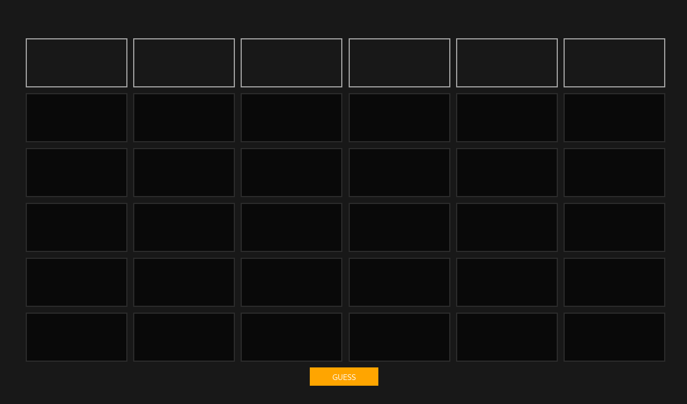
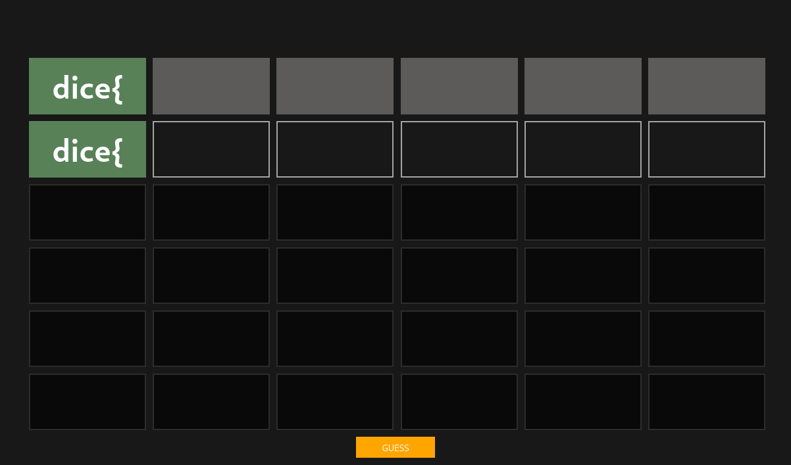
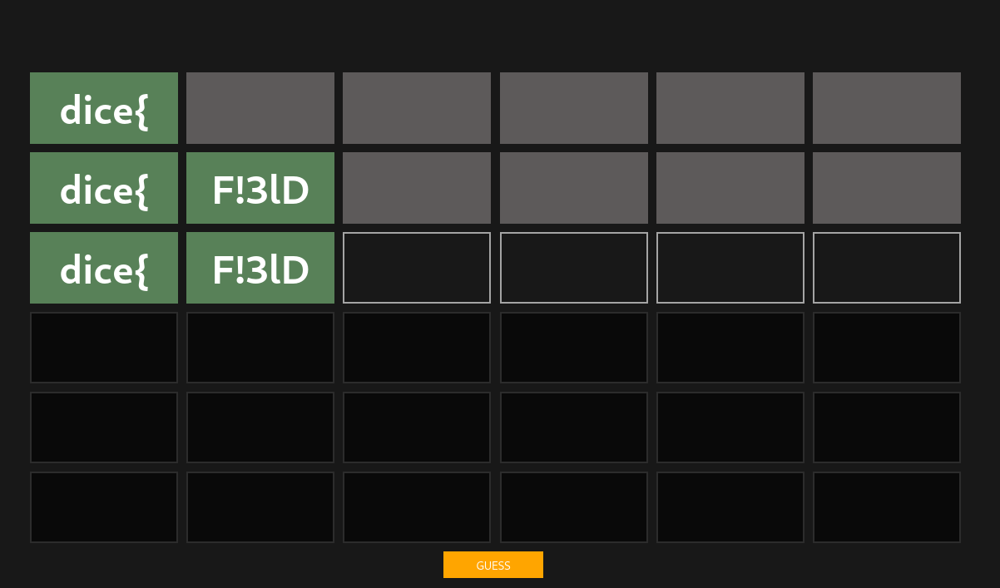
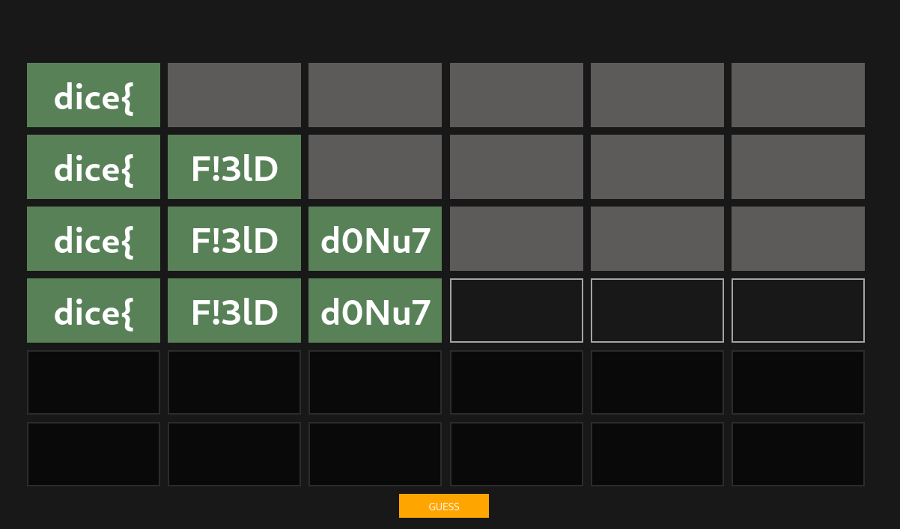
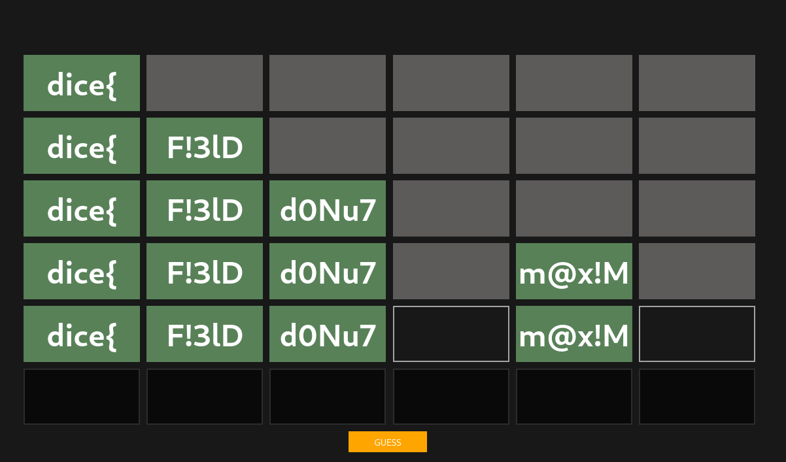
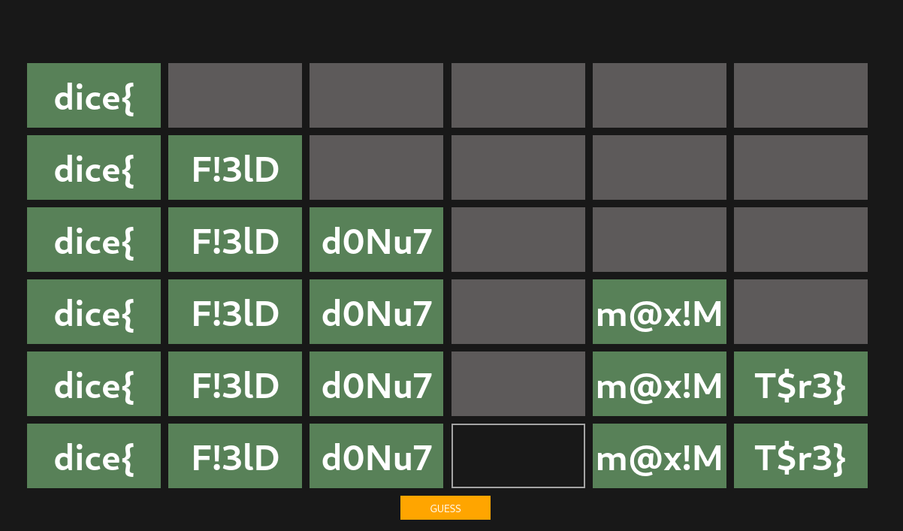

# rev/flagle

## Description

How hard could it be? Just guess the flag.

## Solution

For this challenge we are given a [Wordle](https://www.powerlanguage.co.uk/wordle/) clone that lets us guess the flag.



Guessing a sequence of five letters correctly makes the sequence become green. If the sequence is correct but the
poistion is wrong it becomes orange. Since flags usally start with `dice{`, we can guess the first block:



Now it's time to take a look at the verification logic:

```js
const guess = Module.cwrap('guess', 'number', ['number', 'string']);
const CORRECT = 0;
const WRONG_LOCATION = 1;
const INCORRECT = 2;

const alphabet = "abcdefghijklmnopqrstuvwxyzABCDEFGHIJKLMNOPQRSTUVWXYZ0123456789!#$%&()*+,-./:;<=>?@[]^_{|}~";

let current_guess = 1;
const guess_button = document.getElementById('guess-button');

const submit_guess = () => {
    let correct = 0;
    let input_text = '';

    for (let i = 1; i <= 6; ++i) {
        const el = get_input(current_guess, i);

        const guess_val = el.value;
        input_text += guess_val;

        const result = guess(i, guess_val);
        if (result === CORRECT) {
            el.classList.add('correct');
            correct++;
        } else if (result === WRONG_LOCATION) {
            el.classList.add('partial');
        } else if (result === INCORRECT) {
            el.classList.add('incorrect');
        }
    }

    current_guess++;

    if (correct === 6) {
        prompt('Congrats! Here\'s your flag:', input_text);
    }
};
```

We can see that the blocks are verified independently by calling `guess`. Furthermore, we can see some constants as well
as the alphabet of allowed characters. The interesting part is the `guess` function which is built from a WebAssembly
module. I downloaded the wasm module and used `wasm2c` of [The WebAssembly Binary Toolkit
(WABT)](https://github.com/WebAssembly/wabt) to take a look at the `guess` function. At this point I reversed the blocks
step by step.

### Block 1

```c
data d_a(offset: 1024) = "dice{\00";

export function streq(a:ubyte_ptr, b:ubyte_ptr):int {
  var c:int;
  return loop L_a {
           c = a[0];
           if (c) goto B_b;
           if (b[0]) goto B_b;
           return 1;
           label B_b:
           if (c == b[0]) goto B_c;
           return 0;
           label B_c:
           b = b + 1;
           a = a + 1;
           continue L_a;
         }
}

export function validate_1(a:int):int {
  return streq(a, 1024)
}
```

The first block is verified by simply comparing it to the string `dice{`. This matches what we already found earlier.

### Block 2

```c
function validate(a:int, b:int, c:int, d:int, e:int):int {
  var f:int = g_a - 16;
  f[15]:byte = a;
  f[14]:byte = b;
  f[13]:byte = c;
  f[12]:byte = d;
  d = f[14]:ubyte;
  f[14]:byte = f[13]:ubyte;
  f[13]:byte = d;
  d = f[13]:ubyte;
  f[13]:byte = f[12]:ubyte;
  f[12]:byte = d;
  d = f[13]:ubyte;
  f[13]:byte = f[15]:ubyte;
  f[15]:byte = d;
  d = f[13]:ubyte;
  f[13]:byte = f[12]:ubyte;
  f[12]:byte = d;
  d = f[15]:ubyte;
  f[15]:byte = f[14]:ubyte;
  f[14]:byte = d;
  d = 0;
  if (f[15]:ubyte != 51) goto B_a;
  if (f[14]:ubyte != 108) goto B_a;
  if (f[13]:ubyte != 33) goto B_a;
  d = e == 68 & f[12]:ubyte == 70;
  label B_a:
  return d;
}
```

We can see that this function takes five parameters. I assumed that they correspond to the characters of the sescond
block. Using the debugger I briefly verified this assumption and started reversing the code:

```python
''.join(list(map(chr, [70, 33, 51, 108, 68])))
```

This outputs `F!3lD` and entering it as the second block gives:



### Block 3

```c
export function validate_3(a:int, b:int, c:int, d:int, e:int):int {
  var f:int = 0;
  if (b * a != 4800) goto B_a;
  if (c + a != 178) goto B_a;
  if (c + b != 126) goto B_a;
  if (d * c != 9126) goto B_a;
  if (d - e != 62) goto B_a;
  f = c * 4800 - e * d == 367965;
  label B_a:
  return f;
}
```

This block checks if a few equations are satisfied. I used `sage` to solve them:

```sage
a, b, c, d, e = var("a b c d e")
solve([b * a == 4800, c + a == 178, c + b == 126, d * c == 9126, d - e == 62], a, b, c, d, e)
```

And then converted the results to characters:

```python
''.join(list(map(chr, [100, 48, 78, 117, 55])))
``` 



### Block 5

Notice, that we skipped block 4 for now (more on that later).

```c
export function validate_5(a:int, b:int, c:int, d:int, e:int):int {
  var f:int = g_a - 16;
  f[15]:byte = a;
  f[14]:byte = b;
  f[13]:byte = c;
  f[12]:byte = d;
  f[15]:byte = f[15]:ubyte + 12;
  f[14]:byte = f[14]:ubyte + 4;
  f[13]:byte = f[13]:ubyte + 6;
  f[12]:byte = f[12]:ubyte + 2;
  d = 0;
  if (f[15]:ubyte != 121) goto B_a;
  if (f[14]:ubyte != 68) goto B_a;
  if (f[13]:ubyte != 126) goto B_a;
  d = e == 77 & f[12]:ubyte == 35;
  label B_a:
  return d;
}
```

This block can easily be reversed:

```python
''.join(list(map(chr, [121 - 12, 68 - 4, 126 - 6, 35 - 2, 77])))
```



### Block 6

```c
export function validate_6(a:int, b:int, c:int, d:int, e:int):int {
  var f:int = 0;
  if ((b + 2933) * (a + 1763) != 5483743) goto B_a;
  f = e == 125 & (d + 1546) * (c + 3913) == 6431119;
  label B_a:
  return f;
}
```

Same thing again, we can use `sage` to solve the equation:

```sage
a, b = var("a b")
assume(a, "integer")
assume(b, "integer")
solve([(b + 2933) * (a + 1763) == 5483743], a, b)


c, d = var("c d")
assume(c, "integer")
assume(d, "integer")
solve([(d + 1546) * (c + 3913) == 6431119], c, d)
```

```python
''.join(list(map(chr, [84, 36, 114, 51, 125]))
```



### Block 4

Almost done, we just need to reverse the last block now. It turns out that the last validation is not part of the wasm
code itself but rather an imported function:

```c
import function env_validate_4(a:int):int;
```

The imported code is the following (obfuscated) JS code:
```js
function c(b) {
  var e = {
    'HLPDd': function (g, h) {
      return g === h;
    },
    'tIDVT': function (g, h) {
      return g(h);
    },
    'QIMdf': function (g, h) {
      return g - h;
    },
    'FIzyt': 'int',
    'oRXGA': function (g, h) {
      return g << h;
    },
    'AMINk': function (g, h) {
      return g & h;
    }
  },
  f = current_guess;
  try {
    let g = e['HLPDd'](btoa(e['tIDVT'](intArrayToString, window[b](b[e['QIMdf'](f, 9972 + 4116 + - 14087 * 1)], e['FIzyt']) () ['toString'](e['oRXGA'](e['AMINk'](f, - 419 * - 21 + 2094 * - 1 + - 6701), 4685 + - 6858 + 2175)) ['match'](/.{2}/g) ['map'](h=>parseInt(h, f * f)))), 'ZGljZQ==') ? - 1 * 7493 + 8464 + - 970 : - 9 * 661 + - 21 * - 3 + 54 * 109;
  } catch {
    return 6972 + - 201 * 47 + - 25 * - 99;
  }
}
```

The de-obfuscated version of the above code looks like this:
```js
f = current_guess;
window[b](b[f - 1], 'int')() ['toString']((f & 4) << 2)['match'](/.{2}/g)['map'](h => parseInt(h, f * f)) === [100, 105, 99, 101]
```

And the check is successfull iff. the code runs without any exceptions. At this point I lost quite a bit of time. We can
see that the expression depends on `current_guess`. After a while I realized that `current_guess` has to be at least `4`
since otherwise the `parseInt` couldn't become `100`. This now leaves `4, 5, 6` for `f`/`current_guess`. Moreover, `6`
is also not a vaild value for `f` because `b[5]` would imply that the input is longer than `5` characters. The
expression would therefore be of one of the following forms:

```js
window[b](b[3], 'int')()['toString'](16) == '64696365'
window[b](b[4], 'int')()['toString'](25) == '25453041'
```

or if we assume that the `toString` is called on a number:

```js
window[b](b[3], 'int')() == 1684628325
window[b](b[4], 'int')() == 13468796976
```

At this point I should have rememberd that there was this exact constant in the wasm code:

```js
export function a():int {
  return 1684628325
}
```

But of course I did not. Instead, I enumerated all properties of `window` that had a property name of length 4 or 5
and were functions:

```js
let all = [];

for (let current in window) {
    if ((current.length === 4 || current.length === 5) && typeof window[current] == "function") {
        all.push(current);
    }
}

console.log(all);
```

This gives us the possible valid blocks:

```
0: "close"
1: "stop"
2: "focus"
3: "blur"
4: "open"
5: "alert"
6: "print"
7: "find"
8: "dump"
9: "btoa"
10: "atob"
11: "fetch"
12: "read_"
13: "quit_"
14: "ccall"
15: "cwrap"
16: "_free"
17: "abort"
18: "exit"
```

I realized that I could use `cwrap`  to get a valid expression:

```js
cwrap('c', 'int')() == 1684628325
```

Awesome, with this we have the complete flag `dice{F!3lDd0Nu7cwrapm@x!MT$r3}`.

