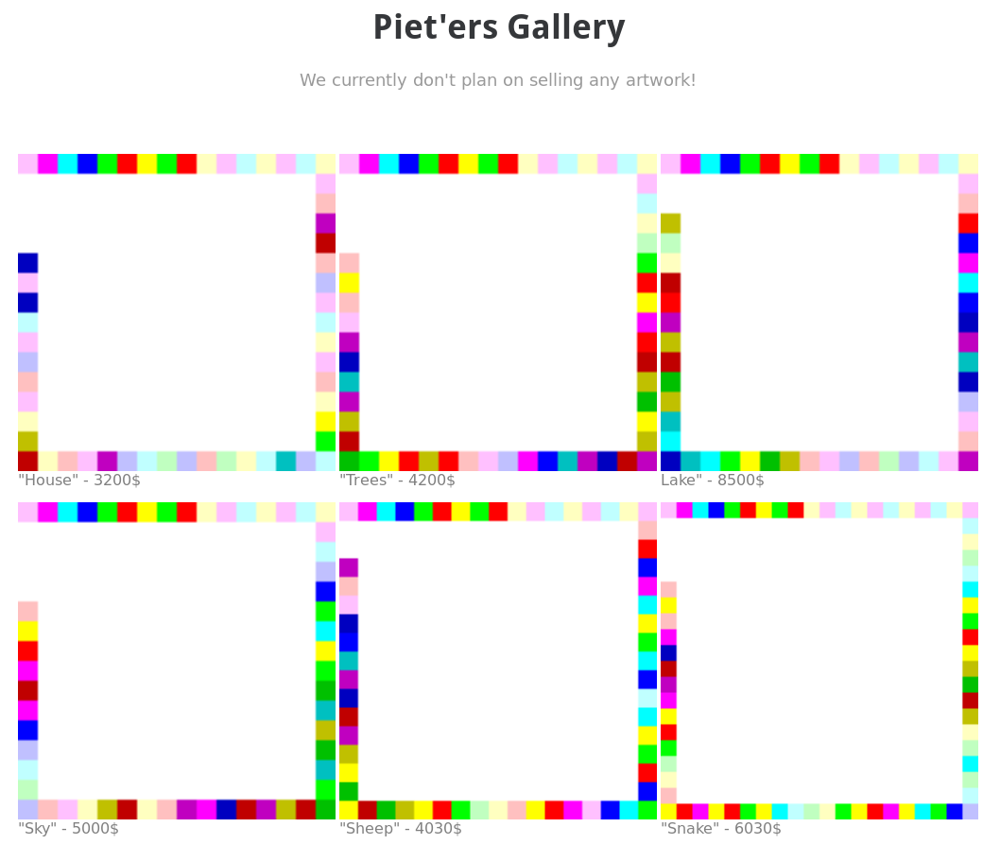

# Day 06: Mondrian

In this challenge we get to see the art gallery of [Piet Mondrian](https://en.wikipedia.org/wiki/Piet_Mondrian).

Unfortunately he doesn't sell his artwork. But it turns out that the paintings are also valid programs written in the
[Piet programming language](https://en.wikipedia.org/wiki/Esoteric_programming_language#Piet). Using the [npiet
online interpreter](https://www.bertnase.de/npiet/npiet-execute.php) we can run the programs/paintings to get the flag.
