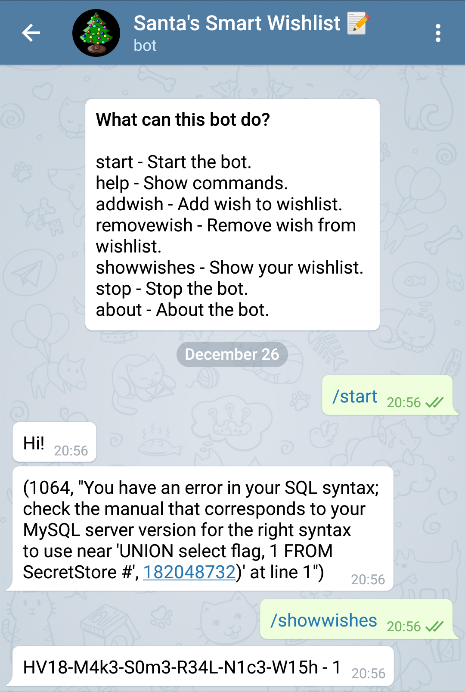

# Day 12: SmartWishList

For this challenge we get a Telegram bot. We can add wishes and show our current wish list. When adding wishes with to
many characters we get an SQL error. So it was obvious that we have to do an SQL injection. After some trial and error I
realized that it's possible to inject SQL by changing the first/lastname in Telegram.
Changing the name to `'UNION SELECT table_name, 1 FROM information_schema.tables #` revealed the `SecretStore` table.
Now we can just select the flag from this table by changing the name to `'UNION SELECT flag, 1 FROM SecretStore #`.

