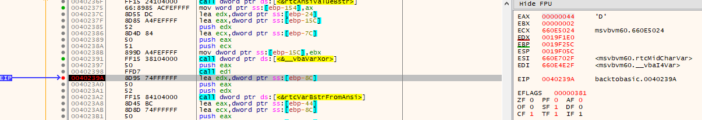

# 12 - back to basic

## Description

Level: Medium<br/>
Author: hardlock

Santa used his time machine to get a present from the past. get your rusty tools out of your cellar and solve this one!

[HV19.12-BackToBasic.zip](67e6c6c2-1119-4c1e-a9b5-85f118173a40.zip)

## Solution

The zip file contained a PE32 executable programmed in VBA. I opened the file in Ghidra and saw the following
interesting part:

```c
local_148 = &DAT_00401b40;
local_150[0] = 0x8008;

if (__vbaVarTstEq(local_150,local_48) != 0) {
  uVar3 = (**(code **)(*piVar6 + 0x300))(piVar6);
  piVar4 = (int *)__vbaObjSet(&local_50,uVar3);
  iVar5 = (**(code **)(*piVar4 + 0x54))(piVar4,L"Status: correct");
}
```

This was the part that checked if the input was indeed correct. At `DAT_00401b40` I found the following sequence of
characters `6klzic<=bPBtdvff\'y\x7fFI~on//N` and I assumed that this must be the result of my transformed input.
Furthermore, there were multiple calls to `__vbaVarXor` before that comparison. I assumed that the calculation looked
like this:

```
input = read();
if ((input XOR key) == "6klzic<=bPBtdvff\'y\x7fFI~on//N") {
   print("Status: correct");
}
```

Now I just had to find the key. To do so I used x32dbg and set a breakpoint on `__vbaVarXor`. After entering enough
characters in the input field and stepping through the instructions I realized that right after `__vbaVarXor` the result
was written to a variable.



Now I simply stepped through the code and wrote down the content of `EAX`. From that I got the string
`DEJKHINOLMRSPQVWTUZ[xY^_\]b` which I assumed to be the result of `input XOR key`. All I had to do now was to calculate
`(DEJKHINOLMRSPQVWTUZ[xY^_\]b XOR myInput) XOR 6klzic<=bPBtdvff\'y\x7fFI~on//N` to get the flag:

```python
def xor_strings(xs, ys):
    return "".join(chr(ord(x) ^ ord(y)) for x, y in zip(xs, ys))

xor_strings(xor_strings('DEJKHINOLMRSPQVWTUZ[xY^_\]b', 'B' * 1000), '6klzic<=bPBtdvff\'y\x7fFI~on//N')
```

Note that I used `BBBB...BBB` as my input. The above python code prints the flag `HV19{0ldsch00l_Revers1ng_sess10n}`.
