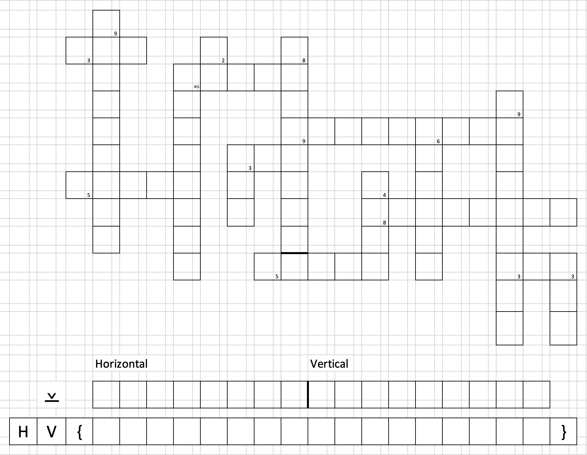
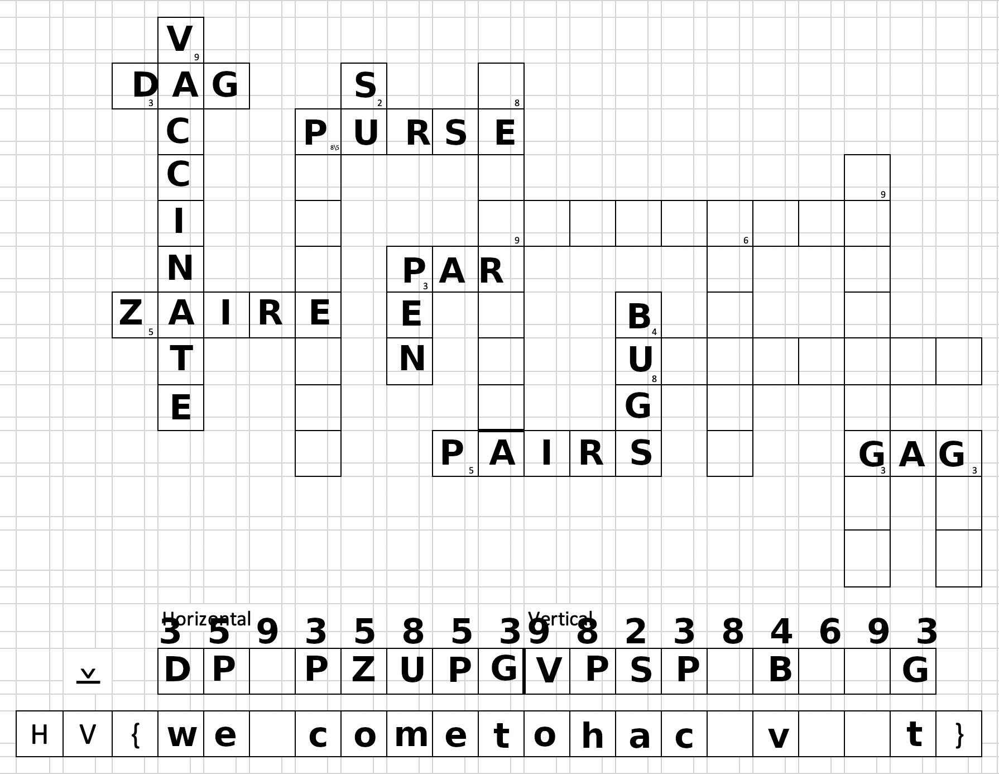

# 01 - X-wORd Puzzle

## Description

**Instructions**
- Fill in the puzzle in all capital letters
- The initial letters of each word are the solution - in order the same order the questions are asked:
  - horizontal words: top to bottom
  - vertical words: left to right

**Horizontal**
1. A diagram of arrows not allowing cycles
2. A handbag for carrying around money
3. Very, very secure
4. Golf: number of strokes required
5. Congo between 1971 and 1997
6. State of appearing everywhere
7. Tuples in everyday language
8. Makes you laugh or silences you

**Vertical**
1. Plea by many doctors right now
2. Put in parcels
3. Lets you change user
4. ...-test
5. How you should transmit your data
6. Need to squash them - fix your code!
7. Attributed to a marquis - no pain, no gain.
8. Doing something in a way that causes fatigue is doing it...
9. A drink you may need after finishing this puzzle.

**Hints**
- the words are in order (ltr & ttb): first hint is for the top left horizontal word
- number means number of chars in word
- check the title - do you need all the letters?
- we know how to hide gridlines
- what seems redundant really isn't - it's the key you seek

## Solution

To solve this challenge, I simply filled out parts of the crossword puzzle and xored the letters with the numbers
representing the number of characters. You can see the filled out puzzle here:

From this I could guess the flag `HV{welcometohackvent}`.

