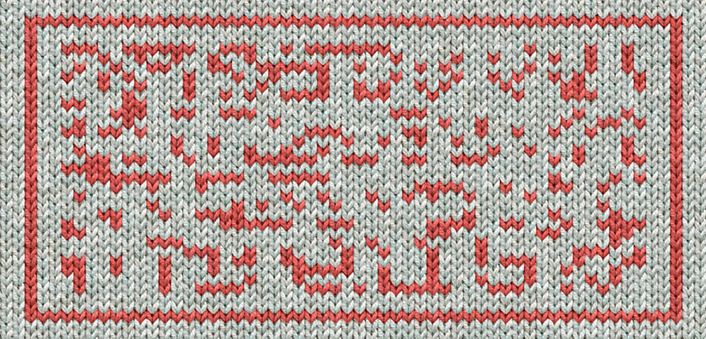

# 05 - X-Mas Jumper

## Description

The elves have been getting into the festive spirit by making Christmas jumpers for themselves to wear in the workshop.
They made one for Santa too, but it looks like they didn't program the knitting machine correctly.

## Solution

We are given the following image of the jumper:



In a first step I wrote the orange parts as 1s and the gray parts as 0s in a binary sequence:

```
111001111110011100101111111000000000001000010010
000100100100100100000000000100001001000010010010
010010011000110011111100100001010000001000010010
100101000010001001000100000100001001010010100001
000100100010000010000100101001010000100001100001
000001000010010100111100111000100000010001110000
110001100000000000000000000000000000000000000000
000011100110011100000000000111000000000000100010
010001000000000001000000000000010010000001001101
110110100000000000001110000011000010010010010000
000000000100100000010001001001001000000000000010
010000001001001001001000000000000001001000100010
001101100010000111111001110011001110000010100011
111100000000000000000000000000000000000000000000
001111111001111001111100000000000000000010000101
000010010001000000000000000001111000100011001000
010000000000000000100100010010100100001000000000
000000010000001010010010001000000000000000001000
000110001001111000000000000000000100000010000100
100010000000011111100111000000111100110001001111
110000000000000000000000000000011000000110000110
000000011100000000000010010001000010000000000100
000000000011100100100001001000100010000000111001
110010001000101100110001000000100010111000100011
110010001000100000011111001000100000001001000100
010000001000000100010000001000100010001000010100
010000001001111000001110101111110001110001001000
```

Then I replaced all 1s with ■ and all 0s with □. Which gave me the following text:

```
■■■□□■■■■■■□□■■■□□■□■■■■■■■□□□□□□□□□□□■□□□□■□□■□
□□□■□□■□□■□□■□□■□□□□□□□□□□□■□□□□■□□■□□□□■□□■□□■□
□■□□■□□■■□□□■■□□■■■■■■□□■□□□□■□■□□□□□□■□□□□■□□■□
■□□■□■□□□□■□□□■□□■□□□■□□□□□■□□□□■□□■□■□□■□■□□□□■
□□□■□□■□□□■□□□□□■□□□□■□□■□■□□■□■□□□□■□□□□■■□□□□■
□□□□□■□□□□■□□■□■□□■■■■□□■■■□□□■□□□□□□■□□□■■■□□□□
■■□□□■■□□□□□□□□□□□□□□□□□□□□□□□□□□□□□□□□□□□□□□□□□
□□□□■■■□□■■□□■■■□□□□□□□□□□□■■■□□□□□□□□□□□□■□□□■□
□■□□□■□□□□□□□□□□□■□□□□□□□□□□□□□■□□■□□□□□□■□□■■□■
■■□■■□■□□□□□□□□□□□□□■■■□□□□□■■□□□□■□□■□□■□□■□□□□
□□□□□□□□□■□□■□□□□□□■□□□■□□■□□■□□■□□□□□□□□□□□□□■□
□■□□□□□□■□□■□□■□□■□□■□□□□□□□□□□□□□□■□□■□□□■□□□■□
□□■■□■■□□□■□□□□■■■■■■□□■■■□□■■□□■■■□□□□□■□■□□□■■
■■■■□□□□□□□□□□□□□□□□□□□□□□□□□□□□□□□□□□□□□□□□□□□□
□□■■■■■■■□□■■■■□□■■■■■□□□□□□□□□□□□□□□□□□■□□□□■□■
□□□□■□□■□□□■□□□□□□□□□□□□□□□□□■■■■□□□■□□□■■□□■□□□
□■□□□□□□□□□□□□□□□□■□□■□□□■□□■□■□□■□□□□■□□□□□□□□□
□□□□□□□■□□□□□□■□■□□■□□■□□□■□□□□□□□□□□□□□□□□□■□□□
□□□■■□□□■□□■■■■□□□□□□□□□□□□□□□□□□■□□□□□□■□□□□■□□
■□□□■□□□□□□□□■■■■■■□□■■■□□□□□□■■■■□□■■□□□■□□■■■■
■■□□□□□□□□□□□□□□□□□□□□□□□□□□□□□■■□□□□□□■■□□□□■■□
□□□□□□□■■■□□□□□□□□□□□□■□□■□□□■□□□□■□□□□□□□□□□■□□
□□□□□□□□□□■■■□□■□□■□□□□■□□■□□□■□□□■□□□□□□□■■■□□■
■■□□■□□□■□□□■□■■□□■■□□□■□□□□□□■□□□■□■■■□□□■□□□■■
■■□□■□□□■□□□■□□□□□□■■■■■□□■□□□■□□□□□□□■□□■□□□■□□
□■□□□□□□■□□□□□□■□□□■□□□□□□■□□□■□□□■□□□■□□□□■□■□□
□■□□□□□□■□□■■■■□□□□□■■■□■□■■■■■■□□□■■■□□□■□□■□□□
```

I could see the upper part of an `H` in the first line. Therefore I tried to rearrange the lines to match the line of
the `H` with the upper part. This gave me the following new text:

```
■■■□□■■■■■■□□■■■□□■□■■■■■■■□□□□□□□□□□
□■□□□□■□□■□□□□■□□■□□■□□■□□■□□□□□□□□□□
□■□□□□■□□■□□□□■□□■□□■□□■□□■□□■■□□□■■□
□■■■■■■□□■□□□□■□■□□□□□□■□□□□■□□■□■□□■
□■□□□□■□□□■□□■□□□■□□□□□■□□□□■□□■□■□□■
□■□□□□■□□□■□□■□□□■□□□□□■□□□□■□□■□■□□■
□■□□□□■□□□□■■□□□□■□□□□□■□□□□■□□■□■□□■
■■■□□■■■□□□■□□□□□□■□□□■■■□□□□■■□□□■■□
□□□□□□□□□□□□□□□□□□□□□□□□□□□□□□□□□□□□□
□□□□□□□■■■□□■■□□■■■□□□□□□□□□□□■■■□□□□
□□□□□□□□■□□□■□□■□□□■□□□□□□□□□□□■□□□□□
□□□□□□□□■□□■□□□□□□■□□■■□■■■□■■□■□□□□□
□□□□□□□□■■■□□□□□■■□□□□■□□■□□■□□■□□□□□
□□□□□□□□■□□■□□□□□□■□□□■□□■□□■□□■□□□□□
□□□□□□□□■□□■□□□□□□■□□■□□■□□■□□■□□□□□□
□□□□□□□□■□□■□□□■□□□■□□□■■□■■□□□■□□□□■
■■■■■□□■■■□□■■□□■■■□□□□□■□■□□□■■■■■■□
□□□□□□□□□□□□□□□□□□□□□□□□□□□□□□□□□□□□□
□□□□□□□□■■■■■■■□□■■■■□□■■■■■□□□□□□□□□
□□□□□□□□□■□□□□■□■□□□□■□□■□□□■□□□□□□□□
□□□□□□□□□■■■■□□□■□□□■■□□■□□□□■□□□□□□□
□□□□□□□□□■□□■□□□■□□■□■□□■□□□□■□□□□□□□
□□□□□□□□□■□□□□□□■□■□□■□□■□□□■□□□□□□□□
□□□□□□□□□■□□□□□□■■□□□■□□■■■■□□□□□□□□□
□□□□□□□□□■□□□□□□■□□□□■□□■□□□■□□□□□□□□
■■■■■■□□■■■□□□□□□■■■■□□■■□□□■□□■■■■■■
□□□□□□□□□□□□□□□□□□□□□□□□□□□□□■■□□□□□□
■■□□□□■■□□□□□□□□■■■□□□□□□□□□□□□■□□■□□
□■□□□□■□□□□□□□□□□■□□□□□□□□□□□□■■■□□■□
□■□□□□■□□■□□□■□□□■□□□□□□□■■■□□■■■□□■□
□□■□□□■□■■□□■■□□□■□□□□□□■□□□■□■■■□□□■
□□□■■■■□□■□□□■□□□■□□□□□□■■■■■□□■□□□■□
□□□□□□■□□■□□□■□□□■□□□□□□■□□□□□□■□□□■□
□□□□□■□□□■□□□■□□□■□□□□■□■□□□■□□□□□□■□
□■■■■□□□□□■■■□■□■■■■■■□□□■■■□□□■□□■□□
```

To make it a bit more readable I replaced □ with spaces:

```
■■■  ■■■■■■  ■■■  ■ ■■■■■■■          
 ■    ■  ■    ■  ■  ■  ■  ■          
 ■    ■  ■    ■  ■  ■  ■  ■  ■■   ■■ 
 ■■■■■■  ■    ■ ■      ■    ■  ■ ■  ■
 ■    ■   ■  ■   ■     ■    ■  ■ ■  ■
 ■    ■   ■  ■   ■     ■    ■  ■ ■  ■
 ■    ■    ■■    ■     ■    ■  ■ ■  ■
■■■  ■■■   ■      ■   ■■■    ■■   ■■ 
                                     
       ■■■  ■■  ■■■           ■■■    
        ■   ■  ■   ■           ■     
        ■  ■      ■  ■■ ■■■ ■■ ■     
        ■■■     ■■    ■  ■  ■  ■     
        ■  ■      ■   ■  ■  ■  ■     
        ■  ■      ■  ■  ■  ■  ■      
        ■  ■   ■   ■   ■■ ■■   ■    ■
■■■■■  ■■■  ■■  ■■■     ■ ■   ■■■■■■ 
                                     
        ■■■■■■■  ■■■■  ■■■■■         
         ■    ■ ■    ■  ■   ■        
         ■■■■   ■   ■■  ■    ■       
         ■  ■   ■  ■ ■  ■    ■       
         ■      ■ ■  ■  ■   ■        
         ■      ■■   ■  ■■■■         
         ■      ■    ■  ■   ■        
■■■■■■  ■■■      ■■■■  ■■   ■  ■■■■■■
                             ■■      
■■    ■■        ■■■            ■  ■  
 ■    ■          ■            ■■■  ■ 
 ■    ■  ■   ■   ■       ■■■  ■■■  ■ 
  ■   ■ ■■  ■■   ■      ■   ■ ■■■   ■
   ■■■■  ■   ■   ■      ■■■■■  ■   ■ 
      ■  ■   ■   ■      ■      ■   ■ 
     ■   ■   ■   ■    ■ ■   ■      ■ 
 ■■■■     ■■■ ■ ■■■■■■   ■■■   ■  ■  
```

And from here I could read the flag `HV{Too_K3wL_F0R_YuLe!}`.

