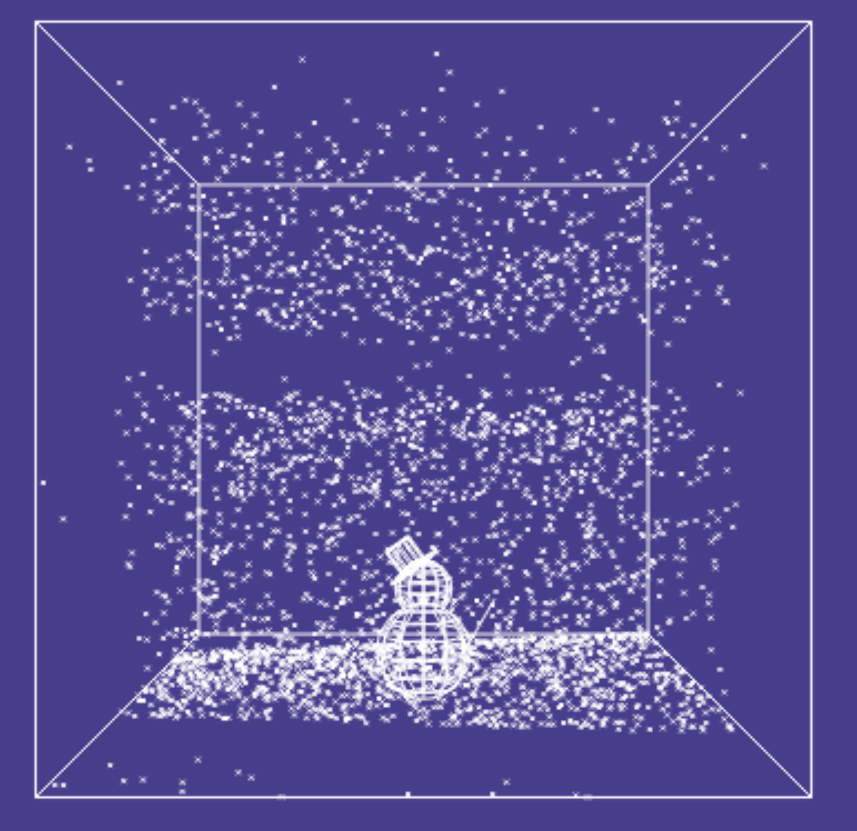

# 06 - Snow Cube

## Description

The easter bunny sent a gift to Santa - what is usually a crystal sphere seemed a bit too boring, so it's a cube!
The snow seems to be falling somewhat strangely, is it possible that there's a message hidden somewhere?

## Solution

We are presented with a website that contains a snow cube:



The snowflakes seem to be falling down completely randomly. Upon inspecting the code a bit more closely, we can see the
following:

```js
canvas.addEventListener('keydown', e => s = (e.key === 's'));
canvas.addEventListener('keyup', e => s = false);
canvas.addEventListener('mousemove', e => {
	var rect = e.target.getBoundingClientRect();
	alpha = s?((e.clientX-rect.left-a/2)*7/a):Math.sin(((e.clientX-rect.left-a/2)*7/a));
	beta = Math.sin(((e.clientY-rect.top-a/2)*7/a));
});
```

Holding the s key pressed allows us to move around more freely. I simply set the `s` variable to true and removed the
event listeners. This allowed me to permanently move around and take another look at the cube. I turned the cube around
and was able to see letters being formed by the falling snowflakes. I simply wrote them down and got the flag
`HV21{M3SSAGE_OUT_OF_FLAKES}`.

