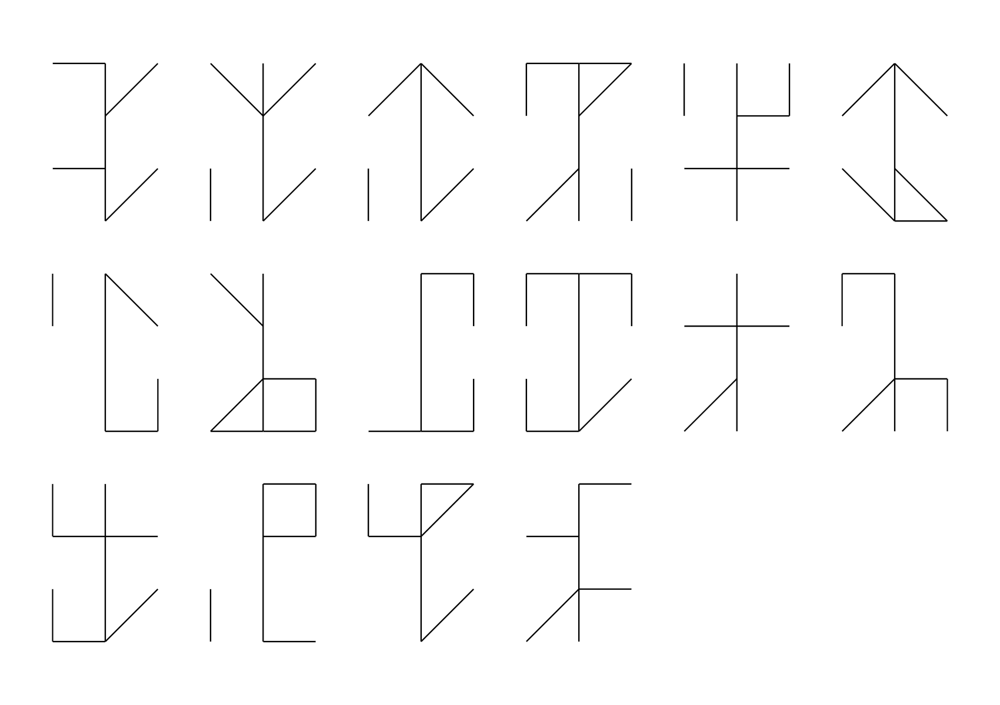

# 09 - Brother Santa

## Description

Ever security minded, Santa is. So switched to a prime encoding system he has, after contemplating for long.



## Solution

At first I tried to search for different *prime* encodings. This proved to be the wrong approach and I took a step back. 
While googling around I came across the [Cistercian numerals](https://en.wikipedia.org/wiki/Cistercian_numerals). I then
used [this decoder](https://www.dcode.fr/cistercian-numbers) to get the actual numbers:

```
2314
6344
6333
4675
2268
3533

763
5940
1707
7377
4022
4870

7382
6109
385
4221
```

At this point I tried different encodings to get the flag but was unsuccessful. The largest numer (7382) needs 13 bits
to be encoded. Therefore, I padded all the numbers to 13 bits, then looked at them in group of 8 bits and interpreteted
that as ASCII encoding:

```python
from textwrap import wrap

i = [2314, 6344, 6333, 4675, 2268, 3533, 763, 5940, 1707, 7377, 4022, 4870, 7382, 6109, 385, 4221]
all = ""
for e in i:
    all += bin(e)[2:].zfill(13)


for group in wrap(all, 8):
    print(chr(int(group, 2)), end='')

print()
```

This gave the flag `HV21{$4n74_w45_4_m0nk_t00}`.

