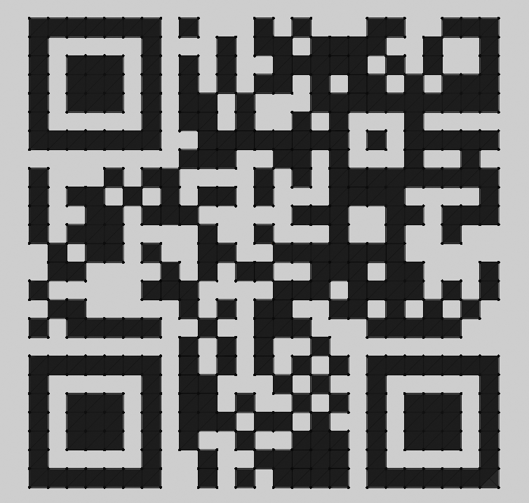
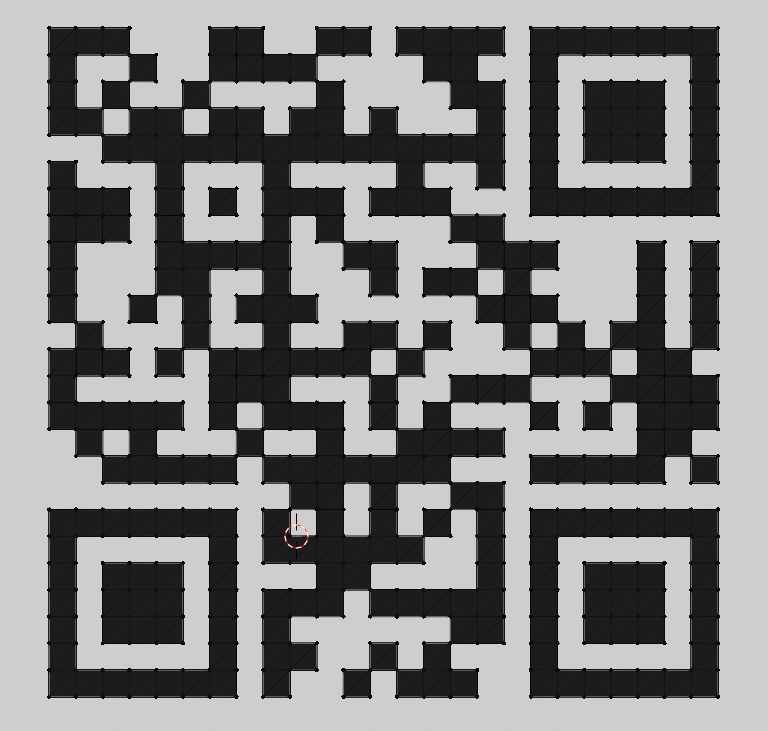

# 15 - Christmas Bauble

## Description

The elves have started taking 3D modeling classes and have presented Santa with a gift. What a nice gesture! But the
ball feels heavier than it should; what does that even mean for digital assets???

## Solution

For this challenge we are given an .stl file. [There was a similar challenge that involved such a
file](https://github.com/InverseIntegral/ctf_writeups/blob/master/hackvent_2019/02/README.md). I opened it in blender
and removed the outer part of the bauble. In the middle was a cube of QR codes. Using blender I made the background
white and the material of the cube black. I then created three QR codes and scanned them to get the flag:

