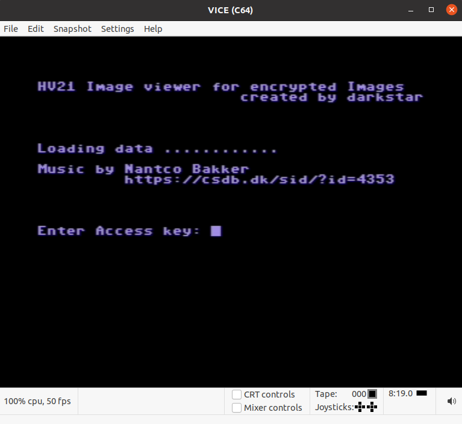
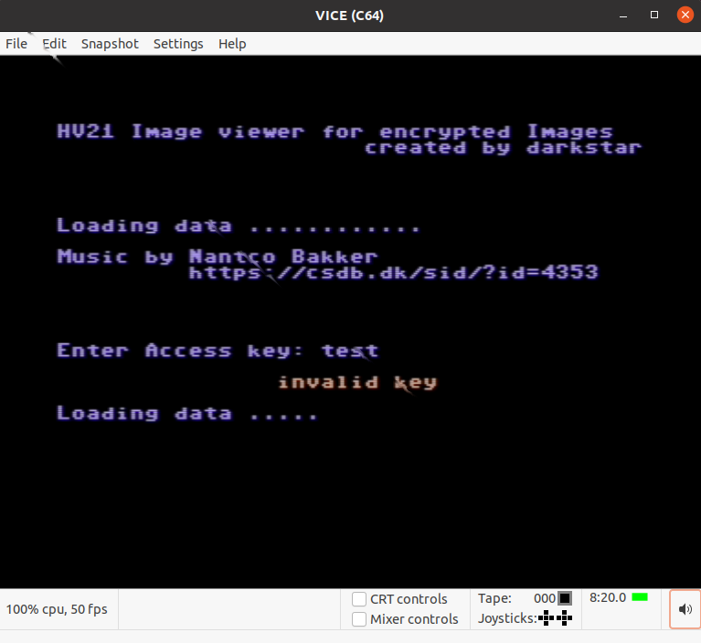
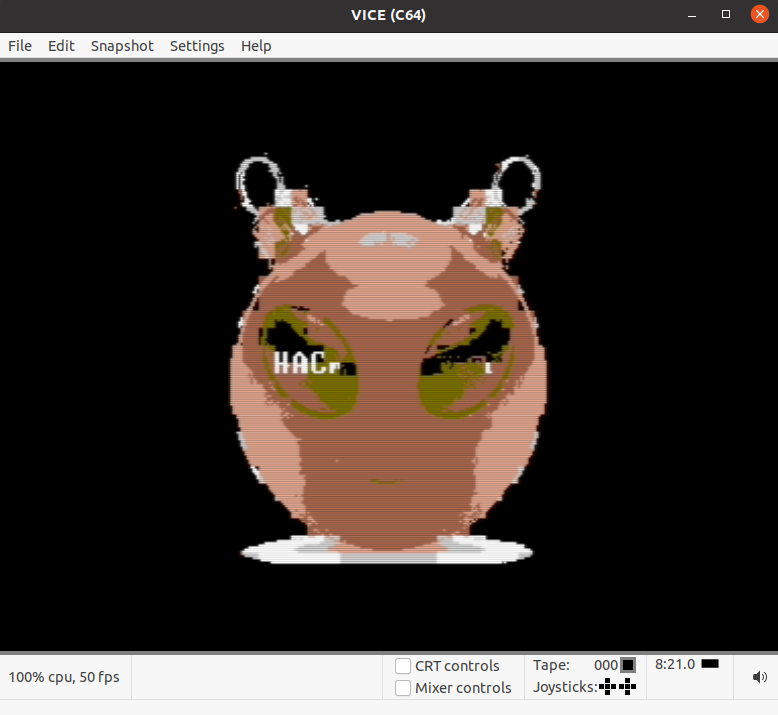
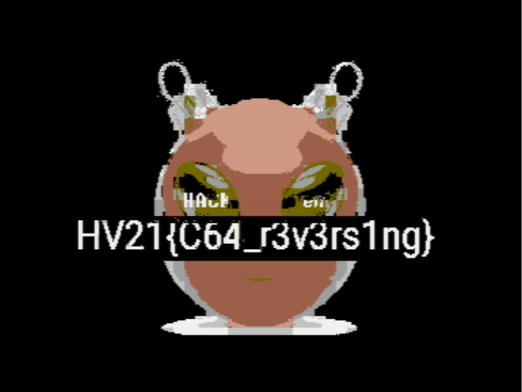

# 24 - Dusty Disk Disaster

## Description

It happened again: Santa misplaced some very important data. His elves came across an old dusty floppy disk that they
can unfortunately no longer read...

## Solution

For this challenge we are given a d64 file that contains a commodore 64 image. First of all I loaded the image using the
[Vice emulator](https://vice-emu.sourceforge.io/). We are asked for an access key and if we enter the wrong one we get
presented a hackvent image:







At this point I started reversing the binary. For that I used ghidra with [an additional plugin for C64
disks](https://github.com/zeroKilo/C64LoaderWV). After a while I cam across an interesting function:


```c
void hash_init() {
   ...
   write_1(DDRA, 0x45);
   write_1(DDRB, 0x67);
   FUN_662f(1, 0x23, 8);
   ...
   write_1(DDRA, 0xcd);
   write_1(DDRB, 0xef);
   FUN_662f(0x89, 0xab, 0xc);
   ...
}
```

And it turns out that these constants are part of [the MD5 spec](https://datatracker.ietf.org/doc/html/rfc1321):

```
word A: 01 23 45 67
word B: 89 ab cd ef
word C: fe dc ba 98
word D: 76 54 32 10
```

So the input definitely gets hashed using MD5. To check this out I used the debugger of VICE. I set a breakpoint at the
start of the MD5 function and indeed it got called. Interstingly enough, it got called 11 times in total. After taking a
look at the memory, I verified that the input indeed got hashed 11 times using MD5.

Now I just needed the hash that we compare to and then I could bruteforce the password. During the challenge a hint was
released to hint towards the [human only password
list](https://crackstation.net/crackstation-wordlist-password-cracking-dictionary.htm). Directly after the strings I
found some values that looked like the hash value. (To verify this I again looked at the memory and saw my own input and
the hash from the binary that I found before). I then used those values and bruteforced the password:

```python
import hashlib

f = open("human.txt", "r", encoding="latin-1")

for line in f.readlines():
    try:
        line = line.rstrip()
        h = hashlib.md5(line.encode('petscii_c64en_lc')).digest()

        for i in range(10):
                h = hashlib.md5(h).digest()

        if(h.hex() == "b229f80b33fac1a464d6b1997ed66bd8"):
            print(line)
            break
    except Exception:
        continue
```

Note that commodore stores values using [PETSCII](https://en.wikipedia.org/wiki/PETSCII). With this I got the pasword
`HOHOHOMERRYXMAS` and finally I could get the flag:



