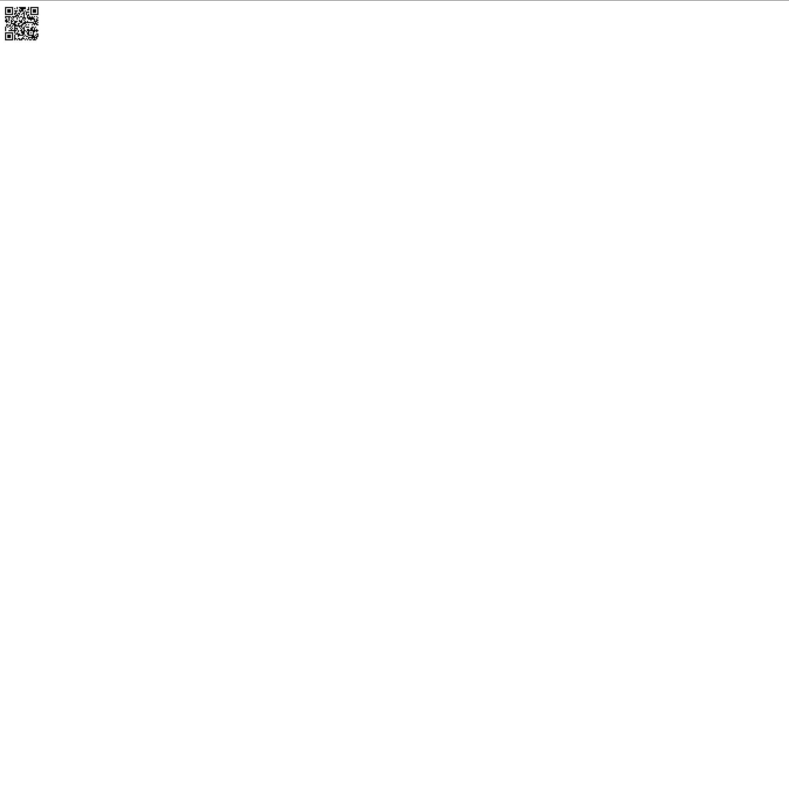
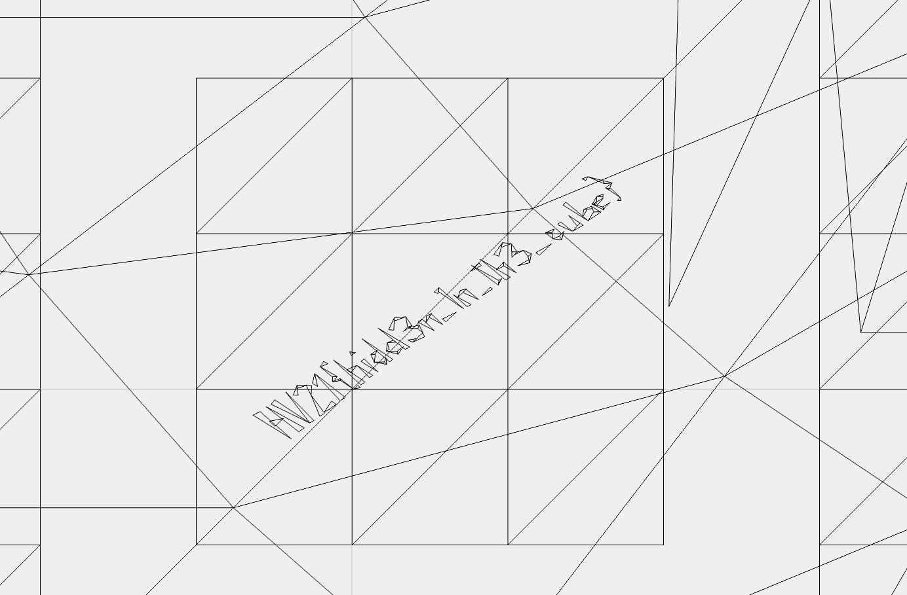

# Hidden Challenges

## Hidden 1

To find the hidden flag in the oversized png I simply ran the following command:

```
vips dzsave --depth one --tile-size=2048 --vips-progress 72d85b7f-4325-432e-93ff-cfdc019306c6.png hidden.png
```

This reduces the whole image into smaller tiles. I then simply took the smallest tile which contained another hidden QR
code:



## Hidden 2

While solving the bauble challenge, I opened the stl file using an online service. When I turned the bauble I saw the
hidden flag:



