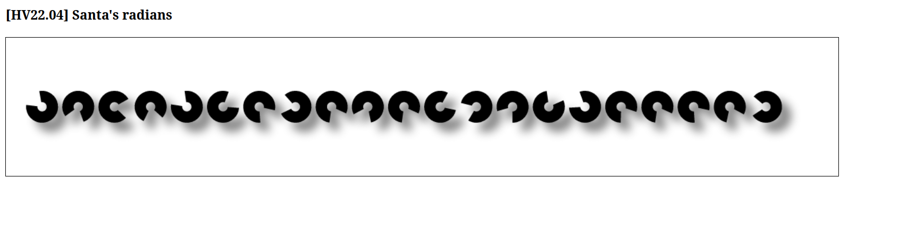

# 04 - Santa's radians

## Description

Level: Easy<br/>
Author: dr_nick

Santa, who is a passionate mathematician, has created a small website to train his animation coding skills. Although
Santa lives in the north pole, where the degrees are very low, the website's animation luckily did not freeze. It just
seems to move very slooowww. But how does this help...? The elves think there might be a flag in the application...

## Solution

For this challenge we are given a website what displays half-open circles:



Looking at the source, we can see some rotations in an array:

```js
let rot = [2.5132741228718345, 0.4886921905584123, -1.2566370614359172, 0, 2.548180707911721, -1.9547687622336491, -0.5235987755982988, 1.9547687622336491, -0.3141592653589793, 0.6283185307179586, -0.3141592653589793, -1.8151424220741028, 1.361356816555577, 0.8377580409572781, -2.443460952792061, 2.3387411976724013, -0.41887902047863906, -0.3141592653589793, -0.5235987755982988, -0.24434609527920614, 1.8151424220741028];
```

I converted the rotations to degrees:

```
rot.map(e => e *180/Math.PI)
```

which gave me the array:

```
[144,28,-72,0,146,-112,-29.999999999999996,112,-18,36,-18,-104.00000000000001,78,48,-140,133.99999999999997,-24,-18,-29.999999999999996,-14,104.00000000000001]
```

The ascii value of `V` is 72, which is exactly half of what we got. Because of this, I divided all the elements by 2 and
got:

```
[72,14,-36,0,73,-56,-15,56,-9,18,-9,-52,39,24,-70,67,-12,-9,-15,-7,52]
```

At this point I got stuck for a while. Only the first letter was correct and the rest didn't make up a readable flag.
The second value should be `86` if we assume the normal flag format starting with `HV`. Doing a prefix sum of the
elements, however, gave the correct array:

```
for (let i = 0; i < rot.length; i++) {
    let sum = 0;
    for (let j = 0; j <= i; j++) {
        sum += rot[j];
    }
    console.log(String.fromCharCode(sum));
}

```

And this finally prints: `HV22{C4lcul8_w1th_PI}`.
