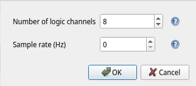

# 17 - Santa's Sleigh

## Description

Level: Hard<br/>
Author: dr_nick

As everyone seems to modernize, Santa has bought a new E-Sleigh. Unfortunately, its speed is limited. Without the
sleight's full capabilities, Santa can't manage to visit all kids... so he asked Rudolf to hack the sleigh for him.

I wonder if it worked.

Unfortunately, Rudolph is already on holiday. He seems to be in a strop because no one needs him to pull the sledge now.
We only got this raw data file he sent us.

## Solution

For this challenge we are given a file [SantasSleigh.raw](SantasSleigh.raw) that contains some text in the range `[0,
3]`. After trying to decode the contents directly for a while, I came across [an interesting Github
repository](https://github.com/teixeluis/escooter-lcd-esc-decode). They intercept the serial communications between the
Electronic Speed Controller (ESC) and the LCD. Therefore, I assumed that we were given this communication and started to
try to decode it.

To decode the communication I used pulseview. Getting the right decoding took a while and that's why I will describe the
steps in a bit more detail here.

1. When importing the raw file we have to specify the sample rate in Hz. I used 2000 for this (it will be relevant later
   on)



2. At this point, the communication (TX and RX) could be seen:


Next, a decoder was needed to actually interpret the data. Since we were dealing with serial data (RS-232), I entered
that into the list of available decoders and chose the only available option "Modbus". Note that this decoder is based
on the (more low-level) "UART" decoder which would have worked just as well.

To configure the decoder, I initially used the following settings:


I obtained the baud rate by first checking the length of a single bit:


and then I simply used `1/2ms = 500 symbols/second` as the baud rate. This already gave me the correct RX data:

```
Hello!
Tell me the secret!
So, give me the flag instead
Please!
Thx!
```

Unfortunately, the TX data was unusable. After a while I figured out that I had to chose 7 instead of 8 data bits in the
UART decoder. I incorrectly assumed it to be [8N1](https://en.wikipedia.org/wiki/8-N-1). With this setting I then
obtained the TX data:

```
Hi
Never
No way
Ok, here it is: HV22{H4ck1ng_S4nta's_3-Sleigh}.
```
