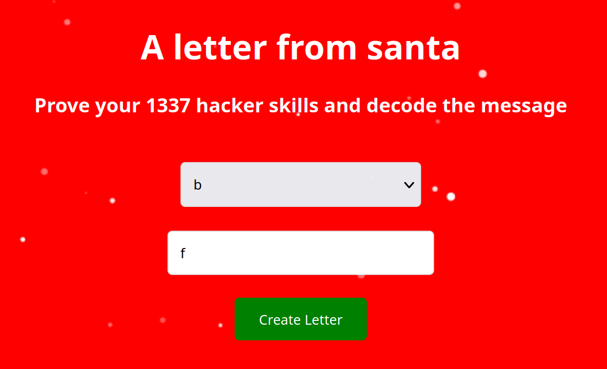
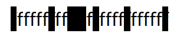
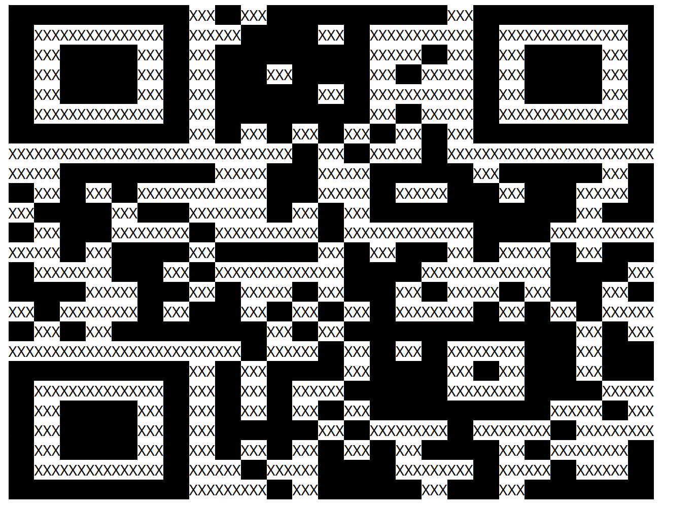

# 01 - A letter from Santa

## Description

Level: Easy<br/>
Author: coderion

Finally, after 11 months of resting, Santa can finally send out his presents and challenges again.
He was writing a letter to his youngest baby elf, who's just learning his ABC/A-Z's.
Can you help the elf read the message?

## Solution

For this challenge we are given [a ZIP file](a-letter-from-santa.zip) that contains the source of a website.
The website looks like this:



We can select a letter from the alphabet (which somehow influences the message) as well as enter an arbitrary text.
For the letter `b` in combination with the letter `f`, we get this output:

```
fffffffffffffffffffffffff
```

Some `f`s are backed out though:



The blacked out characters only seemed to depend on the letter selected of the alphabet.
Moreover, the string output had a length of 25 which hinted at the dimensions of a QR code.
I decided to write the following script:

```python
import requests
import string

URL = "https://030029e6-ad43-4951-9442-33c64b7ac112.idocker.vuln.land/"
data = ""

for char in string.ascii_lowercase:
    params = {
        "alphabet_select": char,
        "user_input": "XXX"
    }
    response = requests.post(URL, data=params)
    data += response.text
    data += "<br/>"

with open("output.html", "w") as f:
    f.write(data)
```

It goes over all letters and uses them as input once. The output of the above program is a html page
which looks like this:



As already expected, we can see a QR code which we can scan to get the flag `HV23{qr_c0des_fun}`.


