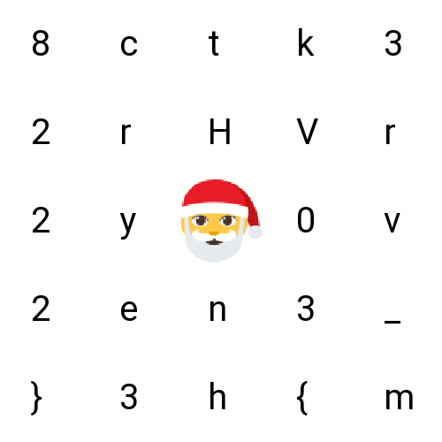

# 03 - Santa's grille

## Description

Level: Easy<br/>
Author: brp64

While contemplating the grille and turning some burgers, Santa decided to send all the hackers worldwide some season's
greetings.



## Solution

The name and text of the challenge hint
at [a Turning Grille cypher](https://en.wikipedia.org/wiki/Grille_(cryptography)).
Using [this solver](https://www.dcode.fr/turning-grille-cipher) and substituting some special characters which didn't
seem to work on that site, we can start working on the pattern we will use to decrypt. Such a cypher works by using a
rotating grid to decide which letter are read, then the grid is rotated by 90 degrees and the letter are read again and
so on.

For our flag, we know that it starts with `HV23{`, so we can try all the combinations (4 in total), to obtain the
flag: `HV23{M3RRY_H8CKVENT2023}`. Note, that we know that the bottom right corner has to be used since the last rotation
gives the final `}` that we need to close the flag. The correct grid configuration (grille) for this challenge is:

```
OOOOO
OOXXO
XOOOO
OOOOO
OXOXX
```
