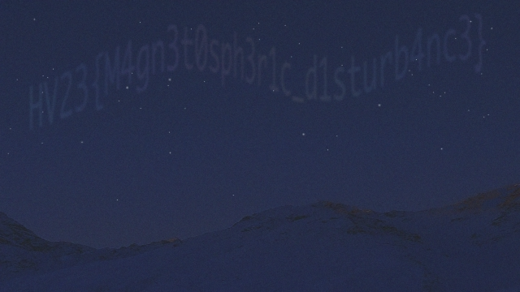

# 05 - Aurora

## Description

Level: Easy<br/>
Author: monkey9508

The Northern Lights appeared at exceptionally low latitudes this year due to the high level of solar activity. But from
Santa's grotto at the North Pole, it's not unusual at all to see them stretching across the sky. Snowball the elf tried
to capture a video of the aurora for his Instagram feed, but his phone doesn't work well in poor light, and the results
were rather grainy and disappointing. Is there anything you can do to obtain a clearer image?

## Solution

For this challenge we are given [aurora.mp4](aurora.mp4), a file with a rather noisy looking night sky. The flag seems
to be showing up in the sky, but it's barely readable. We can convert the whole video into a single image using this
command:

```shell
convert aurora.mp4 -evaluate-sequence mean out.tif
```

This calculates the mean between all the frames and saves it as a single file:



with this we can read the flag `HV23{M4gn3t0sph3r1c_d1sturb4nc3}`.
