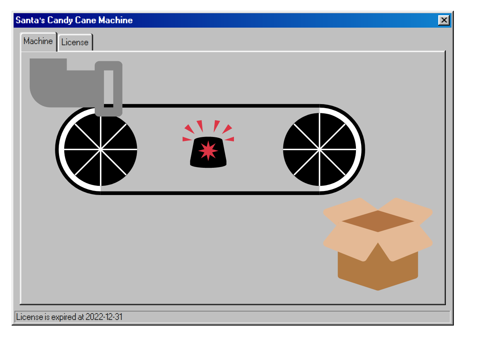
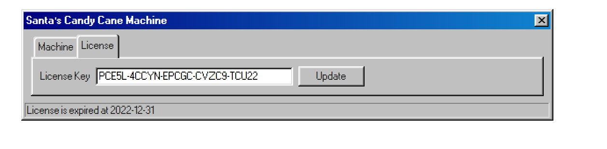
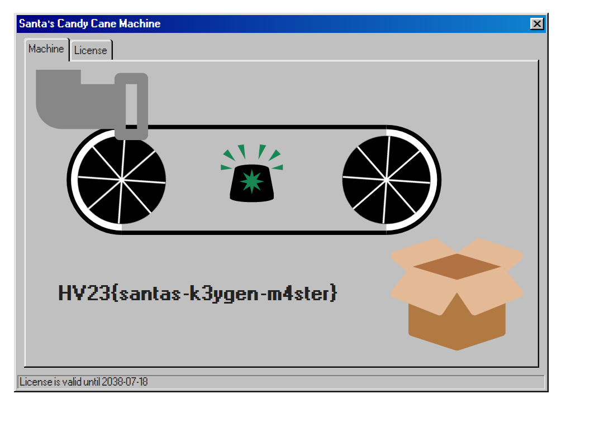

# 20 - Santa's Candy Cane Machine

## Description

Level: Hard<br/>
Author: keep3r

As Santa wanted to start producing Candy Canes for this years christmas season, his machine wouldn't work anymore. All
he got was some error message about an "expired license". Santa tried to get support from the manufacturer.
Unfortunately, the company is out of business since many years.

One of the elves already tried his luck but all he got out of the machine was a `.dll`!

Can you help Santa license his Candy Cane machine and make all those kids happy for this years christmas?

## Solution

We are given a dll file for this challenge and are tasked to fix the expired license of a machine.
The machine is represented by a web server that shows the following:





Note, that we are given an expired license. Perhaps we can use this known license to generate a new one. At this point I
took a look at the binary using [the dotPeek decompiler](https://www.jetbrains.com/decompiler/). The binary was quite
large and seemed to contain the license check logic. First, some important delimiters of the license are checked:

```csharp
if (str == null || str.Length != 29 || str[5] != '-' || str[11] != '-' || str[17] != '-' || str[23] != '-')
    return false;
```

Then, the characters are mapped according to some lookup table:

```csharp
public static readonly byte[] candyMap = new byte[256] { ... };


for (int index = 0; index < 29; ++index) {
  ...
  byte candy = CandyCane.candyMap[(int) str[index] & (int) byte.MaxValue];
  if (candy >= 32)
    return false;
  arr[num++] = candy;
}
```

This already limited the search space of potential licenses since we knew the character
set `23456789ABCDEFGHJKLMNPQRSTUVWXYZ`. The last interesting part is this one:

```csharp
public static readonly byte[] shuffler = new byte[24] {
        (byte) 26,
        (byte) 1,
        (byte) 5,
        (byte) 20,
        (byte) 15,
        (byte) 2,
        (byte) 21,
        (byte) 25,
        (byte) 27,
        (byte) 3,
        (byte) 13,
        (byte) 31,
        (byte) 20,
        (byte) 27,
        (byte) 27,
        (byte) 11,
        (byte) 18,
        (byte) 27,
        (byte) 26,
        (byte) 11,
        (byte) 0,
        (byte) 23,
        (byte) 3,
        (byte) 26
    };
  
private static byte ComputeShuffle(IReadOnlyList<byte> arr) {
    uint num = 0;
    
    for (int index = 0; index < 24; ++index) {
        num += arr[index] + CandyCane.shuffler[index];
    }
    
    return num % 32;
}
  
private static bool UnshuffleArray(byte[] arr) {
    byte shuffle = CandyCane.ComputeShuffle((IReadOnlyList<byte>)arr);
    byte index1 = arr[24];
    
    if (shuffle >= (byte)32 || index1 >= (byte)32)
        return false;
            
    byte[] numArray = new byte[25];
    byte[] candyMixHorizontal = CandyCane.candyMixHorizontals[(int)index1];
    for (int index2 = 0; index2 < 24; ++index2)
        numArray[index2] = candyMixHorizontal[(int)arr[index2]];
    byte[] candyMixVertical = CandyCane.candyMixVerticals[(int)shuffle];
    for (int index3 = 0; index3 < 24; ++index3)
        arr[(int)candyMixVertical[index3]] = numArray[index3];
    return true;
}
```

We can see that all the characters of the license are used to calculate some form of hash via `ComputeShuffle`.
Then, some shuffles are performed based on the result of `ComputeShuffle` as well as the last character of the license.
Finally, the license is decoded into a data structure that contains, amongst other things, an expiry date.

All we had to do now, was to use the existing license and shuffle it until the license turned out to be valid. This
works because the `ComputeShuffle` is not a proper hash function but instead just a sum modulo 32. When we re-arrange
the characters of the license, then the sum stays the same and the same shuffle will be applied as long as we don't
change the last character. Using this we can hope to find a license that decodes into something sensible and an expiry
date that is large enough:

```csharp
string serial = "CGTYE-GECCE-M5PVN-42LUC-C9CC2";
string alpha = serial.Replace("-", "");
var random = new Random();

while (true) {
  string current = "";
  List <char> possibleChars = alpha.ToList<char>();

  for (int i = 0; i < 29; i++) {
    if (i == 5 || i == 11 || i == 17 || i == 23) {
      current += "-";
      continue;
    }

    int r = random.Next(possibleChars.Count);
    current += possibleChars[r];
    possibleChars.RemoveAt(r);

  }
  
  var license = CandyCaneLicense.Create(current);

  if (license != null) {
    if (!license.IsExpired()) {
      Console.WriteLine(current); // CLMEC-5CCCC-GP4YT-2VNEE-G9CU2
      break;
    }
  }
}
```

And just like that, we have a license that gives us the flag:



Note that I didn't even use the fixed last character for my exploit. It was even possible to directly bruteforce valid
licenses. Clearly, this was a well-thought-out challenge with lots of detail, I learned a lot once again. The full
solution can be found in [Solver.cs](Solver.cs).
