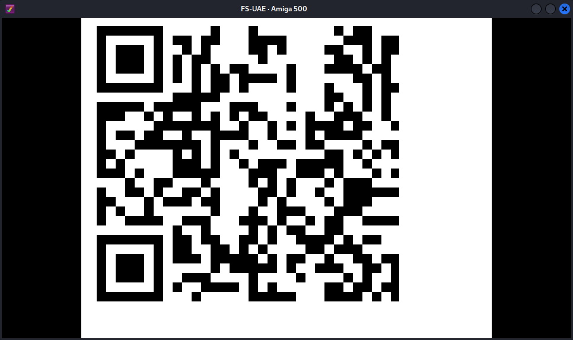

# 24 - Santa's Shuffled Surprise

## Description

Level: Leet<br/>
Author: JokerX

Santa found a dusty old floppy disk in his basement. He started the disk in his A500, but the QR code looks shuffled.
Can you help him to read the QR code?

## Solution

This was the final challenge of this year. We are given [santas-shuffled-surprise.adf](santas-shuffled-surprise.adf) a
binary for an [Amiga](https://en.wikipedia.org/wiki/Amiga). Emulating it
using [fs-uae](https://archlinux.org/packages/extra/x86_64/fs-uae/) we are greeted by a nice text, some awesome
Christmas music
as well as a shuffled QR code:



Next, I installed [ghidra amiga ldr](https://github.com/lab313ru/ghidra_amiga_ldr) a plugin that allows us to load the
[Amiga hunks](https://en.wikipedia.org/wiki/Amiga_Hunk). Using `unadf` we can obtain the actual binary that is contained
within the `.adf` file. Now, we can open the binary in Ghidra and start reversing:

```c
void start() {
  XOR_decrypt();
  openLib();
  
  if (!in_ZF) {
    initIO();
    main();
    freeIO();
  }
  closeLib();
}
```

The first function seems to XOR some data with `0x42`, if we perform the XOR on the whole DATA segment, we can see:

```
JOKERX IS PROUD TO PRESENT: HV23 DAY 24
CHALLENGE DONE BY: JOKERX ON DECEMBER 23, 2023
GREETS GO OUT TO 0xI FOR PLAYTESTING, JOGEIR LILJEDAHL FOR THE MUSIC AND TO ARNAUD CARRE FOR LSP
PRESS LMB TO SHOW QR-CODE OR CONTACT US!
POBOX 1337  1234 WONDERLAND!
SOON COMING MORE AND MORE AMIGA CHALLENGES FROM $ JOKERX $
CALL OUR BOARDS
$ HAPPY ISLAND $ JOKERX WORLD HQ (555)555-1337
YOU MADE IT TO THE END, THANKS FOR READING ALL THE TEXT!
YEAH, FOR REALZ, IT'S OVER! ;)        
NEVER GONNA GIVE YOU UP :D    
OK, ONE MORE EFFECT WITH THE TEXTSCROLLER CAUSE YOU WON'T STOP READING :P
SPECIAL GREETS GO OUT TO    $BACHMMA1$#       
MERRY X-MAS TO ALL OF YOU AT THE    HACKVENT
```

This is the scrolling text shown before we see the shuffled QR code. Next, we dig deeper into the `main`:

```c
void main() {
  shuffle();
  
  show_string();
  show_string();
  show_string();
  show_string();
  show_string();
  show_string();
  show_string();
  
  plot_qr();
  cleanup();
  return;
}
```

We can see two interesting functions, `shuffle` as well as `plot_qr`:

```c
void plot_qr() {
  byte * i = & qr_start;

  // this is where the pixels are written to
  graphics_location = * A6;

  for (short x = 0; k < 16; k++) {
    for (short y = 0; y < 29; y++) {
      byte current = * i;
      i++;

      ushort mask = 128;

      while (mask != 0) {
        char output = 0;
        char output2 = 0;

        // the mask here goes 128, 32, 8, 2
        if ((mask & current) != 0) {
          output = 255;
        }

        // the mask here goes 64, 16, 4, 1
        if ((mask / 2 & current) != 0) {
          output2 = 255;
        }

        mask /= 4;

        // output and output2 are merged and written to the graphics
        for (int j = 0; j < 8; j++) {
          * graphics_location = CONCAT11(output, output2);
          graphics_location += 20;
        }
      }
      // moves to the next iteration
      graphics_location += 160;
    }
  }
}

void rotate(void) {
  for (int i = 0; i < 24; i++) {
    D6 = lookup_table[current];
    D0 = lookup_table[current + 1];
    D4 = lookup_table[current + 2];
    D5 = lookup_table[current + 3];

    rotate_inner(D6, D0, D4, D5);
    current += 4;
  }
}

void rotate_inner(D6, D0, D4, D5) {
  i = D4 - 1;

  do {
    if (D5 == 0) {
      if (D0 != -1) {
        j = 28;
        a = ( & location_a)[D0];
        b = & location_a + D0;
        do {
          temp2 = b;
          * temp2 = temp2[-4];
          j--;
          b = temp2 - 4;
        } while (j != -1);
        * temp2 = a;
      }

      j = 3;
      if (D6 != -1) {
        a = ( & location_b)[D6 * 4];
        c = & location_b + D6 * 4;
        do {
          temp = c;
          * temp = temp[1];
          j--;
          c = temp + 1;
        } while (j != -1);
        * temp = a;
      }
    } else {
      if (D6 != -1) {
        j = 3;
        a = ( & location_c)[D6 * 4];
        b = & location_c + D6 * 4;
        do {
          temp2 = b;
          * temp2 = temp2[-1];
          j--;
          b = temp2 + -1;
        } while (j != -1);
        * temp2 = a;
      }
      if (in_D0 != -1) {
        j = 28;
        a = ( & location_b)[D0];
        c = & location_b + D0;
        do {
          temp = c;
          * temp = temp[4];
          j--;
          c = temp + 4;
        } while (j != -1);
        * temp = a;
      }
    }
    i--;
  } while (i != -1);
}
```

Note that Ghidra failed to properly decompile the code sometimes and I had to do some manual reversing here and there.
The `plot` logic is quite simple, it just prints the whole QR code. `rotate_qr` is more interesting, it modifies the QR
code by rotating either rows or columns or both. The instruction which operation is performed is stored in `table`. This
code runs until we press the left mouse button (LMB). We can now generate all possible QR codes that can be obtained by
these rotations and automatically scan them to find the correct code.

At this point I translated both `plot` and `rotate_qr` into Python code which took forever.

```python
def plot(qr, location):
    pixels = []

    for current in qr:
        mask = 128

        while mask != 0:
            output = 1
            output2 = 1

            # the mask takes the values 128, 32, 8, 2
            if (mask & current) != 0:
                output = 0

            # the mask takes the values 64, 16, 4, 1
            if ((mask // 2) & current) != 0:
                output2 = 0

            mask = mask // 4
            pixels.append(output * 255)
            pixels.append(output2 * 255)

    data = struct.pack('B' * len(pixels), *pixels)
    img = Image.frombuffer('L', (32, 29), data)
    img.save(location)


def rotate_inner(qr, row, col, n, direction):
    for _ in range(n):
        if direction == 0:
            # rotate column D0 upward starting at the end of the column
            if col != -1:
                index = (28 * 4) + col
                a = qr[index]

                for _ in range(28):
                    qr[index] = qr[index - 4]
                    index -= 4

                qr[index] = a

            # rotate row D6 to the right starting at the beginning of the row
            if row != -1:
                index = row * 4
                a = qr[index]

                for _ in range(3):
                    qr[index] = qr[index + 1]
                    index += 1

                qr[index] = a

        else:
            # rotate row D6 to the left starting at the end of the row
            if row != -1:
                index = 3 + row * 4
                a = qr[index]

                for _ in range(3):
                    qr[index] = qr[index - 1]
                    index -= 1

                qr[index] = a

            # rotate column D0 downward starting at the start of the column
            if col != -1:
                index = col
                a = qr[index]

                for _ in range(28):
                    qr[index] = qr[index + 4]
                    index += 4

                qr[index] = a
    return qr
```

Next, I looked for the lookup table as well as the QR code. All that's left to do now is to loop and try all rotations:

```python
# from 0x0021f186
lookup_table = bytes.fromhex(
    "ff0301000aff01000bff0100ff0101010dff01000eff0100ff010101ff0201011102010012ff010013ff0100ff0102010eff01000aff0100ff010100ff0301000d020100ff0101000f01010114010101ff020100ff02010113ff0100ff010101")


def rotate(qr):
    current = 0
    for _ in range(24):
        D6 = lookup_table[current]
        D0 = lookup_table[current + 1]
        D4 = lookup_table[current + 2]
        D5 = lookup_table[current + 3]

        # signed byte
        if D6 == 0xff:
            D6 = -1

        # signed byte
        if D0 == 0xff:
            D0 = -1

        qr = rotate_inner(qr, D6, D0, D4, D5)
        current += 4

    return qr


current_qr = bytearray.fromhex(
    "fea7f57082773b40bac86a90bae31a08bac2ca7082ac72e8fe0b2ac000d0ab08fbaa2070e588cd004faad2cdcb58b6d98f10dbf62dd59be945698bd89cc5683f1322e70be9d9a8d800a071849eac83f8a4f008a00050efe8fe9e08f882ad9ae8ba43b880baf9cff8bab8acf082b09b50fe2b29d0")

for i in range(10_000):
    current_qr = rotate(current_qr)
    plot(current_qr, f"./out/{str(i)}.png")
```

Finally, we can scan all the codes generated using `zbarimg` and we find the
flag `HV23{J4y_M1n3r_4nd_M17chy_m4d3_17_p0551bl3!!!}`. The complete solve script can be found in [solve.py](solve.py).
Although, it took quite some time to get all the details right when writing the Python script. I really liked this
challenge!
