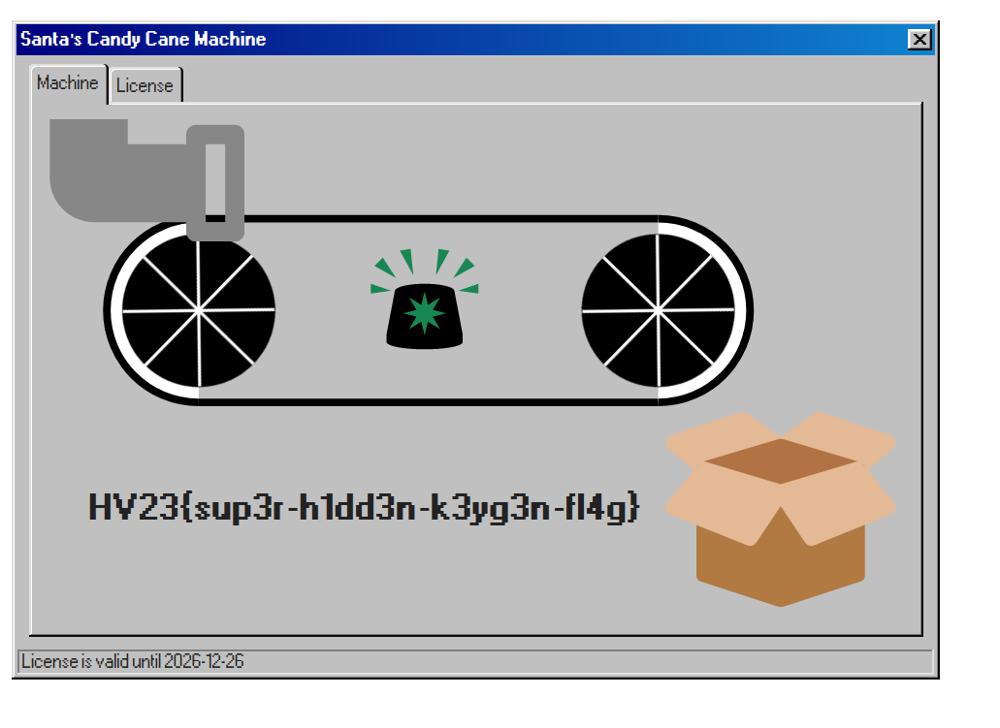

# H3 - Santa's Secret

## Description

Level: Hard<br/>

## Solution

The hard hidden flag this year could be found when generating a very specific license for [HV20](../20/README.md):

```csharp
string serial = "CGTYE-GECCE-M5PVN-42LUC-C9CC2";
string alpha = serial.Replace("-", "");
var random = new Random();

while (true) {
  string current = "";
  List <char> possibleChars = alpha.ToList<char>();

  for (int i = 0; i < 29; i++) {
    if (i == 5 || i == 11 || i == 17 || i == 23) {
      current += "-";
      continue;
    }

    int r = random.Next(possibleChars.Count);
    current += possibleChars[r];
    possibleChars.RemoveAt(r);

  }
  
  var license = CandyCaneLicense.Create(current);

  if (license != null) {
    // Additional checks to obtain the hidden flag
    if (!license.IsExpired() && license.ProductType == ProductLicense.ProductTypes.Premium && license.ProductName == ProductLicense.ProductNames.CandyCaneMachine2000) {
      Console.WriteLine(current); // GGEME-V2P9E-C4CCC-YLTUN-CCC52
      break;
    }
  }
}
```

For the hidden flag, we need the correct product type (Premium) as well as the correct product name (CandyMachine2000).
When we now enter the license on the website, we get:


