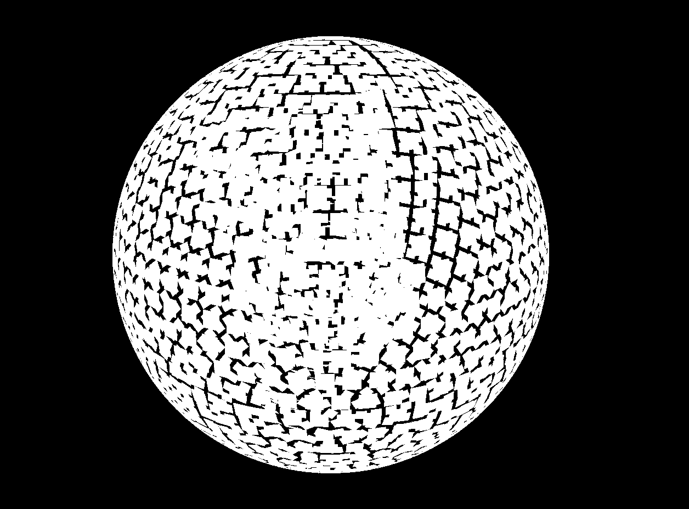
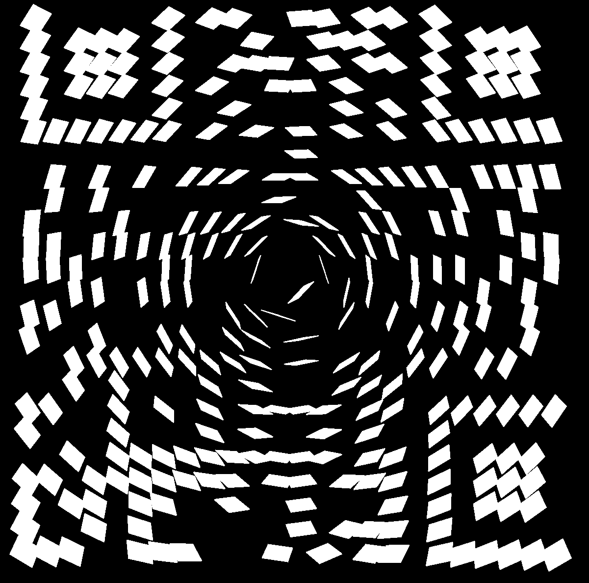
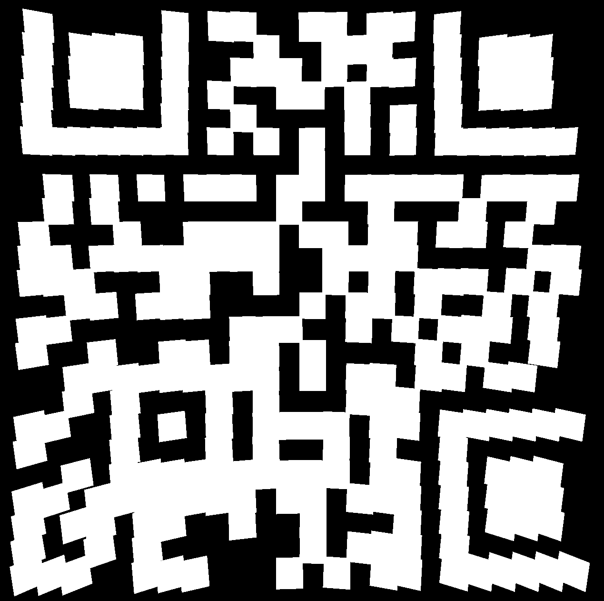
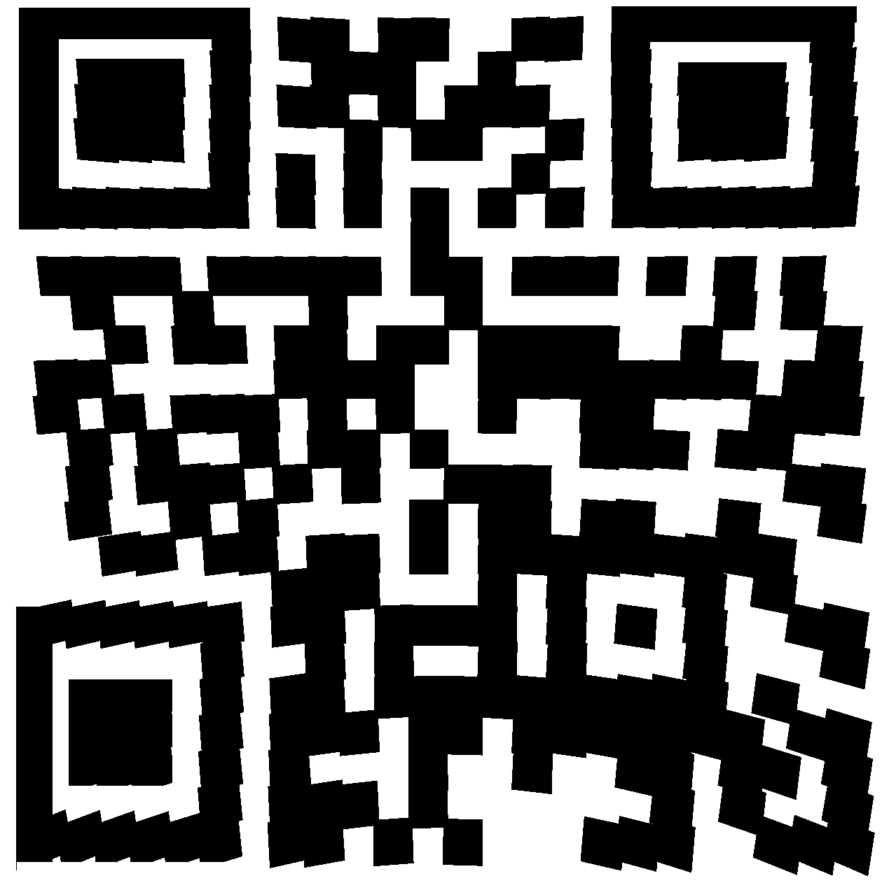

# 04 - Disco 2

## Description

Level: easy<br/>
Author: inik

This year, we dance outside, yeaahh! See [here](https://hackyeaster.hacking-lab.com/hackyeaster/challenges/disco2/disco2.html).

## Solution

I opened the website on my phone and saw that I was able to zoom inside the disco ball. Inside was something that
resembled a QR code. It was clear that I had to display only the mirrors inside the ball.

Firstly I downloaded the whole website with the following command:

```
wget --mirror -p --convert-links -P ./disco https://hackyeaster.hacking-lab.com/hackyeaster/challenges/disco2/disco2.html
```

Now I was able to modify the JavaScript and play around with it.
To zoom inside the disco ball I set the `minDistance` of the controls to zero:

```javascript
controls.minDistance = 0;
```

Then I removed the sphere of the disco ball by simply commenting the following line:

```javascript
// scene.add(sphereMesh);
```

After that I added a new material for the mirror tiles:

```javascript
var tileMaterial = new THREE.MeshLambertMaterial({
  color : 0xfffffff,
  opacity : 1,
  metalness : 1.0,
  diffuse : 1
});

tileMaterial.reflectivity = 0;
```



Now I only had to remove the mirros of the sphere so that only the QR code would be visible.

```javascript
for (let i = 0; i < mirrors.length; i++) {
  var m = mirrors[i];
  if (m[0] < 275 && m[0] > -275 && m[1] < 275 && m[1] > -275 && m[2] < 275 && m[2] > -160) {
    mirrorTile = new THREE.Mesh(tileGeom, tileMaterial);

    mirrorTile.position.set(m[0], m[1], m[2]);
    mirrorTile.lookAt(center);
    scene.add(mirrorTile);
  }
}
```



Almost done, changing the center point fixes the rotation of the tiles. This  will make the QR code scannable:

```javascript
center = new THREE.Vector3(-1.96, 67, 391);
```



I had to slightly adjust the edges by hand so that the QR code would be accepted.



