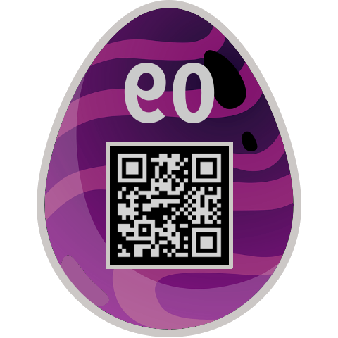

# 09 - rorriM rorriM

## Description

Level: easy<br/>
Author: PS

Mirror, mirror, on the wall, who's the fairest of them all?

[evihcra.piz](files/evihcra.piz)

## Solution

From the filename and the challenge name it was obvious that we would have to revert the order of bytes to get a valid
ZIP archive. I wrote some Java code to revert all the bytes of the file.

```java
private static void reverse(byte[] data) {
    for (int i = 0; i < data.length / 2; i++) {
        byte temp = data[i];

        data[i] = data[data.length - i - 1];
        data[data.length - i - 1] = temp;
    }
}

private static void reverseFile(String name, String ending) throws IOException {
    Path fileLocation = Paths.get(name + "." + ending);
    byte[] data = Files.readAllBytes(fileLocation);

    reverse(data);

    Path outputPath = Paths.get(new StringBuilder(name).reverse().toString() + "." + (new StringBuilder(ending).reverse().toString()));
    Files.write(outputPath, (byte[]) data, StandardOpenOption.CREATE_NEW);
}
```

Then I unzipped the archive and got a new file called `90gge.gnp`.
Opening the file in HEX showed that the PNG header bytes were reversed:

```
00000000: 8947 4e50 0d0a 1a0a 0000 000d 4948 4452  .GNP........IHDR
```

Changing them to PNG and opening the image with GIMP showed the following image:



Inverting the colours and flipping the image revealed the correct QR code:


