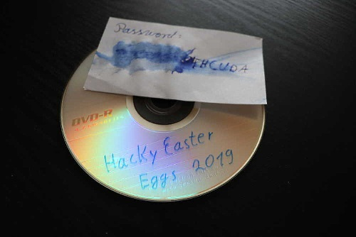
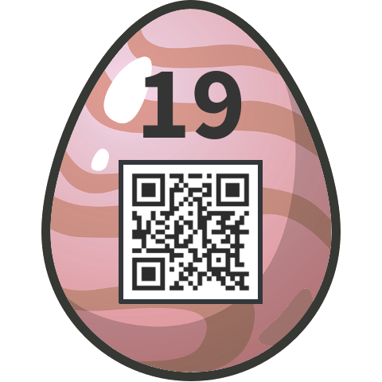

# 19 - CoUmpact DiAsc

## Description
Level: hard<br/>
Author: darkstar

Today the new eggs for HackyEaster 2019 were delivered, but unfortunately the password was partly destroyed by a water damage.



## Solution

From the challenge title it was clear that this had something to do with [CUDA](https://en.wikipedia.org/wiki/CUDA).
The image shows a password that ends in `THCUDA`.

The decompiled source code showed the following main function:

```c
int main() {
    unsigned __int8 *v4;
    unsigned __int8 *v5;
    unsigned int *v6;
    unsigned __int8 *v7;
    unsigned __int8 *v8;

    unsigned int *block_amount;
    unsigned int *plain_text;

    cudart::threadState **v14;
    cudart::threadState **v17;
    cudart::threadState **v20;

    __int64 v13;
    __int64 v16;
    __int64 v19;

    unsigned int v15;
    unsigned int v18;
    unsigned int v21;

    char input[16];
    int key[4];

    printf("Enter Password: ");
    fgets(input, 17, stdin);

    for (int i = 0; i <= 3; ++i) {
        key[i] = (input[4 * i + 1] << 8)
                 | (input[4 * i + 2] << 16)
                 | (input[4 * i + 3] << 24)
                 | input[4 * i];
    }

    cudaMalloc(&plain_text, 0x10);
    cudaMalloc(&block_amount, 0xB0);
    cudaMalloc(&v8, 0x100);
    cudaMalloc(&v7, 0x100);
    cudaMalloc(&v6, 0x28);
    cudaMalloc(&v5, 0x1000);
    cudaMalloc(&v4, 16 * block_amount);
    cudaMemcpy(plain_text, key, 16LL, 1LL);
    cudaMemcpy(v8, &v3, 256LL, 1LL);
    cudaMemcpy(v7, &v4, 256LL, 1LL);
    cudaMemcpy(v6, &v2, 40LL, 1LL);
    cudaMemcpy(v5, &v7, 4096LL, 1LL);
    cudaMemcpy(v4, &plain_text, 16 * block_amount, 1LL);

    dim3::dim3(&v13, 1u, 1u, 1u);
    dim3::dim3(&v14, 1u, 1u, 1u);

    if (!(unsigned int) _cudaPushCallConfiguration(v14, v15)) {
        f13(v8, v7, v6, v5, 1);
    }

    checkError();

    dim3::dim3(&v16, 1u, 1u, 1u);
    dim3::dim3(&v17, 1u, 1u, 1u);
    if (!(unsigned int) _cudaPushCallConfiguration(v17, v18)) {
        f3(plain_text, block_amount, v8, v6, 1);
    }

    dim3::dim3(&v19, 0x40u, 1u, 1u);
    dim3::dim3(&v20, 0x47u, 1u, 1u);

    if (!(unsigned int) _cudaPushCallConfiguration(v20, v21)) {
        f12(v4, block_amount, v7, v5, block_amount);
    }

    checkError();

    cudaMemcpy(&plain_text, v4, 16 * block_amount, 2LL);
    checkError();

    FILE *stream = fopen("egg", "wb");
    fwrite(&plain_text, 1, 16 * block_amount, stream);
    fclose(stream);

    return 0;
}
```

From there several CUDA kernels are called. The password length and the multiplications with 16 imply that it's AES 128
in ECB mode. All I had to do now was to bruteforce the password. The intended solution was probably to use CUDA for
this. I used [Tiny AES](https://github.com/kokke/tiny-AES-c) to decrypt the first block and compare it to the PNG
header. The following code was mainly written by [DrSchottky](https://github.com/DrSchottky), I only made some minor
changes. We made the assumption that the password only consisted of upper-case letters and ended with `WITHCUDA`.

```c
#define ECB 1
#define THREADS_NUM 26

uint8_t cipherText[16] = { 0x71, 0x31, 0xAD, 0x54, 0xEF, 0x04, 0xDB, 0xA5, 0x03, 0x30, 0x0C, 0x0F, 0xF7, 0xBD, 0x83, 0x8E };
uint8_t kp[8] = { 0x89, 0x50, 0x4E, 0x47, 0x0D, 0x0A, 0x1A, 0x0A };

void transform_key(char const * input, uint8_t *output) {
    int* ptr = (int *) output;

    for (size_t i = 0; i <= 3; i++) {
        ptr[i] = (input[4 * i + 1] << 8) | (input[4 * i + 2] << 16) | (input[4 * i + 3] << 24) | input[4 * i];
    }
}

void * decrypt(void *start) {
    char starting_letter = *(char *) start;
    char key[16] = {starting_letter, '\0', '\0', '\0', '\0', '\0', '\0', '\0', 'W', 'I', 'T', 'H', 'C', 'U', 'D', 'A'};
    uint8_t output_key[16];
    uint8_t tmp_ciphertext[16];

    printf("Thread %c\n", starting_letter);

    for (char a = 'A'; a <= 'Z'; a++) {
        key[1] = a;

        for (char b = 'A'; b <= 'Z'; b++) {
            key[2] = b;

            for (char c = 'A'; c <= 'Z'; c++) {
                key[3] = c;

                for (char d = 'A'; d <= 'Z'; d++) {
                    key[4] = d;

                    for (char e = 'A'; e <= 'Z'; e++) {
                        key[5] = e;

                        for (char f = 'A'; f <= 'Z'; f++) {
                            key[6] = f;

                            for (char g = 'A'; g <= 'Z'; g++) {
                                key[7] = g;

                                transform_key(key, output_key);
                                struct AES_ctx ctx;
                                AES_init_ctx(&ctx, output_key);

                                memcpy(tmp_ciphertext, cipherText, 16);
                                AES_ECB_decrypt(&ctx, tmp_ciphertext);

                                if (!memcmp(tmp_ciphertext, kp, 8)) {
                                    char printableKey[17];
                                    memcpy(printableKey, key, 16);
                                    printableKey[16] = '\0';

                                    printf("Found: %s\n", printableKey);
                                    return NULL;
                                }
                            }
                        }
                    }
                }
            }
        }
    }
}

int main() {
    setbuf(stdout, NULL);
    pthread_t threads[THREADS_NUM];
    char starts[THREADS_NUM];

    size_t i;
    for (i = 0; i < THREADS_NUM; i++) {
        starts[i] = (char) (i + 65);
        pthread_create(&threads[i], NULL, decrypt, (void *) &starts[i]);
    }

    for (i = 0; i < THREADS_NUM; i++) {
        pthread_join(threads[i], NULL);
    }

    return 0;
}
```

After about half an hour I got the password `AESCRACKWITHCUDA`. I then used this to decrypt the ciphertext:

```c
#define ECB 1

uint8_t completeCipherText[] = { // data
};

void transform_key(char const * input, uint8_t *output) {
    int* ptr = (int *) output;

    for (size_t i = 0; i <= 3; i++) {
        ptr[i] = (input[4 * i + 1] << 8) | (input[4 * i + 2] << 16) | (input[4 * i + 3] << 24) | input[4 * i];
    }
}

int main() {
    FILE* file = fopen( "solved.png", "wb" );

    char key[16] = { 'A', 'E', 'S', 'C', 'R', 'A', 'C', 'K', 'W', 'I', 'T', 'H', 'C', 'U', 'D', 'A' };
    uint8_t output_key[16];
    transform_key(key, output_key);

    struct AES_ctx ctx;
    AES_init_ctx(&ctx, output_key);

    for (size_t j = 0; j < sizeof(completeCipherText) / 16; j++) {
        AES_ECB_decrypt(&ctx, j * 16 + completeCipherText);
    }

    fwrite(completeCipherText , 1, sizeof(completeCipherText), file );

    return 0;
}
```

From this I got the flag:


