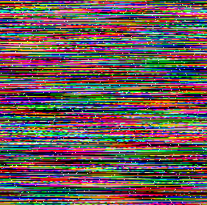
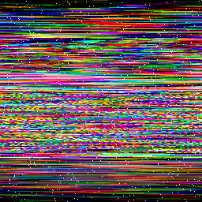

# 20 - Scrambled Egg

## Description

Level: hard<br/>
Author: darkstar

This Easter egg image is a little distorted...<br/>
Can you restore it?



## Solution

The scrambled image contains exactly three transparent pixels per row. Those pixels have either R, G or B set. The value
of the components, however, is always the same in each row. For example the first row has those three transparent
pixels:

```
(r=0,g=23,b=0)
(r=23,g=0,b=0)
(r=0,g=0,b=23)
```

Because the value is unique per row, I guessed that this had to determine the order of the rows. Doing so gives the
following image:



The area that usually contains the QR code is heavily distorted. From here I tried several things that lead nowhere.
I knew that I had to merge the pixels in each row based on the information I got from the transparent pixel.

To do so I divided each row into chunks. One row looks like this:

```
P1, P2, P3, TP1, P4, P5, P6, TP2, P7, P8, TP3, P9
```

`P` stands for a normal pixel and `TP` is a transparent pixel. From this row we get the following chunks:

```
Chunk 1: P4, P5, P6
Chunk 2: P7, P8
Chunk 3: P9, P1, P2, P3
```

Note that I simply appended the pixels that appeared before the first transparent pixel to the last chunk. Now I had to
merge the chunks. Unfortunately the chunks don't have equal lengths. To solve this I appended the other chunks to get
complete rows:

```
Chunk 1, Chunk 2, Chunk 3
Chunk 2, Chunk 3, Chunk 1
Chunk 3, Chunk 1, Chunk 2
```

Finally, we can merge the three rows into one. From each row I only took the components that the invisible pixel had
set. If, for example, `TP1` had the red value set then I took the red values from `Chunk 1, Chunk 2 and Chunk 3` and
added them to the current values.

```java
private static void mixColoursOfChunks(Deque<List<Integer>> allPixels, Color[] colours, ColourMode mode) {
    var i = 0;

    for (var chunk : allPixels) {
        for (var element : chunk) {
            var colour = colours[i];

            var cRed = colour.getRed();
            var cGreen = colour.getGreen();
            var cBlue = colour.getBlue();

            switch (mode) {
                case RED:
                    colours[i++] = new Color(getRed(element) + cRed, cGreen, cBlue);
                    break;
                case BLUE:
                    colours[i++] = new Color(cRed, cGreen, getBlue(element) + cBlue);
                    break;
                case GREEN:
                    colours[i++] = new Color(cRed, getGreen(element) + cGreen, cBlue);
                    break;
            }
        }
    }
}
```

The restored egg looks like this:


The complete source code is available [here](ScrambledEgg.java).
