# 21 - The Hunt: Misty Jungle

## Description

Welcome to the longest scavenger hunt of the world!

The hunt is divided into two parts, each of which will give you an Easter egg. Part 1 is the **Misty Jungle**.

To get the Easter egg, you have to fight your way through a maze. On your journey, find and solve **8** mini challenges,
then go to the exit. Make sure to check your carrot supply! Wrong submissions cost one carrot each.

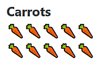

[start the hunt](http://whale.hacking-lab.com:5337/)

## Solution

This challenge consists of multiple mini challenges. First of all I visited the website:


Then I visited the feedback site, which looked like this:


Now I knew that there are three paths in total. From the description of the last hidden challenge it was clear, that
a secret level must be hiding somewhere. You can find more on that [in this writeup](../27).

After reading through the how-to, I started the hunt. All I could see was a blank page:

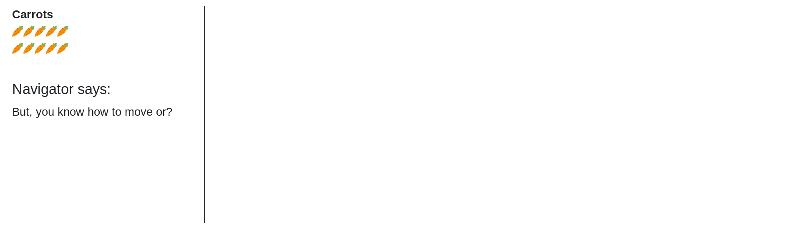

This was a dead end and so I went back and search for clues. On one tab of the how-to I found this text ```
``bqq`vsm``0npwf0y0z```. Subtracting one from each ascii value gives the following text: `__app_url__/move/x/y`. Now
it's clear how I can navigate the environment.

First of all I wrote a maze solver to navigate. I won't go into more detail on how I did this, the [whole source
code](java/src/main/java/MistyJungle.java) is available in this repository.

### Warmup

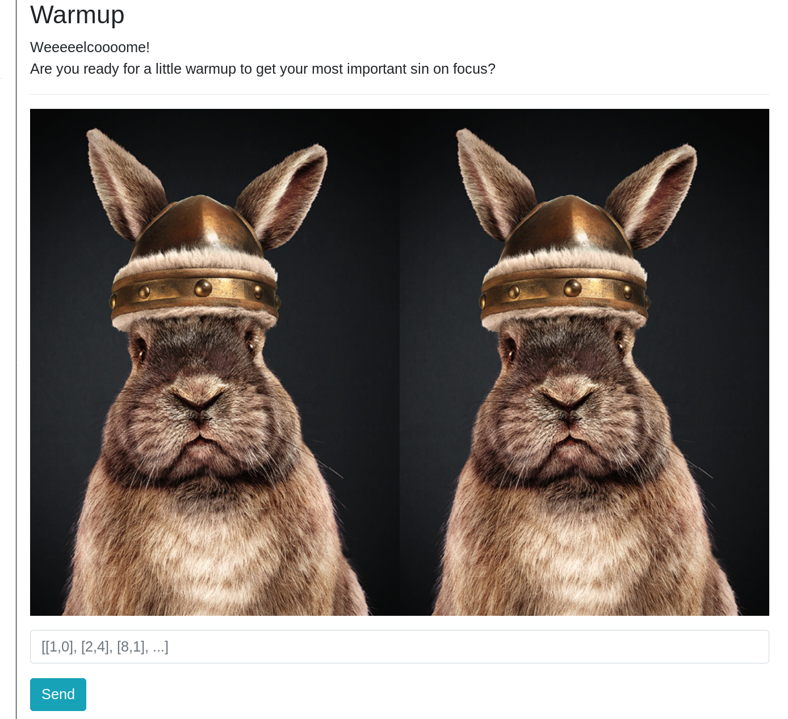

In this challenge I simply had to compare the two images. One of the two images changed after every try so this had to
be considered when implementing the solver.

```java
private static List<MyPoint> solveWarmup(String url) throws IOException {
    BufferedImage original = ImageIO.read(new File("original.png"));
    BufferedImage modified = ImageIO.read(new URL(BASE + "static/img/ch11/challenges/" + url));

    List<MyPoint> diffs = new ArrayList<>();

    for (int i = 0; i < original.getHeight(); i++) {
        for (int j = 0; j < original.getWidth(); j++) {

            int rgb = original.getRGB(j, i);
            int rgb2 = modified.getRGB(j, i);

            if (rgb != rgb2) {
                diffs.add(new MyPoint(i, j));
            }
        }
    }

    return diffs;
}

String imageUrl = "";
List<MyPoint> diff = solveWarmup(imageUrl);
String solved = diff.toString();
```

After solving this challenge I realized that it was also possible to just send an empty array (`[]`). This was probably
not intended.

### C0tt0nt4il Ch3ck V2.0

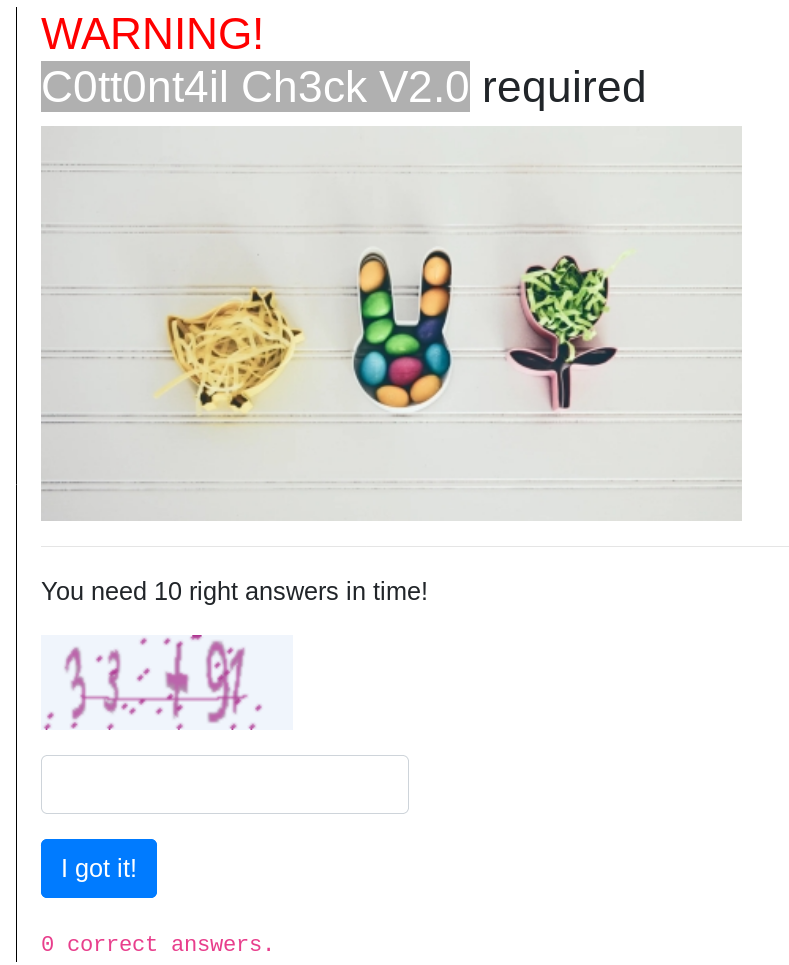

At first I thought I had to convert the captcha images and solve the equations. From the URLs we can get the correct
answer, though: ``. In this
example 124 was the correct answer. I wrote a function that extracts the correct answer and sends the result ten times.

### Mathonymous 2.0

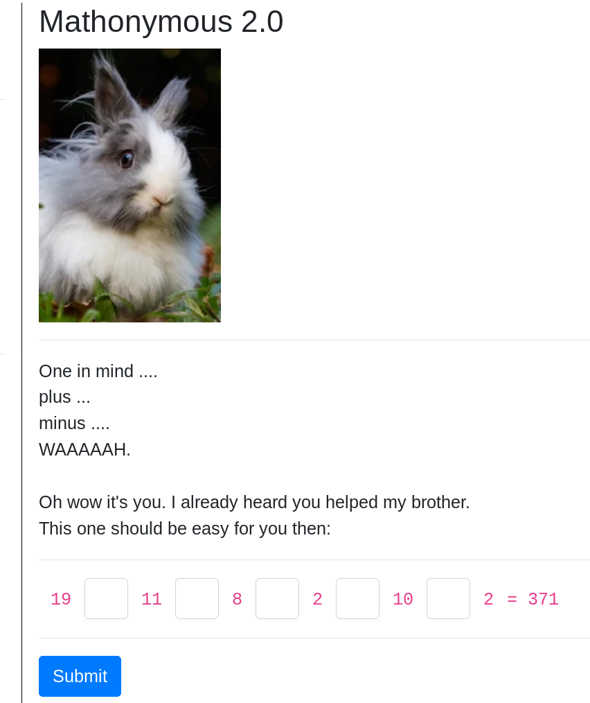

This challenge resembles the [countdown problem](https://en.wikipedia.org/wiki/Countdown_(game_show)#Numbers_round). We
get the operands of an equation and have to enter the correct operators. 

I wrote a function that goes through all possible operators (`+, -, *, /`) and tests if any combination gives the
expected result.

```java
private static String calculateMaths(List<Integer> operands, String current, double expected) throws ScriptException {
    // Base case
    if (operands.isEmpty()) {
        ScriptEngineManager manager = new ScriptEngineManager();
        ScriptEngine engine = manager.getEngineByName("JavaScript");

        Object result = engine.eval(current);
        Double calculatedResult;

        if (result instanceof Integer) {
            calculatedResult = ((Integer) result).doubleValue();
        } else {
            calculatedResult = (Double) result;
        }

        if (Math.abs(expected - calculatedResult) < 0.1) {
            return "";
        } else {
            return "NOK";
        }
    }

    Integer firstOperand = operands.remove(0);

    // Recursive cases
    String plusResult = calculateMaths(new ArrayList<>(operands), current + "+" + firstOperand, expected);
    String minusResult = calculateMaths(new ArrayList<>(operands), current + "-" + firstOperand, expected);
    String multiplyResult = calculateMaths(new ArrayList<>(operands), current + "*" + (double) firstOperand, expected);
    String divideResult = calculateMaths(new ArrayList<>(operands), current + "/" + (double) firstOperand, expected);

    if (!plusResult.contains("NOK")) {
        return "+" + plusResult;
    } else if (!minusResult.contains("NOK")) {
        return "-" + minusResult;
    } else if (!multiplyResult.contains("NOK")) {
        return "*" + multiplyResult;
    } else if (!divideResult.contains("NOK")) {
        return "/" + divideResult;
    } else {
        return "NOK";
    }
}
```

### Pumple's Puzzle

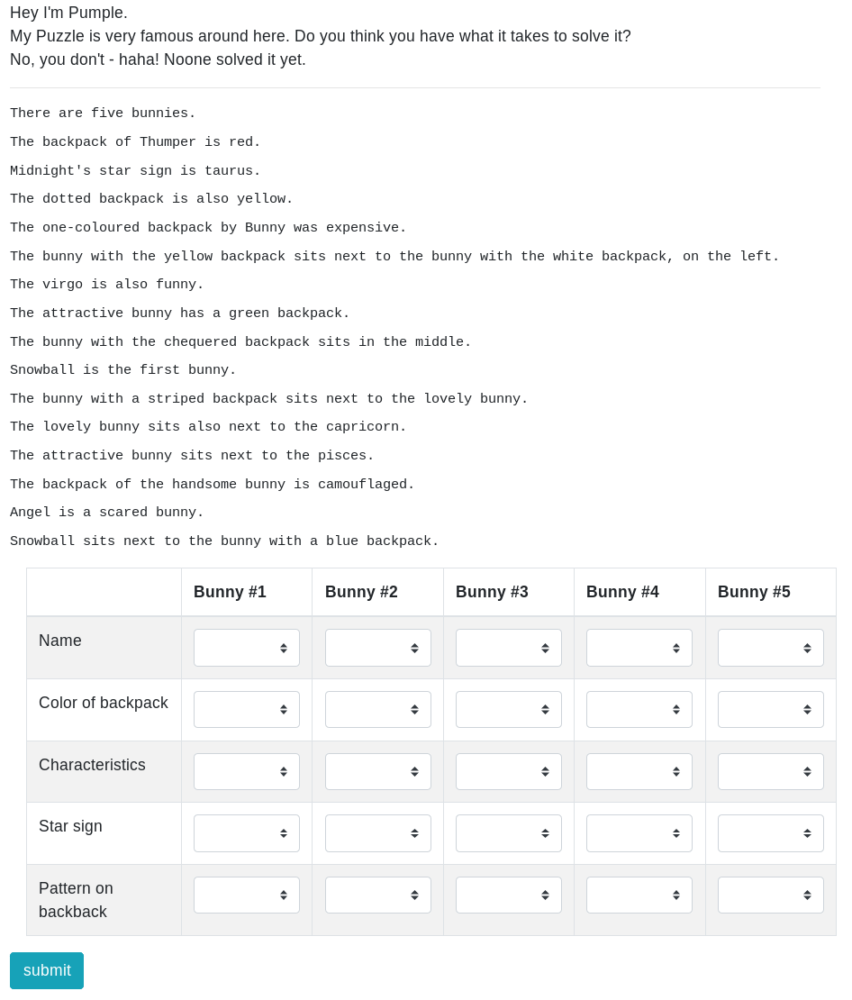

This was a quite difficult challenge. After some tries I realized that the pattern was always the same and only the
colours, names, patterns etc. changed. I solved the puzzle on paper and then wrote a function that extracts the relevant
data:

```java
private static String solvePumplesPuzzle(String[] hints) {
    String[] names = new String[5];
    String[] colours = new String[5];
    String[] characteristics = new String[5];
    String[] starSigns = new String[5];
    String[] patterns = new String[5];

    // The backpack of b3_name is b3_colour
    Pattern p1 = Pattern.compile("The backpack of (.+) is (.+)\\.");
    Matcher m1 = p1.matcher(hints[2]);
    m1.find();

    names[2] = m1.group(1);
    colours[2] = m1.group(2);

    // b5_name's star sign is b5_sign.
    Pattern p2 = Pattern.compile("(.+)&#39;s star sign is (.+)\\.");
    Matcher m2 = p2.matcher(hints[3]);
    m2.find();

    names[4] = m2.group(1);
    starSigns[4] = m2.group(2);

    // The b4_pattern backpack is also b4_colour.
    Pattern p3 = Pattern.compile("The (.+) backpack is also (.+)\\.");
    Matcher m3 = p3.matcher(hints[4]);
    m3.find();

    patterns[3] = m3.group(1);
    colours[3] = m3.group(2);

    // The b2_pattern backpack by b2_name was expensive.
    Pattern p4 = Pattern.compile("The (.+) backpack by (.+) was expensive\\.");
    Matcher m4 = p4.matcher(hints[5]);
    m4.find();

    patterns[1] = m4.group(1);
    names[1] = m4.group(2);

    // The bunny with the b4_colour backpack sits next to the bunny with the b5_colour backpack, on the left.
    Pattern p5 = Pattern.compile("The bunny with the (.+) backpack sits next to the bunny with the (.+) backpack, on the left\\.");
    Matcher m5 = p5.matcher(hints[6]);
    m5.find();

    colours[3] = m5.group(1);
    colours[4] = m5.group(2);

    // The b3_sign is also b3_char.
    Pattern p6 = Pattern.compile("The (.+) is also (.+)\\.");
    Matcher m6 = p6.matcher(hints[7]);
    m6.find();

    starSigns[2] = m6.group(1);
    characteristics[2] = m6.group(2);

    // The b1_char bunny has a b1_colour backpack.
    Pattern p7 = Pattern.compile("The (.+) bunny has a (.+) backpack\\.");
    Matcher m7 = p7.matcher(hints[8]);
    m7.find();

    characteristics[0] = m7.group(1);
    colours[0] = m7.group(2);

    // The bunny with the b3_pattern backpack sits in the middle.
    Pattern p8 = Pattern.compile("The bunny with the (.+) backpack sits in the middle\\.");
    Matcher m8 = p8.matcher(hints[9]);
    m8.find();

    patterns[2] = m8.group(1);

    // b1_name is the first bunny.
    Pattern p9 = Pattern.compile("(.+) is the first bunny\\.");
    Matcher m9 = p9.matcher(hints[10]);
    m9.find();

    names[0] = m9.group(1);

    // The bunny with a b1_pattern backpack sits next to the b2_char bunny.
    Pattern p10 = Pattern.compile("The bunny with a (.+) backpack sits next to the (.+) bunny\\.");
    Matcher m10 = p10.matcher(hints[11]);
    m10.find();

    patterns[0] = m10.group(1);
    characteristics[1] = m10.group(2);

    // The b2_char bunny sits also next to the b1_sign.
    Pattern p11 = Pattern.compile("The (.+) bunny sits also next to the (.+)\\.");
    Matcher m11 = p11.matcher(hints[12]);
    m11.find();

    characteristics[1] = m11.group(1);
    starSigns[0] = m11.group(2);

    // The b1_char bunny sits next to the b2_sign.
    Pattern p12 = Pattern.compile("The (.+) bunny sits next to the (.+)\\.");
    Matcher m12 = p12.matcher(hints[13]);
    m12.find();

    characteristics[0] = m12.group(1);
    starSigns[1] = m12.group(2);

    // The backpack of the b5_char bunny is p5_pattern.
    Pattern p13 = Pattern.compile("The backpack of the (.+) bunny is (.+)\\.");
    Matcher m13 = p13.matcher(hints[14]);
    m13.find();

    characteristics[4] = m13.group(1);
    patterns[4] = m13.group(2);

    // b4_name is a b4_char bunny.
    Pattern p14 = Pattern.compile("(.+) is a (.+) bunny\\.");
    Matcher m14 = p14.matcher(hints[15]);
    m14.find();

    names[3] = m14.group(1);
    characteristics[3] = m14.group(2);

    // b1_name sits next to the bunny with a b2_colour backpack.
    Pattern p15 = Pattern.compile("(.+) sits next to the bunny with a (.+) backpack\\.");
    Matcher m15 = p15.matcher(hints[16]);
    m15.find();

    names[0] = m15.group(1);
    colours[1] = m15.group(2);

    List<String> possibleSigns = new ArrayList<>(Arrays.asList("virgo", "capricorn", "aquarius", "pisces", "taurus"));

    possibleSigns.remove(starSigns[0]);
    possibleSigns.remove(starSigns[1]);
    possibleSigns.remove(starSigns[2]);
    possibleSigns.remove(starSigns[4]);

    starSigns[3] = possibleSigns.get(0);

    StringBuilder builder = new StringBuilder("Name");

    for (String name : names) {
        builder.append(",").append(name);
    }

    builder.append(",Color");

    for (String colour : colours) {
        builder.append(",").append(WordUtils.capitalize(colour));
    }

    builder.append(",Characteristic");

    for (String characteristic : characteristics) {
        builder.append(",").append(WordUtils.capitalize(characteristic));
    }

    builder.append(",Starsign");

    for (String starSign : starSigns) {
        builder.append(",").append(WordUtils.capitalize(starSign));
    }

    builder.append(",Mask");

    for (String patten : patterns) {
        builder.append(",").append(WordUtils.capitalize(patten));
    }

    return builder.toString();
}
```

### The Oracle

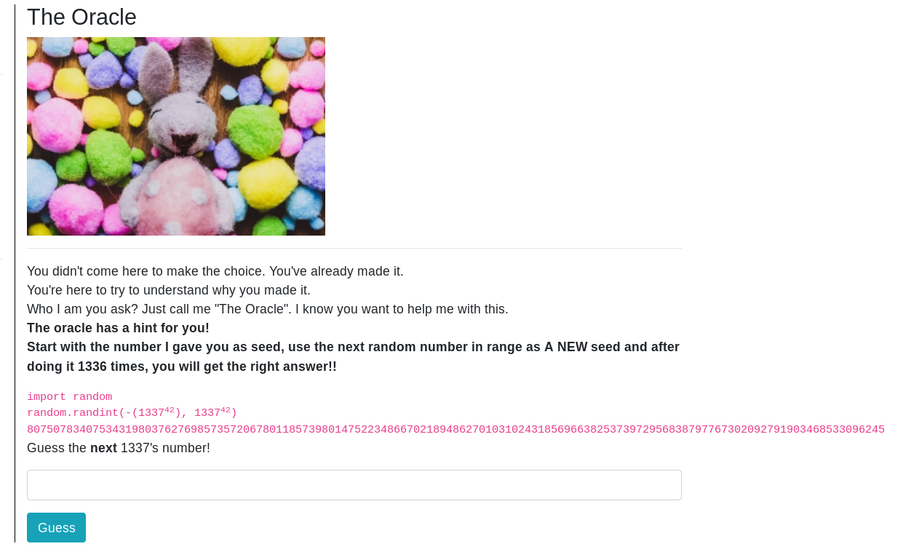

I solved this challenge with a python script that first initializes the seed and then generates 1337 new seeds:

```python
import random
import sys

initial = int(sys.argv[1])
current = initial

for i in range(1337):
  random.seed(current)
  current = random.randint(-(1337**42), 1337**42)

print (current)
```

The last value is the next guess.

### Punkt.Hase

![Punkt.Hase][images/punkthase.png]

In this challenge we get a blinking dot. I extracted the frames from the image and converted the frames to a binary
string with the help of the following function:

```java
private static String splitFrames() throws IOException, InterruptedException {
   Runtime.getRuntime().exec("convert frames/initial.gif frames/frame.png").waitFor();

   File[] files = new File("frames/").listFiles((file, s) -> s.contains("test"));
   
   Arrays.sort(files, (file, t1) -> {
       Pattern p = Pattern.compile("frame-(.+).png");
       String first = file.getName();
       String second = t1.getName();

       Matcher firstMatcher = p.matcher(first);
       firstMatcher.find();
       firstMatcher.group(1);
       Integer firstNr = Integer.valueOf(firstMatcher.group(1));

       Matcher secondMatcher = p.matcher(second);
       secondMatcher.find();
       Integer secondNr = Integer.valueOf(secondMatcher.group(1));

       return firstNr - secondNr;
   });

   StringBuilder binary = new StringBuilder();

   for (File file : files) {
       if (ImageIO.read(file).getRGB(0, 0) == -1) {
           binary.append("1");
       } else {
           binary.append("0");
       }
   }

   StringBuilder ascii = new StringBuilder();

   Arrays.stream(binary.toString().split("(?<=\\G.{8})"))
           .forEach(s -> ascii.append((char) Integer.parseInt(s, 2)));

   return ascii.toString();
}
```

### Pssst...

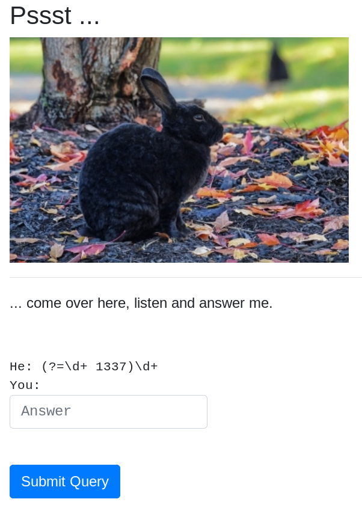

In this mini challenge we were asked to find a string that matches the supplied regex. I solved this challenge by hand because
I didn't find a smart solution.

For example for the regex `(?=\d+ 1337)\d+` the solution was simply `1 1337`.

### CLC32

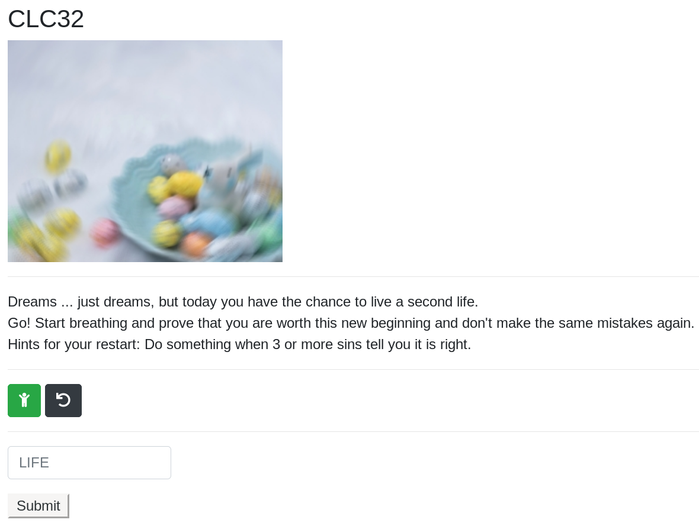

In this challenge we get a GraphQL backend that we can query. Using
[introspection](https://graphql.org/learn/introspection/) I was able to find the expected query structure. A query is
structured as follows:

```json
{
  "data": {
    "__type": {
      "fields": [
        {
          "name": "Out",
          "type": {
            "name": "Out",
            "kind": "OBJECT"
          }
        },
        {
          "name": "see",
          "type": {
            "name": "String",
            "kind": "SCALAR"
          }
        },
        {
          "name": "hear",
          "type": {
            "name": "String",
            "kind": "SCALAR"
          }
        },
        {
          "name": "taste",
          "type": {
            "name": "String",
            "kind": "SCALAR"
          }
        },
        {
          "name": "smell",
          "type": {
            "name": "String",
            "kind": "SCALAR"
          }
        },
        {
          "name": "touch",
          "type": {
            "name": "String",
            "kind": "SCALAR"
          }
        }
      ]
    }
  }
}
```

To query the backend I used the following query string:

```
{ In { Out { see, hear, taste, smell, touch }, see, hear, taste, smell, touch } }
```

The `Out` part was probably optional. An answer to a query looks like this:

```json
{
  "data": {
    "In": {
      "Out": {
        "see": "d",
        "hear": "d",
        "taste": "3",
        "smell": "k",
        "touch": "Z"
      },
      "see": "r",
      "hear": "W",
      "taste": "k",
      "smell": "U",
      "touch": "T"
    }
  }
}
```

From the hint we know that at least three senses have to gives us the same characters so that we can use it. I wrote a
function that queries the backend until I have at least four characters.

```java
private static String solveCLC32(HttpClient client) throws IOException, InterruptedException {
    StringBuilder builder = new StringBuilder();

    outer:
    while (true) {
        HttpRequest solutionRequest = HttpRequest
                .newBuilder()
                .header("Content-Type", "application/json")
                .POST(HttpRequest.BodyPublishers.ofString("{\n" +
                        "  \"query\": \"{ In { Out { see, hear, taste, smell, touch }, see, hear, taste, smell, touch } }\"\n" +
                        "}"))
                .uri(URI.create("http://whale.hacking-lab.com:5337/live/a/life"))
                .build();

        HttpResponse<String> response = client.send(solutionRequest, HttpResponse.BodyHandlers.ofString());

        JSONObject jsonObject = new JSONObject(response.body());

        Map<String, Integer> outerMap = new HashMap<>();
        JSONObject in = jsonObject.getJSONObject("data").getJSONObject("In");

        increaseMap(in, outerMap);

        for (String key : outerMap.keySet()) {
            if (outerMap.get(key) >= 3) {
                builder.append(key);

                if (builder.length() >= 4) {
                    break outer;
                }
            }
        }

        Map<String, Integer> innerMap = new HashMap<>();
        JSONObject out = jsonObject.getJSONObject("data").getJSONObject("In").getJSONObject("Out");
        increaseMap(out, innerMap);

        for (String key : innerMap.keySet()) {
            if (innerMap.get(key) >= 3) {
                builder.append(key);

                if (builder.length() >= 4) {
                    break outer;
                }
            }
        }
    }

    return builder.toString();
}
```

### Bunny-Teams

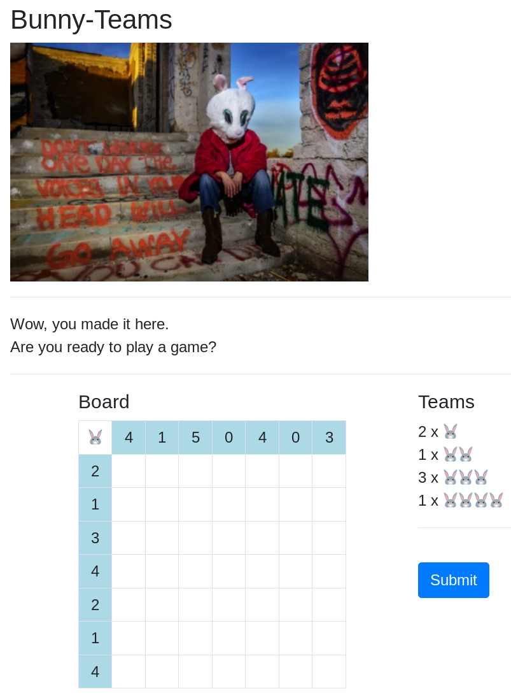

This challenge looks exactly like a [Bimaru](https://en.wikipedia.org/wiki/Battleship_(puzzle)) puzzle. I wasn't able to
solve it automatically so I just did it manually.

### Opa & CCrypto - Museum

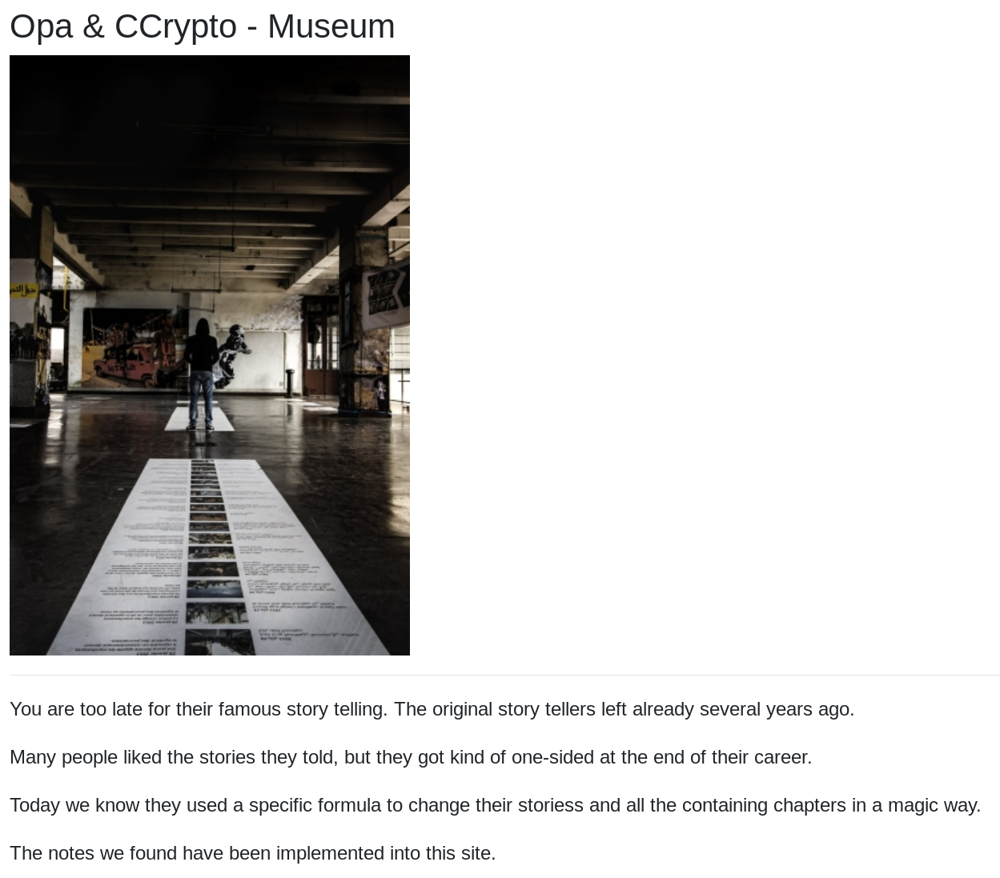

This was the final challenge of the first hunt. I took a look at the JavaScript of the website and got the following
code:

```js
let theBoxOfCarrots = [ /* a large array of arrays */ [], [], []];
let a = ['abcdefghijklmnopqrstuvwxyzABCDEFGHIJKLMNOPQRSTUVWXYZ0123456789'];
let c = 0;
let f = false;
let n = 0;
let s = 1;
let alive = true;
let age = 0;
let destiny = 7331;
let note = 'Whoever finds this may continue to tell our stories or may reveal the secret that is hidden behind all of them. gz opa & ccrypto'

function heOpened(a) {
    return a;
}

Object.prototype.and = function and() {
    if (s % 1 === 0) console.log('just');
    if (s % 3 === 0) console.log('a');
    if (s % 13 === 0) console.log('lie');
    if (s % 37 === 0) console.log('?');
    return this;
};

Object.prototype.then = function then() {
    s += 1;
    return this;
};

Object.prototype.heClosed = function heClosed() {
    this.sort((a, b) => {
        return a[0] - b[0]
    });
    return this;
};

Object.prototype.heShuffled = function heShuffled(what) {
    if (what === 'everything') {
        this.forEach((o, i) => {
            s = o[0] + Math.abs(Math.floor(Math.sin(s) * 20));
            this[i][0] = s;
        });

        this.forEach((o, i) => {
            this[i][1] += (i + ".");
        });
    }

    return this
};

Object.prototype.but = function but() {
    s = s;
    return this
};

Object.prototype.sometimes = function sometimes() {
    if (s % 133713371337 === 0) f = true;
    return this
};


Object.prototype.heForgot = function heForgot() {
    if (f) s = Math.abs(Math.floor(Math.sin(s) * parseInt(13.37)));
    f = false;
    return this
};

Object.prototype.heSaid = function heSaid(w) {
    let magic = 0;
    w.forEach((y) => {
        if (y === 'ca') {
            magic += 3;
        }
        if (y === 'da') {
            magic -= 1;
        }
        if (y === 'bra') {
            magic /= 2;
        }
    });
    s -= magic;
    return this;
};

Object.prototype.heDidThat = function heDidThat(a) {
    if (a === 'for a very long time.') {
        theBoxOfCarrots = this;
        age += 1;
        if (age > destiny) {
            alive = false;
        }
    }
};


Object.prototype.heRolled = function heRolled(a) {
    if (a === 'a really large dice') {
        n = Math.abs(Math.floor(Math.sin(s) * 1337));
    }
    return this
};


let tell_a_story = () => {
    while (alive) {
        heOpened(theBoxOfCarrots)
            .and().then().heRolled('a really large dice')
            .and().then().heSaid(['a', 'bra', 'ca', 'da', 'bra'])
            .but().sometimes().heForgot()
            .and().then().heShuffled('everything')
            .and().then().heClosed(theBoxOfCarrots)
            .and().heDidThat('for a very long time.');
    }
};

tell_a_story();
```

This code does a lot of unnecessary steps and can be simplified:

```js
let s = 1;

for (let j = 0; j < 7332; j++) {
    s += 2;

    theBoxOfCarrots.forEach((element, index) => {
        s = element[0] + Math.abs(Math.floor(Math.sin(s) * 20));
        element[0] = s;
        element[1] += (index + ".");
    });

    s++;

    theBoxOfCarrots.sort((a, b) => {
        return a[0] - b[0]
    });
}
```

I assumed that I had to revert this algorithm to get the original `boxOfCarrots`. To do this I first had to undo the
sorting operation, restore the `s` value as well as subtract the calculated value for the `element[0]`. The code that
reverses the algorithm looks like this:

```js
const a = 'abcdefghijklmnopqrstuvwxyzABCDEFGHIJKLMNOPQRSTUVWXYZ0123456789';

// Convert index string to array
box.forEach((element) => {
    element[1] = element[1].split(".").map(e => Number(e));
    element[1].splice(-1, 1); // remove last (empty) element
});

function compareByLastNr(a, b) {
    const firstOrder = a[1];
    const secondOrder = b[1];

    return secondOrder[secondOrder.length - 1] - firstOrder[firstOrder.length - 1];
}

function getPrevious(arr) {
    const copy = [...arr];
    copy.sort(compareByLastNr);
    return copy[0][0];
}

for (let i = 0; i < 7332; i++) {
    // restore order
    box.sort(compareByLastNr);

    // Remove last known index from string
    box.forEach(element => {
        element[1].splice(-1, 1);
    });

    box.forEach((element, index) => {
        let previousS;

        if (index === box.length - 1) {
            previousS = getPrevious(box) + 3;
        } else {
            previousS = box[index + 1][0];
        }

        if (i === 7331 && index + 1 === box.length) {
            previousS = 3;
        }

        element[0] -= Math.abs(Math.floor(Math.sin(previousS) * 20));
    });
}

const flag = box.map(element => a[element[0]])
    .reverse()
    .join('');

console.log(flag);
```

Running it gives the flag `he19-JfsM-ywiw-mSxE-yfYa`.
