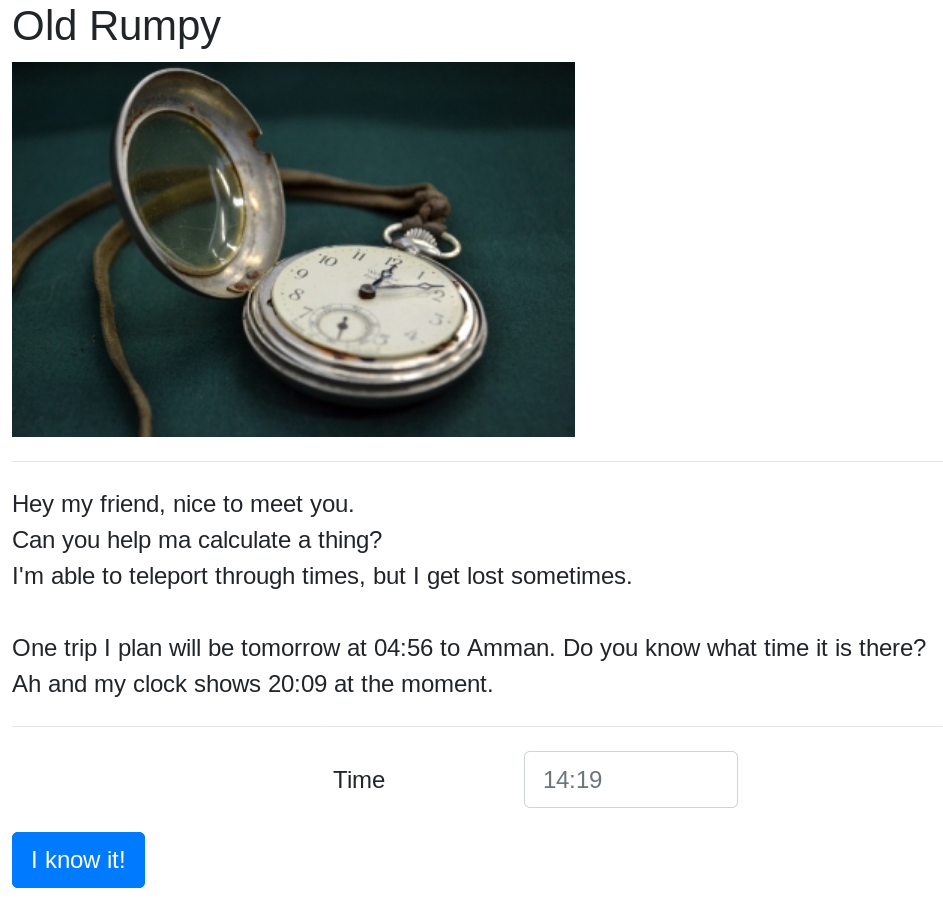
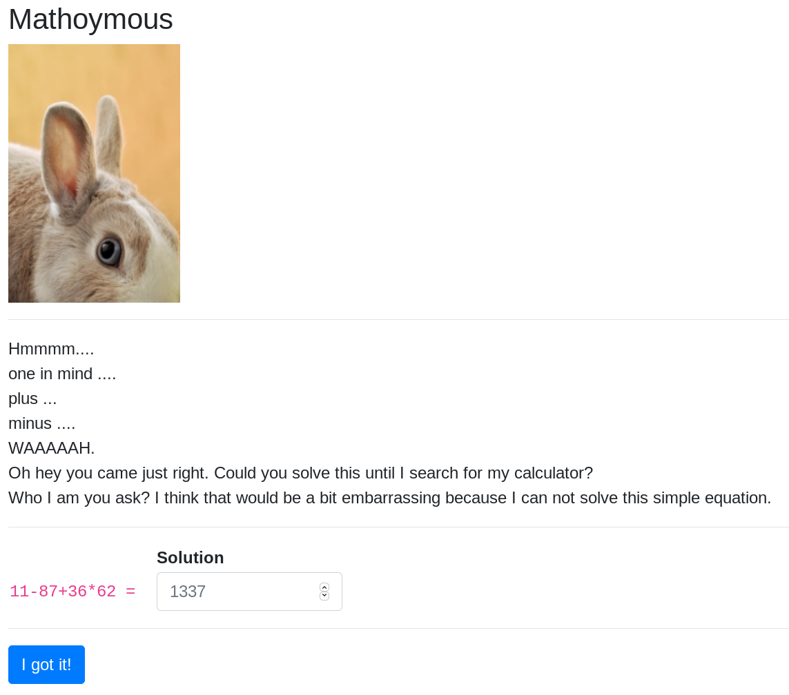
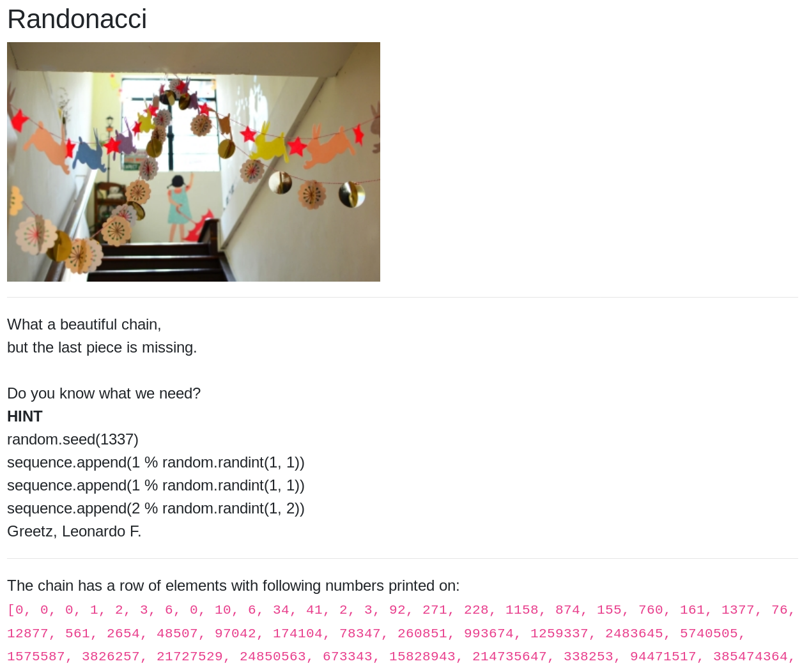
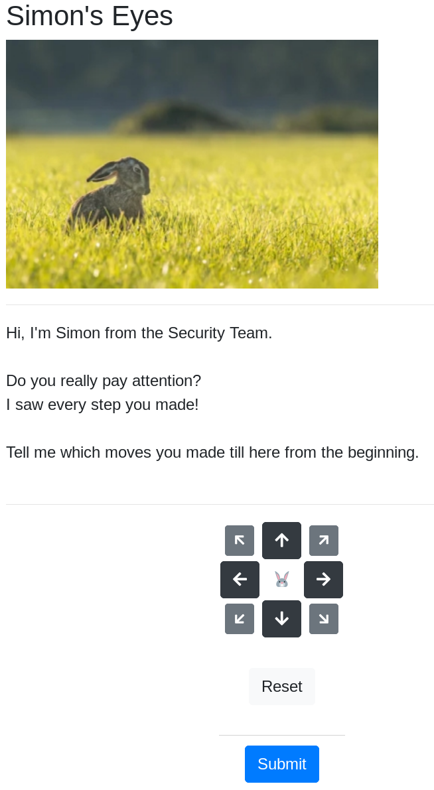
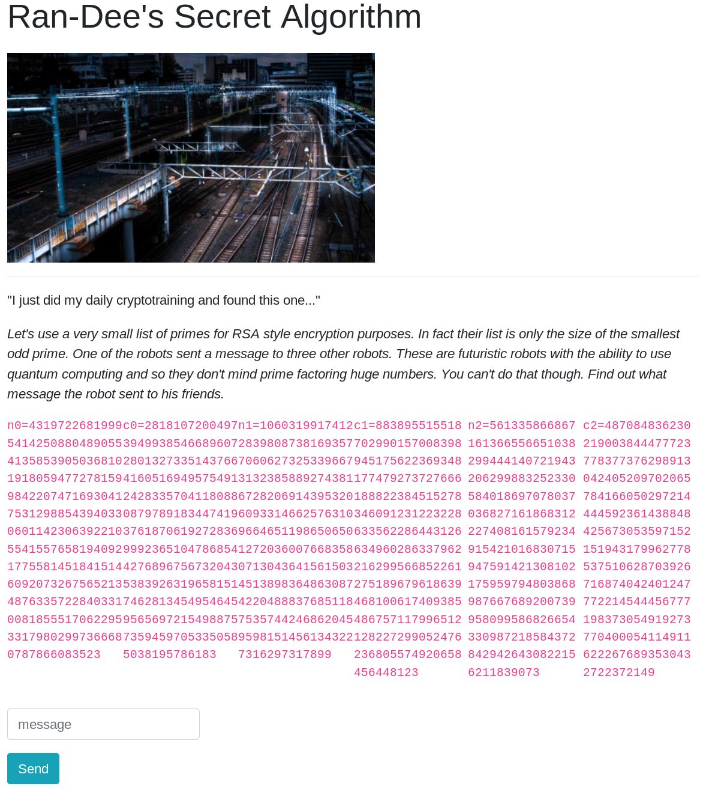
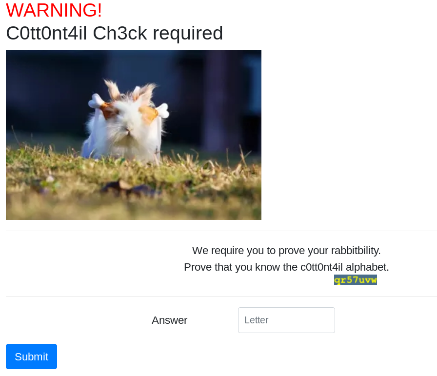
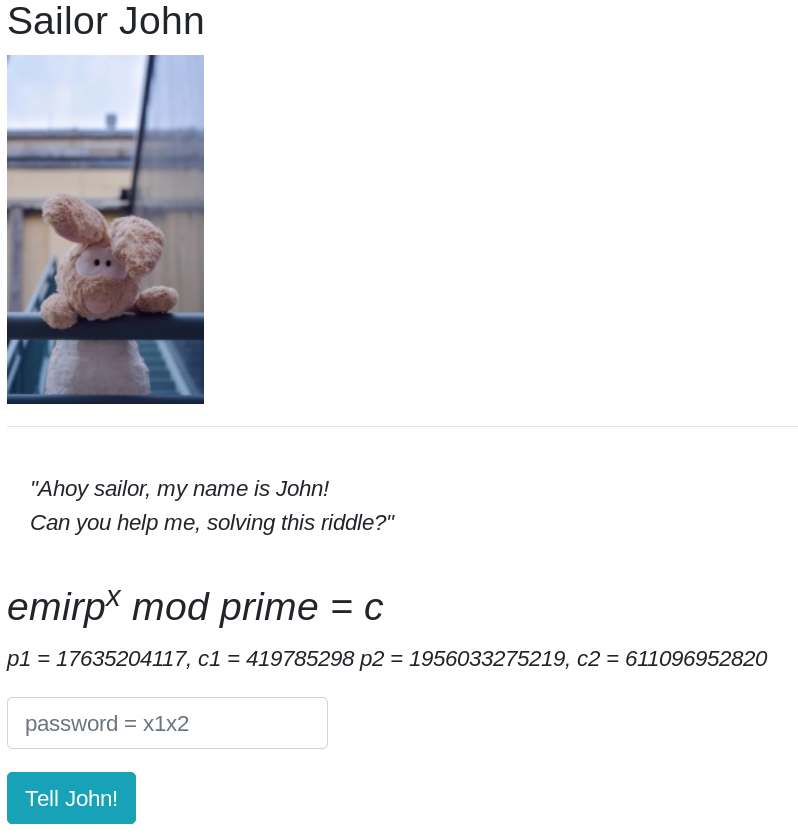
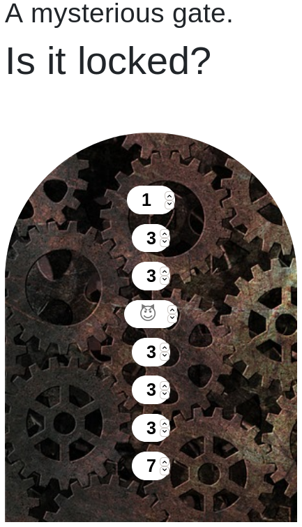

# 22 - The Hunt: Muddy Quagmire

## Description
Level: hard<br/>
Author: opasieben & ccrypto

Welcome to the longest scavenger hunt of the world!

The hunt is divided into two parts, each of which will give you an Easter egg. Part 1 is the **Muddy Quagmire**.

To get the Easter egg, you have to fight your way through a maze. On your journey, find and solve **9** mini challenges,
then go to the exit. Make sure to check your carrot supply! Wrong submissions cost one carrot each.


[start the hunt](http://whale.hacking-lab.com:5337/)

## Solution

This is the second part of the hunt. The writeup of the first part can be [found here](../21).

### Old Rumpy



In this challenge we're asked to calculate a time in a different timezone. I did this manually.
For the above image the solution was simply `04:56 + 03:00 = 07:56`.

### Mathoymous



This challenge was quite simple. I simply had to solve the equation. For this I used the following code:

```java
ScriptEngineManager mgr = new ScriptEngineManager();
ScriptEngine engine = mgr.getEngineByName("JavaScript");

Object result = engine.eval(question); // For example: 11-87+36*62
```

### Randonacci



The hint shows that we have to calculate the next random integer between `1` and the next [fibonacci
number](https://en.wikipedia.org/wiki/Fibonacci_number). The following code solves the puzzle:

```python
import random

fib = [0,1,1,2,3,5,8,13,21,34,55,89,144,233,377,610,987,1597,2584,4181,6765,10946,17711,28657,46368,75025,121393,196418,317811,514229,832040,1346269,2178309,3524578,5702887,9227465,14930352,24157817,39088169,63245986,102334155,165580141,267914296,433494437,701408733,1134903170,1836311903,2971215073,4807526976,7778742049,12586269025,20365011074,32951280099,53316291173,86267571272,139583862445,225851433717,365435296162,591286729879,956722026041,1548008755920,2504730781961,4052739537881,6557470319842,10610209857723,17167680177565,27777890035288,44945570212853,72723460248141,117669030460994,190392490709135,308061521170129,498454011879264,806515533049393,1304969544928657,2111485077978050,3416454622906707,5527939700884757,8944394323791464,14472334024676221,23416728348467685,37889062373143906,61305790721611591,99194853094755497,160500643816367088,259695496911122585,420196140727489673,679891637638612258,1100087778366101931,1779979416004714189,2880067194370816120,4660046610375530309,7540113804746346429,12200160415121876738,19740274219868223167,31940434634990099905,51680708854858323072,83621143489848422977,135301852344706746049,218922995834555169026,354224848179261915075,573147844013817084101,927372692193078999176,1500520536206896083277]

def F(n):
    return fib[n]

random.seed(1337)

for i in range(1, 103):
  random.randint(1, F(i))

print (F(103) % random.randint(1, F(103)))
```

The next number is `117780214897213996119`.

### Simon's Eyes



To solve this challenge I simply saved all my previous moves and built the answer based on those moves:

```java
List<String> answer = new ArrayList<>();

for (Point previousMove : allMoves) {
    int previousX = previousMove.x;
    int previousY = previousMove.y;

    if (previousX == 1 && previousY == 1) {
        answer.add("\"7\"");
    } else if (previousX == 1 && previousY == 0) {
        answer.add("\"4\"");
    } else if (previousX == 1 && previousY == -1) {
        answer.add("\"2\"");
    } else if (previousX == 0 && previousY == -1) {
        answer.add("\"1\"");
    } else if (previousX == -1 && previousY == -1) {
        answer.add("\"8\"");
    } else if (previousX == -1 && previousY == 0) {
        answer.add("\"3\"");
    } else if (previousX == -1 && previousY == 1) {
        answer.add("\"5\"");
    } else if (previousX == 0 && previousY == 1) {
        answer.add("\"6\"");
    } else {
        System.out.println("Unknown move");
    }
}

String path = "[" + String.join(",", answer) + "]";
```

### Ran-Dee's Secret Algorithm



From the hint we know that a prime factor has been reused. From two `n`s we can get the prime factors by simply using
`gcd`. This is much faster than factoring the prime numbers. 

The following code decrypts one of the cipher text:

```java
public static void main(String[] args) {
    BigInteger n0 = new BigInteger("43197226819995414250880489055413585390503681019180594772781599842207471693041753129885439403306011423063922105541557658194092177558145184151460920732675652134876335722840331008185551706229533179802997366680787866083523");
    BigInteger n1 = new BigInteger("10603199174122839808738169357706062732533966731323858892743816728206914395320609331466257631096646511986506501272036007668358071304364156150345138983648630874220488837685118753574424686204595981514561343227316297317899");
    BigInteger c0 = new BigInteger("28181072004973949938546689607280132733514376641605169495754912428335704118088087978918344741937618706192728369992365104786854427689675673204353839263196581517462813454954645956569721549887573594597053350585038195786183");

    BigInteger p1 = n0.gcd(n1);
    BigInteger q0 = n0.divide(p1);

    decrypt(q0, p1, n0, c0);
}

private static void decrypt(BigInteger p, BigInteger q, BigInteger n, BigInteger c) {
    BigInteger z = p.subtract(new BigInteger("1"))
            .multiply(q.subtract(new BigInteger("1")));

    BigInteger e = new BigInteger("2").pow(16).add(new BigInteger("1"));
    BigInteger d = e.modInverse(z);

    System.out.println(new String(c.modPow(d, n).toByteArray()));
}
```

The solution was `RSA3ncrypt!onw!llneverd!e`.

### Bun Bun's Goods & Gadgets


The first thing I tried here was to click on the button. After clicking it I realized that multiple requests
were sent to the server. The server replied to each of them with a 301 response code. 

The response headers of those requests looked like this:

```
HTTP/1.0 302 FOUND
Content-Type: shop/gun
Location: http://whale.hacking-lab.com:5337/
WhatYouHear: You are not really interested or?
Content-Length: 0
```

From there challenge description it was clear that I would have to buy an item. When using the buy button I received a
response with the [status code 418 I'M A TEAPOT](https://developer.mozilla.org/en-US/docs/Web/HTTP/Status/418). From
this it was clear that I had to buy the item `shop/teabag`.

All I had to do now was to issue the request at the correct time. As soon as I received the correct item, I sent a buy
request:

```java
HttpClient nonFollowingClient = HttpClient.newBuilder()
        .cookieHandler(CookieHandler.getDefault())
        .followRedirects(HttpClient.Redirect.NEVER)
        .build();

HttpRequest watchRequest = HttpRequest
        .newBuilder()
        .GET()
        .uri(URI.create(BASE + "?action=watch"))
        .build();

HttpResponse<String> watchResponse = nonFollowingClient.send(watchRequest, HttpResponse.BodyHandlers.ofString());

while (watchResponse.statusCode() == 302) {
    final String item = watchResponse.headers().firstValue("Content-Type").orElse("Unknown");
    final String next = watchResponse.headers().firstValue("Location").orElse("Unknown");

    if (item.endsWith("teabag")) {
        break;
    }

    watchRequest = HttpRequest
            .newBuilder()
            .GET()
            .uri(URI.create(next))
            .build();

    watchResponse = nonFollowingClient.send(watchRequest, HttpResponse.BodyHandlers.ofString());
}

HttpRequest buyRequest = HttpRequest
        .newBuilder()
        .GET()
        .uri(URI.create(BASE + "?action=buy"))
        .build();

HttpResponse<String> buyResponse = client.send(buyRequest, HttpResponse.BodyHandlers.ofString());
```

### C0tt0nt4il Ch3ck



In this challenge we get a moving image and we have to prove that we know the alphabet. The answer expects exactly one
letter. I assumed that it would always be the next letter in the alphabet and it worked most of the time. I'm not sure
if that's the correct solution though.

### Sailor John



In this challenge we get two equations that we have to solve. `emirp` is `prime` backwards so I used `p1` and `p2` respectively
with the digits reversed there. The two equations looked like this:

```
71140253671^x = 419785298 mod 17635204117
9125723306591^x = 611096952820 mod 1956033275219
```

Solving for x gives two [discrete logarithms](https://en.wikipedia.org/wiki/Discrete_logarithm). [This discrete
logarithm calculator](https://www.alpertron.com.ar/DILOG.HTM) implements the [Pohlig–Hellman
algorithm](https://en.wikipedia.org/wiki/Pohlig%E2%80%93Hellman_algorithm). Solving for x gives two results:

```
1647592057
305768189495
```

Converting both numbers to hex, then concatenating them together and finally converting that to ascii gives the password
`b4ByG14N7`. The password is a reference to the [baby-step giant-step
algorithm](https://en.wikipedia.org/wiki/Baby-step_giant-step) that can be used to solve discrete logarithms.

### Myterious gate



This was the final challenge of the second hunt. First of all I coped the JavaScript code:

```js
function h(s) {
    return s.split("").reduce(function (a, b) {
        a = ((a << 5) - a) + b.charCodeAt(0);
        return a & a
    }, 0);
}

var ca = function (str, amount) {
    if (Number(amount) < 0)
        return ca(str, Number(amount) + 26);
    var output = '';
    for (var i = 0; i < str.length; i++) {
        var c = str[i];
        if (c.match(/[a-z]/i)) {
            var code = str.charCodeAt(i);
            if ((code >= 65) && (code <= 90))
                c = String.fromCharCode(((code - 65 + Number(amount)) % 26) + 65);
            else if ((code >= 97) && (code <= 122))
                c = String.fromCharCode(((code - 97 + Number(amount)) % 26) + 97);
        }
        output += c;
    }
    return output;

};

$('.door').click(function () {
    var n = [
        $('#n1').val(),
        $('#n2').val(),
        $('#n3').val(),
        $('#n4').val(),
        $('#n5').val(),
        $('#n6').val(),
        $('#n7').val(),
        $('#n8').val()
    ];

    var g = 'Um';
    var et = 'iT';
    var lo = 'BG';
    var st = '4I';

    var into = 'xr';
    var the = 'Xp';
    var lab = 'rr';
    var hahaha = 'Qv';

    var ok = ca('mj19', -5) + '<br>' +
        ca(et, n[0]) +
        ca(the, n[1]) + '<br>' +
        ca(g, n[2]) +
        ca(lo, n[3]) + '<br>' +
        ca(st, n[4]) +
        ca(hahaha, n[5]) + '<br>' +
        ca(into, n[6]) +
        ca(lab, n[7]);

    $('#key').html(ok);

    if (h(n.join('')) === -502491864) {
        $('.door').toggleClass('what');
    }
});
```

Then I simplified it and wrote a small script to bruteforce the pin. I assumed that each digit was between -9 and 9
which turned out to be correct.

```js
function hash(s) {
    return s.split("").reduce(function (a, b) {
        return ((a << 5) - a) + b.charCodeAt(0);
    }, 0);
}

function calculateFlag(str, amount) {
    if (Number(amount) < 0) {
        return calculateFlag(str, Number(amount) + 26);
    }

    let output = '';

    for (let i = 0; i < str.length; i++) {
        let c = str[i];

        if (c.match(/[a-z]/i)) {
            let code = str.charCodeAt(i);

            if ((code >= 65) && (code <= 90)) {
                c = String.fromCharCode(((code - 65 + Number(amount)) % 26) + 65);
            } else if ((code >= 97) && (code <= 122)) {
                c = String.fromCharCode(((code - 97 + Number(amount)) % 26) + 97);
            }
        }

        output += c;
    }
    
    return output;
}

function decrypt(n1, n2, n3, n4, n5, n6, n7, n8) {
    let pin = [n1, n2, n3, n4, n5, n6, n7, n8].join('');

    if (hash(pin) === -502491864) {
        console.log(pin);

        const flag = 'he19-' +
            calculateFlag('iT', n1) +
            calculateFlag('Xp', n2) + '-' +
            calculateFlag('Um', n3) +
            calculateFlag('BG', n4) + '-' +
            calculateFlag('4I', n5) +
            calculateFlag('Qv', n6) + '-' +
            calculateFlag('xr', n7) +
            calculateFlag('rr', n8);

        console.log(flag);
    }
}

for (let i = -9; i <= 9; i++) {
    for (let j = -9 + 11; j <= 9; j++) {
        for (let k = -9; k <= 9; k++) {
            for (let l = -9; l <= 9; l++) {
                for (let m = -9; m <= 9; m++) {
                    for (let n = -9; n <= 9; n++) {
                        for (let o = -9; o <= 9; o++) {
                            for (let p = -9; p <= 9; p++) {
                                decrypt(i, j, k, l, m, n, o, p);
                            }
                        }
                    }
                }
            }
        }
    }
}
```

After some minutes I got the flag: `he19-zKZr-YqJO-4OWb-auss`.
