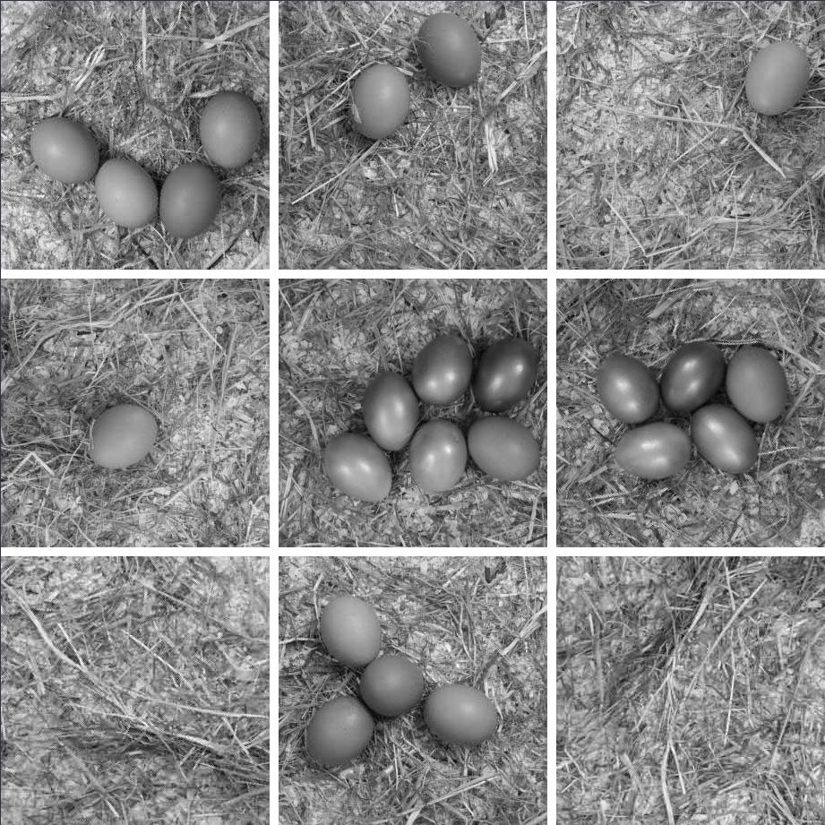
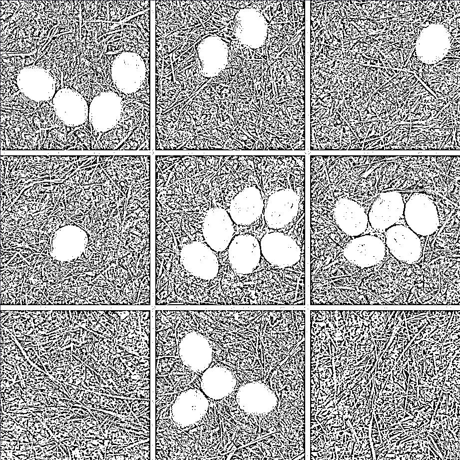
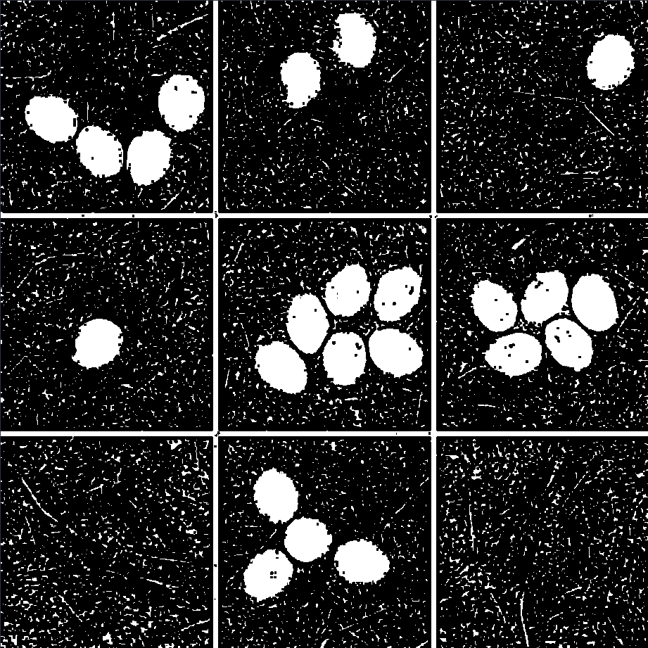
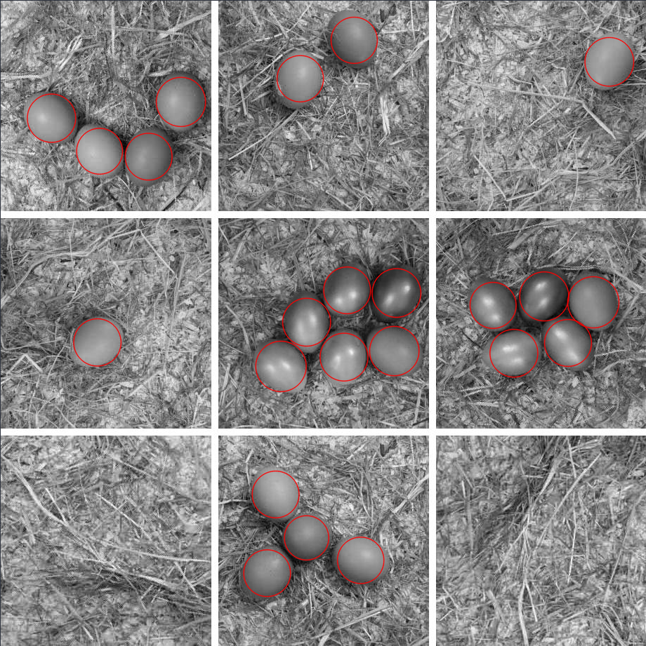
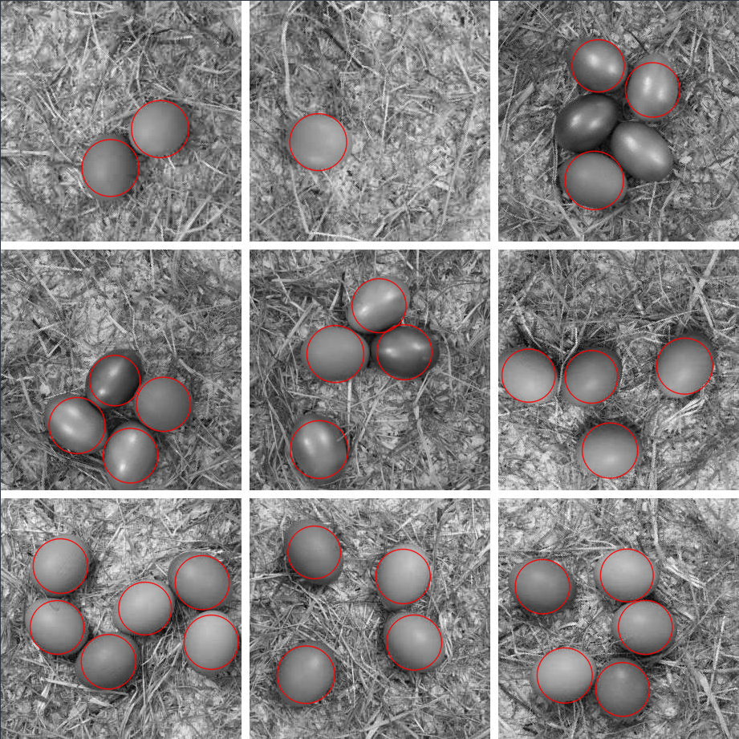

# 24 - CAPTEG

## Description

CAPTEG - Completely Automated Turing test to know how many Eggs are in the Grid

CAPTEG is almost like a CAPTCHA.
But here, you have to proof you are a bot that can count the eggs in the grid quickly.
Bumper also wanna train his AI for finding eggs faster and faster ;)

## Solution

I tried several solutions for this challenge. The one I like best uses [OpenCV](https://opencv.org/) to count the eggs.
First of all I import the original image in grayscale mode.



Then I apply an adaptive threshold operation to the image. This should only leave the eggs as white "spots":



Applying a blur in this stage makes it easier to process the image later on. If this step is left out a lot of false
ellipses are detected.


Now a second threshold operation is applied to the image. This makes the contrast between white and black more
significant.



At this stage I used [this tutorial](https://www.learnopencv.com/blob-detection-using-opencv-python-c/) to do a
detection of elliptic shapes. The result can be seen in the following image:



Unfortunately the detection is not perfect and sometimes eggs don't get detected:



To solve this problem I simply ran the detection and corrected the amount by supplying a delta. The blob detection is
implemented in C++.

```c++
Mat im = imread("picture.jpg", IMREAD_GRAYSCALE);
Mat thresholded;
Mat blurred;

adaptiveThreshold(im, thresholded, 255, ADAPTIVE_THRESH_GAUSSIAN_C, THRESH_BINARY, 11, 6);
blur(thresholded, blurred, Size{4, 4});
threshold(blurred, thresholded, 235, 255, THRESH_BINARY);

SimpleBlobDetector::Params parameters;

parameters.filterByArea = true;
parameters.minArea = 200;

parameters.filterByConvexity = true;
parameters.minConvexity = 0.3;
parameters.maxConvexity = 1;

parameters.filterByInertia = false;
parameters.filterByColor = false;

vector<KeyPoint> keypoints;

Ptr<SimpleBlobDetector> detector = SimpleBlobDetector::create(parameters);
detector->detect(thresholded, keypoints);

std::cout << keypoints.size() << std::endl;

Mat markedImage;
drawKeypoints(im, keypoints, markedImage, Scalar{0, 0, 255}, DrawMatchesFlags::DRAW_RICH_KEYPOINTS);

imshow("Keypoints", markedImage);
waitKey(0);
```

To do the correction and the HTTP interaction I used Java. The Java program simply calls the C++ binary to execute the
image detection.

```java
while (true) {
    LocalDateTime now = LocalDateTime.now();
    getImage(client);

    Process process = Runtime.getRuntime().exec("./capteg");
    Scanner processOutput = new Scanner(process.getInputStream());

    int foundNumber = processOutput.nextInt();

    System.out.println(">");
    String delta = scanner.nextLine();

    process.destroy();

    int deltaNr = Integer.valueOf(delta);

    int myAnswer = foundNumber + deltaNr;
    System.out.println("Sending: " + myAnswer);
    System.out.println("Took " + Duration.between(now, LocalDateTime.now()).getSeconds() + " seconds");

    HttpRequest verifyRequest = HttpRequest
            .newBuilder()
            .header("Content-Type", "application/x-www-form-urlencoded; charset=UTF-8")
            .POST(HttpRequest.BodyPublishers.ofString("s=" + myAnswer))
            .uri(URI.create(BASE + "verify")).build();

    HttpResponse<String> verifyResponse = client.send(verifyRequest, HttpResponse.BodyHandlers.ofString());
    System.out.println(verifyResponse.body());
}
```

With this I was able to get the flag quite fast:

```
Sending: 25
Took 3 seconds
Great success. Round 41 solved.
> 0
Sending: 27
Took 3 seconds
he19-s7Jj-mO4C-rP13-ySsJ
```
