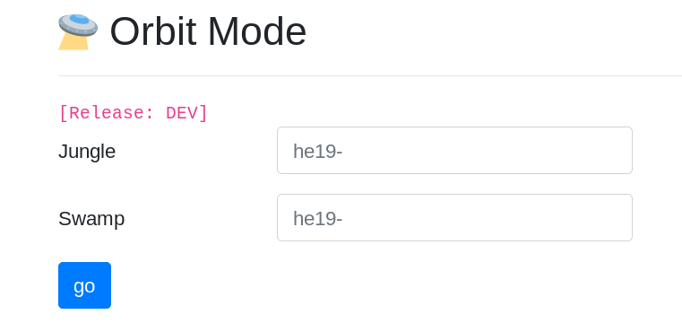
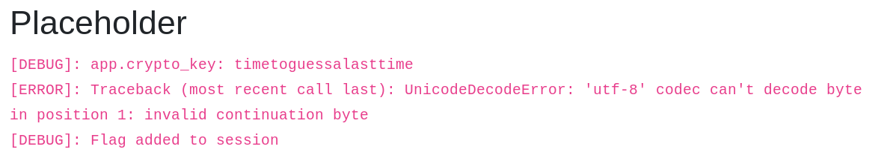

# 27 - Hidden Egg 3

## Description

Level: hidden<br/>
Author: opasieben & ccrypto

Sometimes, there is a hidden bonus level.

## Solution

From the description it was clear that I had to enter the orbit route of the hunt challenge. The previous two paths had
the following URLs:

```
http://whale.hacking-lab.com:5337/1804161a0dabfdcd26f7370136e0f766
http://whale.hacking-lab.com:5337/7fde33818c41a1089088aa35b301afd9
``` 

The last part is exactly 32 characters long so I guessed it would be an MD5 hash. I quickly searched for a known string
that hashed to one of the above and found `P4TH1`. There was also a hint in one of the previous paths that mentioned
`P4TH3`. I quickly hashed `P4TH3` and checked the URL:



I entered the two previous flags and started two walk through the maze until I reached:



Looks like the flag is part of my session cookie and the key is: `timetoguessalasttime`. I quickly reversed the
cookie algorithm:

```python
from Crypto.Cipher import AES
import base64

ciphertext = base64.b64decode(
    bytes(
        'HZeh4Z3fKZWOiR/hcfRv2Fu/u36bpTDsaTtaP+OCe1OHwVQVs1ImVKqsDGjKocwo3Sq8/0c1JnwfrTbuMpiKNCyfGMlwzGqUoaJXX04LjHk4fmOAoPfqTMi6SgWwGc8V19hK2YwqLUWucTw9E0sv/XfEc9BMbmrQ1IzvtmIExCzfo293X9wysXkWJp9NgIjExtS6mx7JUNrpMdSgJdVDoN0asw8Zsp5F4sviCSIz40NfC1uMQgYEYZWKfN58nvAzG1/cTOL4qJN2URQlD9Tjg+h1MKeQb0czyasu75C5wkbcpusvWHYabdNEDjjSiS+xZ2o/zpDok/9Fyk+vBVHEhdJd5brDey2Q28W4GIUDCGM3JiOgIbXTsfziowrQGoeQkYM0GXToYErzLTSUpblches8cGr4U/qdLHI/Lo2EZwajPN0rbzEny498ESrIn9lFOD05oIS9JuCoHDVs5YCD+5+68lwKF1D6ady4cE1kFs/yCOMMQjSroq9eZ9P7bNvDLxF3iEJkb4gbC9/zmlVpfPKx0dK3AT4fnShVydx0YWLZEN29fyhEbEF2aP/TVa9Bq4ruyL/p1TzOlFmDA91jM7KegqJ+vJcP7CDnCLftnqTeBt7YW6Ifspi+rmoQp86FN5RPdLbjw242q2mzSfQON7SX1R6sGe3V+n5cqwoIyG9CTHGpN1Xvag==',
        'utf-8'))

nonce = base64.b64decode(bytes('RN+0ykSvTy30km/JZYBKDg==', 'utf-8'))

cipher = AES.new(bytes('timetoguessalasttime', 'utf-8'), AES.MODE_EAX, nonce)
data = cipher.decrypt(ciphertext)

print(data.decode('utf-8'))
```

The decoded / decrypted cookie looked like this:

```
{"c11": {"a": 1}, "c12": {"a": 1}, "c13": {"a": 1}, "c14": {"a": 1}, "c15": {"a":1}, "c16": {"a": 1}, "c17": {"a": 1},
"c18": {"a": 1}, "c20": {"a": 1}, "t01": {"a": 1}, "f02": {"a": 1}, "c01": {"a": 1}, "c02": {"a": 1}, "c03": {"a": 1},
"c04":{"a": 1}, "c06": {"a": 1}, "c07": {"a": 1}, "c08": {"a": 1}, "c09": {"a": 1}, "f01": {"a": 1}, "h01": {"a": 1},
"v": [], "h": [], "m": {}, "l": 10, "hidden_flag": "he19-fmRW-T6Oj-uNoT-dzOm", "credit": "thanks for playing! gz
opasieben & ccrypto :)", "x": 34, "y": 1, "p": 3}
```

In there was the last hidden flag: `he19-fmRW-T6Oj-uNoT-dzOm`.
