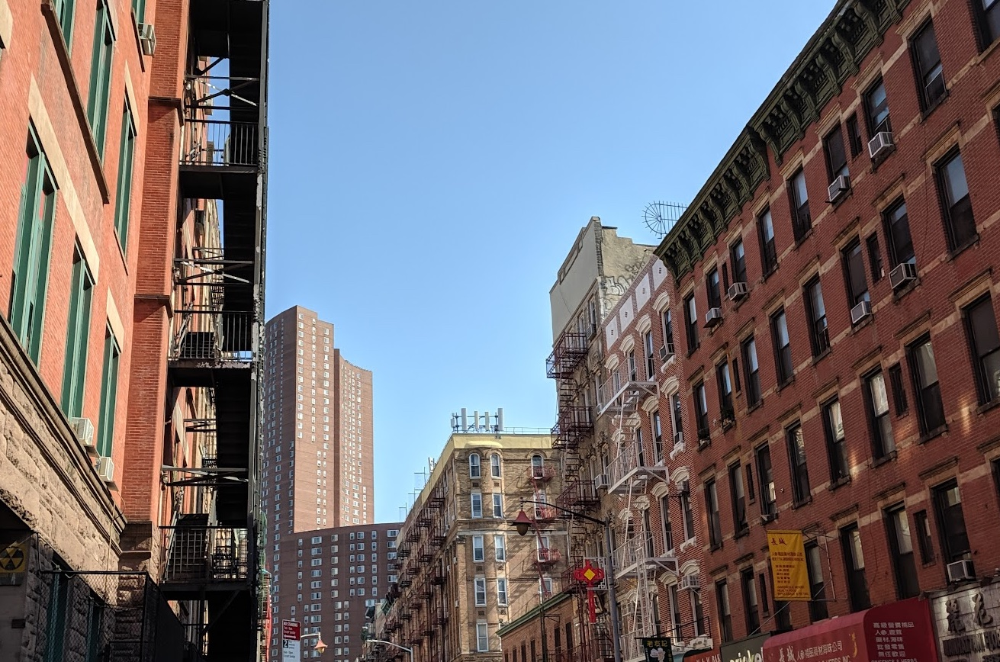

# City Trip

## Description
Level: easy 
Author: PS

I made a nice city trip. Find out where I was!

🚩 Flag
- street's name in lowercase and without spaces
- district or city name is not enough, we need the street
- example: Main Rd -> he2022{mainrd}

## Solution

For this challenge we are given an image and have to find its location. Probably the best method to do so, is to use
Google Image search. This directly leads us to "The Five Points" in Manhatten, a location close to the road in question.
We can then use Google Street View to search for the exact location.

