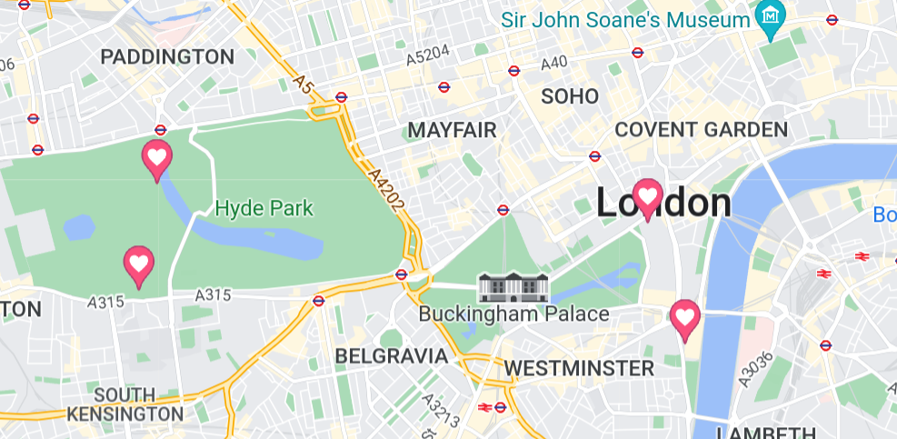
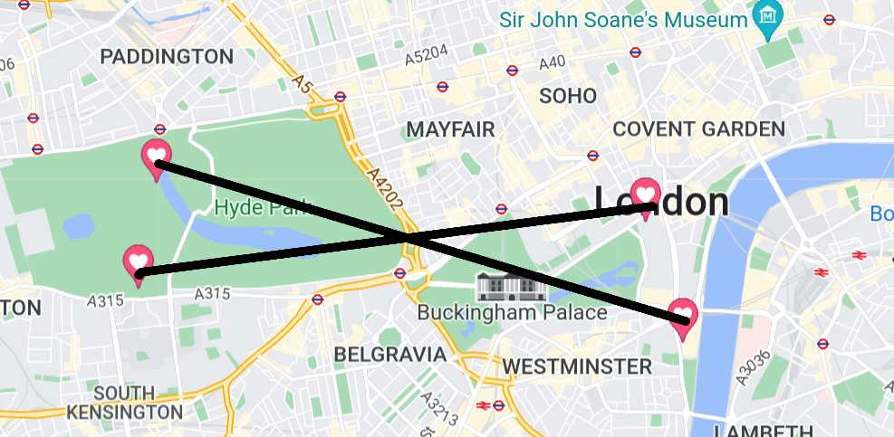

# Statues

## Description
Level: easy 
Author: PS

Hope you like statues as much as I do!
I created a little tour in my favourite city for you:

- Richard I
- Peter Pan
- Albert
- James Cook

I will not reveal my favourite statue, though. Find it yourself!

## Solution

For this challenge we are given four names of statues. Marking them on google maps gives us:

The last statue would now be at the intersection point:

There was the "Statue of Achilles" and the flag was `he2022{achilles}`.

