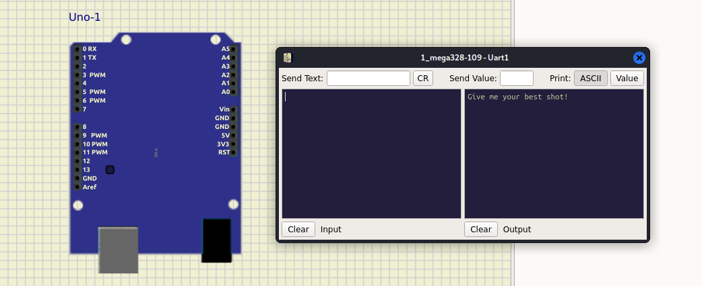
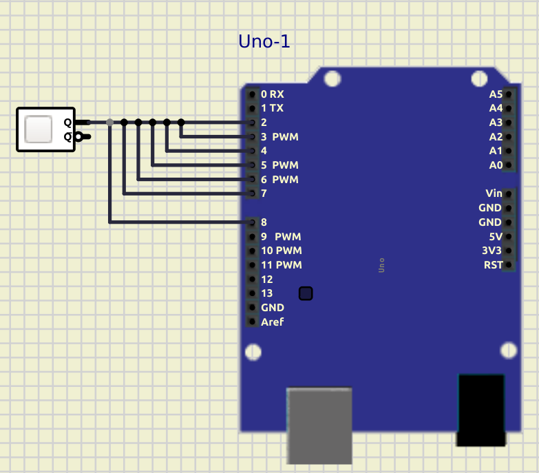

# Back to the Roots

## Description
Level: hard<br/>
Author: daubsi

Reversing is considered hard so we thought some old school stuff might be a gentle start?
This one is only for a simple 8 Bit, 16 MHz and 2KB RAM machine, so how hard can it be?
Remember: there is always a hard and a simple way.... choose your path!

[backtotheroots.zip](backtotheroots.zip)

## Solution

For this challenge we are given an AVR 8-bit ELF file. Looking at it in Ghidra we can see some intersting things:

```c
void setup() {
  HardwareSerial::begin(0x42e0000,0x80);
  ezButton::setDebounceTime(0x40d0000);
  ezButton::setDebounceTime(0x3f50000);
  ezButton::setDebounceTime(0x3dd0000);
  println("Give me your best shot!");
}

void main() {
  init();
  initVariant();
  setup();

  do {
    loop();
    serialEventRun();
  } while(true);
}
```

This pattern is how you usually program on Arduinos. At this point I switched to dynamic analysis. Unfortunately, I do
not own an Arduino, instead I used [SimulIDE](https://www.simulide.com/p/home.html) to simulate the board. To run the
binary in the simulator I had to convert it to a .hex file:

```
objcopy -O ihex backtotheroots.elf backtotheroots.hex
```

Once I got the emulator to run, I was greeted by the message of the `setup` function:



I knew that I would have to press some buttons (or in other words send a signal to some pin) since they are initialized
in the `setup` code. Since I was lazy and didn't want to figure out which pin needs to receive a signal, I simply hooked
up a button to all pins:



Pressing the button three times passes all three checks and prints the flag `he2022{0ld_Sko0l_CPu$_st1ll_r0cK!}`.

